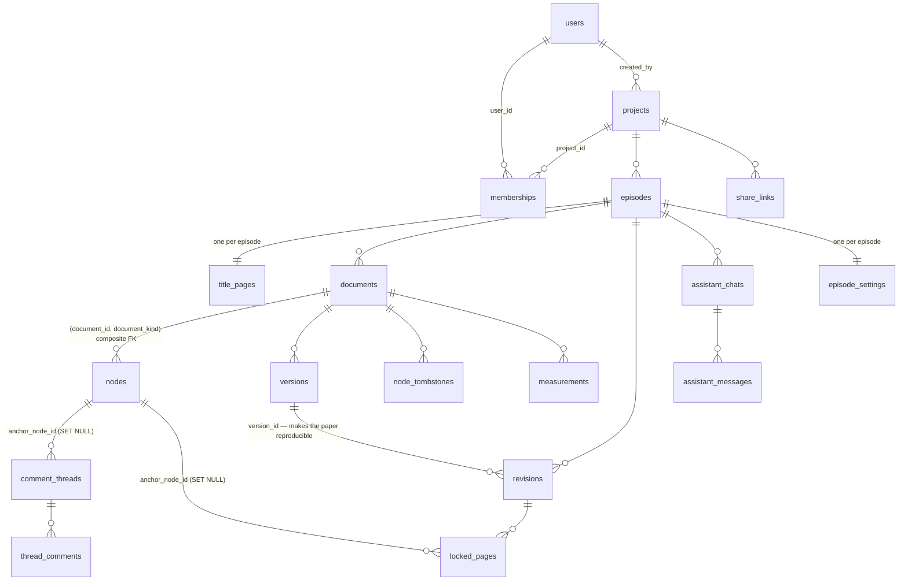
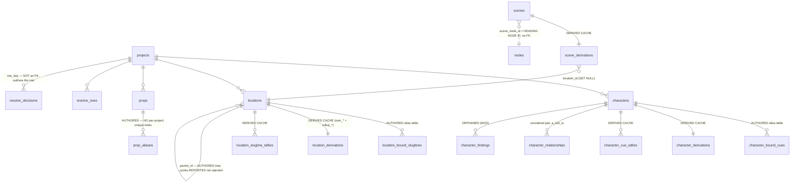
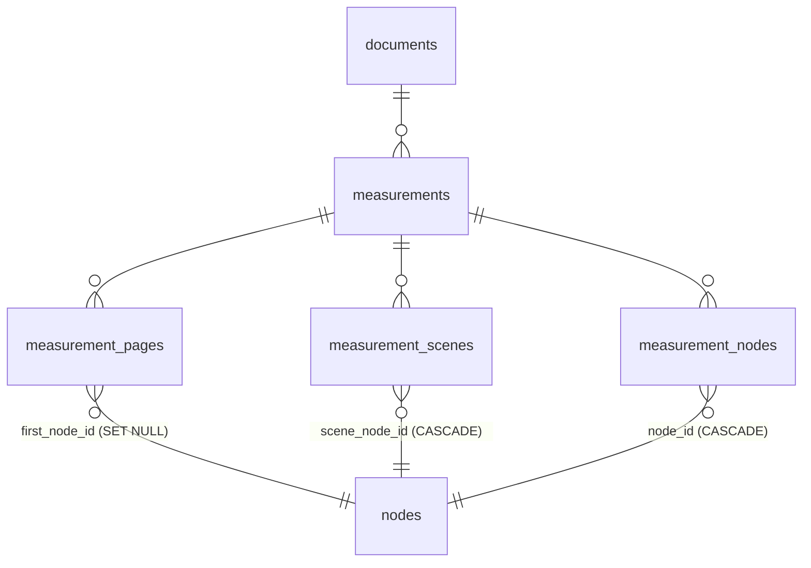
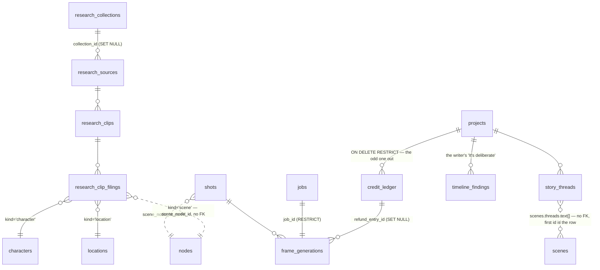
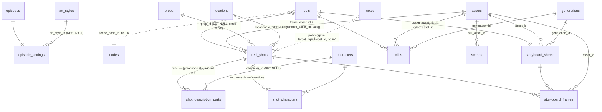

# Folio — Agent Readiness Report

**Audit date:** 2026-09-22 · **Branch:** `main` · **Head:** `b807d1a`
**Scope:** read-only audit of the repository at `Folio codebase/`, to assess what an in-app
AI copilot (side panel, calling backend functions directly, then navigating the UI) would be
able to do today and what is missing.

**Rules this report follows.** Nothing in the codebase was modified. Every factual claim carries
a `path:line` citation. Where the code does not answer a question, the report says **UNKNOWN**
rather than guessing. Environment variables appear **by name only** — no values, no secrets, no
keys, anywhere in this document.

---

## Contents

1. [Tech stack & structure](#1-tech-stack--structure)
2. [Data model](#2-data-model)
3. [API surface](#3-api-surface)
4. [Frontend routes & pages](#4-frontend-routes--pages)
5. [Feature inventory](#5-feature-inventory)
6. [Action map](#6-action-map)
7. [Existing AI integration](#7-existing-ai-integration)
8. [Auth, permissions & teams](#8-auth-permissions--teams)
9. [Real-time, versioning & jobs](#9-real-time-versioning--jobs)
10. [Agent integration risks & gaps](#10-agent-integration-risks--gaps)
11. [Open questions](#11-open-questions)

---

## Executive summary — the five things that decide the design

1. **The screenplay is a typed node list in Postgres, one row per node** — not a blob, not
   Fountain, not FDX, not ProseMirror JSON. `packages/db/src/schema/documents.ts:172-235`. Every
   other surface (scenes, characters, locations, page counts, shot lists) is a *derived view* of
   that list. An agent that writes anywhere else creates a second authority, which the codebase
   is explicitly architected against.
2. **There is already a persistent, app-wide layout with nothing in it.**
   `apps/web/app/(app)/layout.tsx:69-77` wraps *every* signed-in route — account shell and
   project workspace alike — and renders only `{children}`. A side panel mounted there survives
   every navigation. A second, narrower panel slot already exists inside the workspace shell
   (`apps/web/app/(app)/app/project/[projectId]/_chrome/project-shell.tsx:141-155`).
3. **99 server actions already exist and almost all are agent-callable as-is.** Each takes a
   `(projectId, episodeSlug, …)` pair, gates on identity + membership, validates with Zod, and
   returns a discriminated union rather than throwing (`apps/web/lib/script/gate.ts:84-166`).
   Below them sit ~259 project-scoped repository functions in `packages/db/src/repositories/`
   that are pure server functions with no UI coupling at all.
4. **Seven significant pieces of domain logic exist only in the browser** and have no server
   counterpart: screenplay pagination, timeline continuity + placement proposals, all four
   export formats, the assistant's own "report" answers, project-list filtering, and the
   optimistic Production tree. An agent cannot invoke any of them today. See §6.2.
5. **The current assistant is read-only by design and has no tool calling.**
   `apps/web/lib/assistant/server.ts:62` — *"Text only: no tools, because the assistant may not
   write."* Its system prompt tells the model it cannot edit
   (`apps/web/lib/assistant/context.ts:68`). Turning it into an actor is a product decision, not
   a refactor — and `AGENTS.md` specifies a proposal/diff surface that **has no implementation**.

---

## 1. Tech stack & structure

### 1.1 Languages, frameworks, versions

| Concern | Choice | Evidence |
|---|---|---|
| Language | TypeScript 5.9.3, `strict` + `noUncheckedIndexedAccess` + `exactOptionalPropertyTypes` | `package.json:20`, `tsconfig.base.json` |
| Runtime | Node `>=22.12.0 <23.0.0` | `package.json:7-9` |
| Package manager | pnpm 10.33.4, workspaces | `package.json:6` |
| Build orchestration | Turborepo 2.10.12 | `package.json:17` |
| Web framework | **Next.js 16.3.4**, App Router, React 19.3, React Server Components | `apps/web/package.json:29-31` |
| Styling | Tailwind CSS 4.3.3 (+ `@tailwindcss/postcss`), CSS custom properties as design tokens | `apps/web/package.json:36-37`; `packages/ui/src/tokens/` |
| Rich text | **Tiptap 3.31.3** (`@tiptap/core`, `/pm`, `/react`, `/suggestion`) — both the Script and the Outline editor | `apps/web/package.json:24-27` |
| Client state | **Zustand 5.0.15** (+ `persist` → `sessionStorage`), React Context, `useSyncExternalStore` cells | `apps/web/package.json:33`; `apps/web/lib/state/` |
| Validation | **Zod 4.6.1**, centralised in `@folio/contracts` | `apps/web/package.json:32` |
| ORM / DB | **Drizzle ORM** over Postgres (Supabase), forward-only SQL migrations `0000`–`0030` | `packages/db/src/schema/`, `packages/db/migrations/` |
| Auth | **Supabase Auth** via `@supabase/ssr` 0.12.7 / `@supabase/supabase-js` 2.116 | `apps/web/package.json:22-23` |
| Object storage | **Cloudflare R2** over the S3 API, signed with `aws4fetch` 1.0.20 | `apps/web/lib/storage/r2.ts:42-47` |
| LLM | `@anthropic-ai/sdk` 0.126.0 (assistant) | `apps/web/package.json:12` |
| Image/video models | Google Gemini + Veo over plain `fetch` — **no SDK** | `apps/web/lib/production/pipeline/gemini.ts:28` |
| XML | `fast-xml-parser` 5.11.1 (FDX import/export only) | `apps/web/package.json:28` |
| Positioning | `@floating-ui/dom` 1.8.0 | `apps/web/package.json:13` |
| Tests | Vitest 5, Playwright 1.63, Testing Library 16 | `apps/web/package.json:35-47` |

**The dependency list above is the whole list.** `apps/web/package.json:11-34` has 18 runtime
dependencies and four of them are workspace packages. `CLAUDE.md` states any new dependency needs
approval, every time, and `eslint.config.mjs` enforces the ban list.

**Not present anywhere** (verified by grep across the repo): react-query / TanStack Query, SWR,
Redux, MobX, Yjs / Automerge / any CRDT, socket.io, `ws`, tRPC, GraphQL, Prisma, OpenAI,
LangChain, Ollama, Cohere, Mistral, BullMQ, Redis.

### 1.2 Hosting & deployment

**UNKNOWN.** There is no `vercel.json`, `Dockerfile`, `fly.toml`, CI workflow, or deploy
manifest in the repository. What the code *does* establish:

- The build is `next build` followed by a post-build secret scanner
  (`apps/web/package.json:7`, `apps/web/scripts/assert-no-server-secrets.mjs`), which greps
  `.next/static/**` to prove no server secret was inlined into a client bundle.
- Server-action request bodies are capped at 6 MB (`apps/web/next.config.ts:14`).
- The database is Supabase Postgres reached through **two poolers** — a transaction pooler for
  request work and a session pooler for advisory locks/`LISTEN` — modelled as a type parameter
  on the scope (`packages/db/src/scope.ts:95-102`, `POOLER_MODES`).
- Media is Cloudflare R2 with a **public** origin (`apps/web/lib/storage/r2.ts:57-60`).
- `after()` from `next/server` is used to run work past the response
  (`apps/web/lib/production/generate.ts:16,125`), which requires a host that keeps the function
  alive after the response is flushed.

### 1.3 Monorepo layout

```
Folio codebase/
├─ apps/
│  ├─ web/                    Next 16 app — the entire product
│  └─ worker/                 DELIBERATELY EMPTY (one exported constant)
├─ packages/
│  ├─ script/                 the pure core — zero runtime dependencies, by rule
│  ├─ contracts/              Zod boundary schemas + every closed vocabulary
│  ├─ db/                     Drizzle schema, migrations, project-scoped repositories
│  └─ ui/                     design tokens (CSS custom properties), inline SVG icons
├─ docs/
│  ├─ adr/                    0001 node identity, 0002 episode identity
│  ├─ production/             the v12 Production spec + runnable mockup
│  └─ remainingroadmap.md     what is deliberately cut vs. a known defect
├─ AGENTS.md                  the engineering contract
└─ CLAUDE.md                  per-package guidance
```

#### `packages/script` — the pure core (19,013 lines incl. tests)

Zero runtime dependencies, now and always (`packages/script/src/index.ts:46-51`). No React, no
database, no `fetch`, no `process.env`, no `Date.now()`, no `Math.random()` — **enforced by
`eslint.config.mjs`, not by convention**. It cannot mint an id; every operation that needs one
takes it from the caller. This is the single most agent-relevant property in the repo: **every
domain computation in this package is already a pure function an agent can call server-side.**

| Module | What it owns |
|---|---|
| `node.ts` `inline.ts` `outline.ts` `document.ts` `ids.ts` `provenance.ts` | The node model — 8 screenplay types, 7 outline types, inline runs, branded ids |
| `operations.ts` | The seven operations: `splitNode` `mergeNodes` `insertNodes` `deleteNodes` `reorderNode` `changeNodeType` `pasteNodes` |
| `read.ts` | The wire reader — rejects pagination fields, malformed nodes |
| `derive.ts` (1,594 lines) | The one derivation pass: characters, locations, scenes, resolve queue |
| `paginate.ts` (783) `sheet.ts` `measure.ts` `revision.ts` | Pagination → a **measurement record**, never a node |
| `fountain-parse.ts` `fountain-serialise.ts` `fountain-syntax.ts` | Fountain both ways |
| `fdx.ts` `fdx-export.ts` | Final Draft both ways (takes an already-parsed XML tree) |
| `diff.ts` | `diffScreenplays` — the draft diff, joined on node id |
| `alias.ts` `entities.ts` `introductions.ts` `slugline.ts` | Entity identity and the alias mechanism |
| `beats.ts` `shots.ts` `timeline.ts` `continuity.ts` `time-cues.ts` `sets.ts` `props.ts` `rename.ts` `sides.ts` `description.ts` | One read module per derived route |
| `stream.ts` `generated-text.ts` | Renderable stream; the one place `(V.O.)` is told from `(CONT'D)` |

`props.ts` is the odd one: a prop is **authored**, so it reads the script back as *evidence* for
records the caller hands it and never proposes one (`packages/db/src/schema/props.ts:14-31`).

#### `packages/contracts`

Every closed vocabulary in the product plus its Zod schema, and the branded id types. Notably
`production.ts:356-366` holds `MODEL_REGISTRY` — **the only place in the codebase a model is
named** — and `:335-343` holds `GENERATION_COSTS`.

#### `packages/db`

- `schema/` — 18 files, 60 tables, ~50 Postgres enums, each table classified AUTHORED /
  DERIVED CACHE / MEASUREMENT in `schema/index.ts:1-129`.
- `migrations/` — `0000_initial_schema.sql` … `0030_props_route.sql`, forward-only.
- `repositories/` — 25 modules, **~259 exported functions**, every one taking an unforgeable
  `ProjectScope` as its first argument.
- `scope.ts` — the tenancy mechanism (see §8.3).
- `env.ts` — the **only** legal reader of `process.env` on the server side.

#### `apps/web`

```
app/
├─ (auth)/                  sign-in, sign-up, forgot-password, reset-password
├─ (app)/                   ★ requireUser() — the real security boundary
│  ├─ layout.tsx            ★ THE persistent app-wide shell (renders only {children})
│  └─ app/
│     ├─ (home)/            account shell: new, projects, trash, settings (+3 redirects)
│     └─ project/[projectId]/
│        ├─ layout.tsx      loads the project → <ProjectShell>
│        ├─ _chrome/        rail, header, sidebar, drawers, assistant panel
│        ├─ _script/ _outline/ _storyboard/ _scenes/ _characters/
│        ├─ _locations/ _props/ _timeline/ _research/ _production/
│        └─ [episodeId]/ … and a duplicated (film)/ tree (Next has no optional segment)
├─ api/assistant/route.ts   the one streaming endpoint
├─ auth/callback/route.ts
└─ share/[token]/page.tsx
lib/
├─ auth/  workspace/  state/  storage/  env/  routes.ts
├─ script/ outline/ scenes/ characters/ locations/ props/ timeline/
├─ storyboard/ research/ production/{,pipeline/} assistant/ share/ projects/ settings/
proxy.ts                    Next 16's renamed middleware
```

Each route folder follows the same three-file pattern: `lib/<route>/server.ts` (the loader,
server-only), `lib/<route>/actions.ts` (`'use server'` mutations), `_<route>/*.tsx` (the UI).

#### `apps/worker`

`apps/worker/src/index.ts` is 7 lines and exports one constant. This is deliberate
(`packages/db/src/schema/storyboard.ts:56-59`): *"there is no BullMQ and no Redis in this
repository yet … `apps/worker` is empty on purpose."* Production generations therefore run
inside the web request via `after()` + 3-second client polling.

---

## 2. Data model

### 2.0 How to read this section

`packages/db/src/schema/index.ts:1-129` classifies every one of the 60 tables into exactly one of
three classes, **and the class decides who may write it**:

| Class | Count | Rule | Written by |
|---|---|---|---|
| **AUTHORED** | 46 | A human or an explicit operation wrote it | Server actions / repositories |
| **DERIVED CACHE** | 6 | Reproducible by re-running `derive` over the node list | `repositories/derived.ts` **only** |
| **MEASUREMENT** | 4 | Produced by `paginate`, never by `derive` | `repositories/measurement.ts` **only** |
| *(plus)* | 4 | Production system-written on a click (`generations`, `activity_log`) — classified AUTHORED | the runner |

The split is enforced structurally, not by discipline: the derivation writer holds a handle that
can only reach the derived tables, *"so clobbering a synopsis is not a mistake somebody has to
avoid — it is a query that does not compile"* (`packages/db/src/schema/derived.ts:59-62`).

**Two invariants that constrain every agent write:**

1. **Every table carries `project_id` except `users`** — and the exception is enforced by the
   type system: `users` has no such column, so it is not assignable to `ProjectScopedTable` and
   cannot be passed to a scoped query at all (`packages/db/src/scope.ts:141-152`).
2. **Nothing is stored that can be computed**, with exactly three exemptions: page numbers and
   eighths (on a measurement record), the credit balance (a view over the append-only ledger),
   and the derived entity rows (marked as caches). There is no fourth case
   (`packages/db/src/schema/index.ts:97-112`).

---

### 2.1 How the screenplay is stored — the headline answer

**Not a text blob. Not rich-text JSON. Not Fountain. Not FDX. Not ProseMirror JSON.**

A screenplay is **one database row per screenplay element**, in the `nodes` table, ordered by a
fractional text `order_key`. Fountain and FDX are *codecs at the boundary*; the editor's
ProseMirror document is a *projection* that lives in Tiptap and is converted at the boundary
files `apps/web/lib/script/pm-model.ts` and `apps/web/lib/outline/pm-model.ts`.

```sql
-- packages/db/src/schema/documents.ts:104-127
create table documents (
  id          uuid primary key default gen_random_uuid(),
  project_id  uuid not null references projects(id) on delete cascade,
  episode_id  uuid not null references episodes(id) on delete cascade,
  kind        document_kind not null,          -- 'screenplay' | 'outline'
  title       text not null,
  created_at  timestamptz not null default now(),
  updated_at  timestamptz not null default now(),
  constraint documents_id_kind_key       unique (id, kind),        -- FK target, see below
  constraint documents_episode_kind_key  unique (episode_id, kind) -- one script per episode
);

-- packages/db/src/schema/documents.ts:172-235
create table nodes (
  id                   uuid primary key default gen_random_uuid(),
  project_id           uuid not null references projects(id) on delete cascade,
  document_id          uuid not null,
  document_kind        document_kind not null,   -- NOT a copy: half of a composite FK
  type                 node_type not null,       -- the 8 + 7 tags, one Postgres type
  order_key            text not null,            -- fractional index, compared lexicographically
  content              jsonb not null,           -- InlineContent: a list of runs
  modifiers            delivery_modifier[] not null default '{}',
  provenance_source    provenance_source not null,  -- 'typed' | 'agent'
  provenance_run_id    uuid,
  created_at           timestamptz not null default now(),
  updated_at           timestamptz not null default now(),

  constraint nodes_document_kind_fk foreign key (document_id, document_kind)
    references documents (id, kind) on delete cascade,
  constraint nodes_document_order_key unique (document_id, order_key),

  constraint nodes_type_matches_document_kind check (
      (document_kind = 'screenplay' AND type IN
        ('scene','action','character','paren','dialogue','transition','comment','subtitle'))
   OR (document_kind = 'outline'    AND type IN
        ('body','h1','h2','h3','quote','rule','beat'))),

  constraint nodes_provenance_run_matches_source check (
      (provenance_source = 'agent') = (provenance_run_id IS NOT NULL)),

  constraint nodes_modifiers_only_on_cues check (
      type = 'character' OR cardinality(modifiers) = 0)
);
```

**The mechanism worth understanding before designing an agent.** `document_kind` on a node is
*not a denormalised copy* — it is half of a composite foreign key into `documents (id, kind)`.
Postgres will not let the pair exist unless that exact pair exists in `documents`, so it cannot
drift even for the duration of a transaction, and the CHECK constraint can then decide the legal
tag set from the row alone (`packages/db/src/schema/documents.ts:133-158`).

**Two things deliberately absent from a node** — both directly relevant to an agent:

- **No `page`, `pageNumber`, `pages`, `eighths` or `measurement`.** `PAGINATION_FIELDS`
  (`packages/script/src/node.ts:28`) is the single source for a two-sided ban: `NoPagination`
  (`:42`) makes it a *compile* error and `read.ts:49` makes it a *runtime* rejection, so a node
  cannot smuggle a page number in over the wire either. A node's position on a sheet lives on a
  measurement record which points *at* the node; the node never points back.
- **No `character_id` on a cue.** Resolving a cue to a person goes through the alias table. *"A
  resolved id cached here would be a second authority on who is speaking"*
  (`packages/script/src/node.ts:121-129`).

#### The eight screenplay node types

`packages/script/src/node.ts:53-62` — `scene`, `action`, `character`, `paren`, `dialogue`,
`transition`, `comment`, `subtitle`. The union and the runtime set are proved to agree at compile
time by `SCREENPLAY_NODE_TYPE_COVERAGE` (`:191-200`).

- `character` is the only type that carries `modifiers` — authored `V.O.` / `O.S.` / `O.C.` only.
  `(MORE)`, `(CONT'D)` at a split and speaker `(CONT'D)` are **layout artefacts** computed at
  render and stripped on import; they have no representation in the model at all
  (`packages/script/src/node.ts:73-82`).
- `comment` is the Fountain `[[ ]]` note. **Comment nodes occupy zero page space** and never
  reach an export (`:152-161`).
- `scene` holds only heading *text*. `INT./EXT.`, the set and the time of day are parser output
  and the scene record they feed is *derived* (`:100-110`).

#### Inline content — why text is a list, not a string

```ts
// packages/script/src/inline.ts:17-33
type MentionTarget =
  | { entity: 'character'; id: CharacterId }
  | { entity: 'location';  id: LocationId }

type InlineRun =
  | { kind: 'text';    text: string }
  | { kind: 'mention'; target: MentionTarget }

type InlineContent = readonly InlineRun[]
```

An `@mention` is **a structural reference to a record id, not text**, so a character who is
discussed in action but never speaks still gets a record, and a rename does not have to rewrite
prose. A mention carries **no display label** — the label is the record's `name` at render time
(`packages/script/src/inline.ts:3-16`). A mention counts as **one** character for anchor offsets
(`contentLength`, `:57-58`).

#### Example record

A one-scene fragment as it is actually stored. (`content` values are real `InlineContent`; ids
are illustrative.)

```jsonc
// documents
{
  "id":         "7c1f0a2e-4b6d-4b7a-9e31-0b8c5a1d2f44",
  "project_id": "2a9d4e10-c7f3-4c81-8a55-6f0e2b3d1c90",
  "episode_id": "b41c6d73-2e58-4a19-9d02-77aa3e5c4b18",
  "kind":       "screenplay",
  "title":      "Episode 1"
}
```

```jsonc
// nodes — three rows, in document order by order_key
[
  {
    "id": "e0a1b2c3-1111-4aaa-8bbb-000000000001",
    "project_id": "2a9d4e10-…", "document_id": "7c1f0a2e-…",
    "document_kind": "screenplay",
    "type": "scene",
    "order_key": "a0",
    "content": [{ "kind": "text", "text": "INT. CHAWL CORRIDOR - NIGHT" }],
    "modifiers": [],
    "provenance_source": "typed", "provenance_run_id": null
  },
  {
    "id": "e0a1b2c3-1111-4aaa-8bbb-000000000002",
    "document_id": "7c1f0a2e-…", "document_kind": "screenplay",
    "type": "action",
    "order_key": "a1",
    // "MEERA" here is a mention run: a reference to the character record,
    // NOT the string "MEERA". A rename changes nothing in this row.
    "content": [
      { "kind": "mention", "target": { "entity": "character",
                                       "id": "9f2c7b41-aaaa-4bbb-8ccc-1d2e3f405162" } },
      { "kind": "text", "text": " counts the notes twice, then once more." }
    ],
    "modifiers": [],
    "provenance_source": "typed", "provenance_run_id": null
  },
  {
    "id": "e0a1b2c3-1111-4aaa-8bbb-000000000003",
    "document_id": "7c1f0a2e-…", "document_kind": "screenplay",
    "type": "character",
    "order_key": "a2",
    "content": [{ "kind": "text", "text": "MEERA" }],   // the cue, as authored
    "modifiers": ["V.O."],                              // authored only; never (CONT'D)
    "provenance_source": "agent",
    "provenance_run_id": "4d5e6f70-8888-4999-8aaa-bbbbccccdddd"
  }
]
```

Note the third row: `provenance_source: 'agent'` **requires** a non-null `provenance_run_id` by
CHECK constraint. **This is the existing hook for agent attribution** — an agent-authored node is
already a first-class, queryable state in the schema, and
`versions.reason = 'before_agent_run'` (`packages/contracts` `VERSION_REASONS`) already exists so
that *"revert this run"* is one operation rather than a reverse-diff
(`packages/db/src/schema/history.ts:74-78`).

#### Node identity — the rules an agent's edits must obey

`docs/adr/0001-node-identity.md`, implemented in `packages/script/src/operations.ts:12-36`:

| Operation | Identity rule |
|---|---|
| `splitNode` | Head keeps the id; anchors past the split point re-point at the tail via a `split` event |
| `mergeNodes` | First node's id wins; the second is retired with a `merged` event carrying the offset shift |
| `pasteNodes` | Id preserved only when the clipboard came from **this** document and the id is currently absent; otherwise fresh. So cut+paste keeps its comments, copy+paste does not, cross-document paste always mints |
| `deleteNodes` | Tombstones. **An id is never reused** (`node_tombstones.node_id` is the PK) |
| `reorderNode`, `changeNodeType` | Every id survives |

None of the seven operations mints an id, and none of them throws — a bad index or a cursor
inside a mention is an `OperationError` in the return type.

---

### 2.2 Full SQL DDL — all 60 tables

Types below are the Postgres types the Drizzle definitions generate. `timestamptz` is
`timestamp with time zone` throughout — *"a production office in Mumbai and a producer in London
reading the same revision date is not a hypothetical"* (`packages/db/src/schema/columns.ts:35-45`).

#### 2.2.1 Tenancy — `packages/db/src/schema/tenancy.ts`

```sql
-- :98-105  AUTHORED. The ONLY table with no project_id.
-- id IS the Supabase auth.users id. No cross-schema FK (a trigger maintains the link,
-- written in 0001_rls_and_grants.sql).
create table users (
  id            uuid primary key,
  email         text not null,
  display_name  text not null,
  avatar_url    text,
  created_at    timestamptz not null default now(),
  updated_at    timestamptz not null default now()
);

-- :164-194  AUTHORED.  projects.id IS the project_id every other table carries.
create table projects (
  id                uuid primary key default gen_random_uuid(),
  title             text not null,
  kind              project_kind not null,        -- screenwriting | filmmaking
  project_type      project_type not null,        -- film | series
  format            script_format not null,       -- hollywood | asian  (an ENGINE INPUT)
  page_mode         page_mode not null default 'paged',      -- paged | continuous
  live_repaginate   boolean not null default false,          -- a cadence flag
  tags              text[] not null default '{}',
  logline           text,                                    -- 0029, authored
  created_by        uuid not null references users(id),
  created_at        timestamptz not null default now(),
  updated_at        timestamptz not null default now(),
  trashed_at        timestamptz,                             -- soft delete
  archived_at       timestamptz,                             -- 0029, a SECOND, independent state
  index projects_created_by_idx (created_by)
);
-- NOTE: no page_count, no scene_count, no episode_count. Deliberate (:117-123).
-- archived != trashed: a project is live, archived or trashed, and both can be true (:138-146).

-- :212-228  AUTHORED.
create table memberships (
  id           uuid primary key default gen_random_uuid(),
  project_id   uuid not null references projects(id) on delete cascade,
  user_id      uuid not null references users(id) on delete cascade,
  role         membership_role not null,          -- owner | writer | reader
  invited_via  invited_via not null,              -- created | share_link
  created_at   timestamptz not null default now(),
  constraint memberships_project_user_key unique (project_id, user_id),
  index memberships_user_idx (user_id)
);
-- The unique index makes membership a SET, not a log. Every RLS policy joins against it.

-- :254-281  AUTHORED.  A FILM HAS EXACTLY ONE ROW HERE (the router hides the segment).
create table episodes (
  id               uuid primary key default gen_random_uuid(),
  project_id       uuid not null references projects(id) on delete cascade,
  slug             text not null,                 -- 'ep_NNN' — a routing handle, re-issuable
  ordinal          integer not null,              -- 1-based; MOVES on reorder, the id does not
  title            text not null,
  revision_colour  revision_colour not null default 'white',
  created_at       timestamptz not null default now(),
  updated_at       timestamptz not null default now(),
  constraint episodes_project_slug_key    unique (project_id, slug),
  constraint episodes_project_ordinal_key unique (project_id, ordinal),
  constraint episodes_slug_shape       check (slug ~ '^ep_[0-9]{3,}$'),
  constraint episodes_ordinal_positive check (ordinal >= 1)
);

-- :307-330  AUTHORED. One per episode. Columns ARE the Fountain title-page keys.
create table title_pages (
  id          uuid primary key default gen_random_uuid(),
  project_id  uuid not null references projects(id) on delete cascade,
  episode_id  uuid not null references episodes(id) on delete cascade,
  title text, credit text, author text, source text,
  draft_date text,            -- TEXT: "Blue revision, 2 Sep 2026" is a date to a production office
  contact text, copyright text, notes text,
  created_at timestamptz not null default now(),
  updated_at timestamptz not null default now(),
  constraint title_pages_episode_key unique (episode_id),
  index title_pages_project_idx (project_id)
);
```

#### 2.2.2 Documents & nodes — `packages/db/src/schema/documents.ts`

`documents` and `nodes` are given in full in §2.1. The third table:

```sql
-- :261-283  AUTHORED.  PK is the node id itself — that is what makes "never reused" checkable.
create table node_tombstones (
  node_id      uuid primary key,
  project_id   uuid not null references projects(id) on delete cascade,
  document_id  uuid not null references documents(id) on delete cascade,
  reason       tombstone_reason not null,         -- deleted | merged
  merged_into  uuid,                              -- the survivor, when this id LOST a merge
  retired_at   timestamptz not null default now(),
  retired_by   uuid references users(id) on delete set null,
  index node_tombstones_project_idx (project_id),
  index node_tombstones_merged_into_idx (merged_into),
  constraint node_tombstones_merge_names_survivor
    check ((reason = 'merged') = (merged_into IS NOT NULL))
);
```

There is deliberately **no list of detached comment anchors** here — a thread carries its own
`anchor_node_id` and a repository resolves it through this table
(`packages/db/src/schema/documents.ts:256-259`).

#### 2.2.3 Comment threads — `packages/db/src/schema/threads.ts`

```sql
-- :62-108  AUTHORED.  Anchored by node id and ONLY by node id.
-- There is NO offset column, NO quoted-text column and NO line number in this file.
create table comment_threads (
  id              uuid primary key default gen_random_uuid(),
  project_id      uuid not null references projects(id) on delete cascade,
  anchor_kind     thread_anchor_kind not null,   -- script_node | beat | outline_block | storyboard_shot
  anchor_node_id  uuid references nodes(id) on delete set null,   -- 3 of the 4 kinds
  anchor_shot_id  uuid,                          -- storyboard_shot only. NO FK — a placeholder
  state           thread_state not null default 'open',
  created_by      uuid not null references users(id),            -- no onDelete: NO ACTION
  created_at      timestamptz not null default now(),
  updated_at      timestamptz not null default now(),
  resolved_at     timestamptz,
  resolved_by     uuid references users(id) on delete set null,
  index comment_threads_project_idx (project_id),
  index comment_threads_anchor_node_idx (anchor_node_id),
  index comment_threads_state_idx (project_id, state),
  constraint comment_threads_anchor_matches_kind check (
        (anchor_kind =  'storyboard_shot') = (anchor_shot_id IS NOT NULL)
    AND (anchor_kind <> 'storyboard_shot') = (anchor_node_id IS NOT NULL)),
  constraint comment_threads_resolution_consistent
    check ((state = 'resolved') = (resolved_at IS NOT NULL))
);

-- :126-147  AUTHORED.  A comment NEVER reaches an export — enforced by the exporter not
-- reading this table, not by a flag on it (:121-125).
create table thread_comments (
  id          uuid primary key default gen_random_uuid(),
  project_id  uuid not null references projects(id) on delete cascade,
  thread_id   uuid not null references comment_threads(id) on delete cascade,
  author_id   uuid not null references users(id),          -- no onDelete: NO ACTION
  body        text not null,
  created_at  timestamptz not null default now(),
  updated_at  timestamptz not null default now(),
  edited_at   timestamptz,
  index thread_comments_thread_idx (thread_id, created_at),
  index thread_comments_project_idx (project_id),
  constraint thread_comments_body_not_empty check (length(btrim(body)) > 0)
);
```

#### 2.2.4 History — `packages/db/src/schema/history.ts`

Two tables that look alike and are deliberately distinct: *a version is the editor's undo-history
backstop; a revision is a production artefact* (`:21-44`).

```sql
-- :79-103  AUTHORED.  The whole node list as JSON. Cheap, frequent, PRUNABLE.
create table versions (
  id           uuid primary key default gen_random_uuid(),
  project_id   uuid not null references projects(id) on delete cascade,
  document_id  uuid not null references documents(id) on delete cascade,
  ordinal      integer not null,                 -- monotonic WITHIN a document
  reason       version_reason not null,          -- autosave | manual | before_agent_run |
                                                 -- before_import | before_rename | before_restore | restore
  snapshot     jsonb not null,                   -- validated by @folio/script, never by SQL
  node_count   integer not null,                 -- stored: a frozen artefact cannot drift
  created_by   uuid references users(id) on delete set null,
  created_at   timestamptz not null default now(),
  constraint versions_document_ordinal_key unique (document_id, ordinal),
  index versions_project_idx (project_id),
  index versions_document_created_idx (document_id, created_at),
  constraint versions_ordinal_positive       check (ordinal >= 1),
  constraint versions_node_count_not_negative check (node_count >= 0)
);

-- :149-188  AUTHORED.  A coloured draft that goes to a crew. NEVER pruned.
create table revisions (
  id              uuid primary key default gen_random_uuid(),
  project_id      uuid not null references projects(id) on delete cascade,
  episode_id      uuid not null references episodes(id) on delete cascade,
  ordinal         integer not null,              -- 1-based within an episode
  colour          revision_colour not null,      -- white|blue|pink|yellow|green — STOPS at green
  label           text not null,
  note            text,
  tags            text[] not null default '{}',
  lines_added     integer not null default 0,
  lines_deleted   integer not null default 0,
  scenes_touched  integer not null default 0,
  page_count      integer not null default 0,    -- pages AS ISSUED, not a cache
  locked          boolean not null default false,
  version_id      uuid references versions(id) on delete set null,  -- makes the paper reproducible
  author_id       uuid references users(id) on delete set null,
  created_at      timestamptz not null default now(),
  constraint revisions_episode_ordinal_key unique (episode_id, ordinal),
  index revisions_project_idx (project_id),
  constraint revisions_ordinal_positive          check (ordinal >= 1),
  constraint revisions_line_counts_not_negative  check (lines_added >= 0 AND lines_deleted >= 0),
  constraint revisions_issue_counts_not_negative check (scenes_touched >= 0 AND page_count >= 0)
);

-- :212-231  AUTHORED.  One page whose number is frozen.
create table locked_pages (
  project_id      uuid not null references projects(id) on delete cascade,
  revision_id     uuid not null references revisions(id) on delete cascade,
  label           text not null,                 -- '12', or '12A' under an earlier lock
  anchor_node_id  uuid references nodes(id) on delete set null,   -- SET NULL, not cascade
  colour          revision_colour not null,
  primary key (revision_id, label),
  index locked_pages_project_idx (project_id),
  index locked_pages_anchor_idx (anchor_node_id),
  constraint locked_pages_label_not_empty check (length(btrim(label)) > 0)
);
```

`revisions` and `comment_threads` **have no route of their own** (their routes were cut) but are
read by the Script route — see `CLAUDE.md` and §5.

#### 2.2.5 Measurement — `packages/db/src/schema/measurement.ts`

The only place in the schema a page number may live. *"These rows point **at** node ids. No node
points back"* (`:44-50`).

```sql
-- :74-118  MEASUREMENT.  One pagination pass.
create table measurements (
  id               uuid primary key default gen_random_uuid(),
  project_id       uuid not null references projects(id) on delete cascade,
  episode_id       uuid not null references episodes(id) on delete cascade,
  document_id      uuid not null references documents(id) on delete cascade,
  format           script_format not null,
  page_mode        page_mode not null,
  live_repaginate  boolean not null default false,
  sheet            jsonb not null,               -- the resolved SheetSpec, read whole
  total_pages      integer not null,
  total_lines      integer not null,
  total_scenes     integer not null,
  total_eighths    integer not null,
  node_digest      text not null,                -- hash of the measured node list; mismatch = stale
  computed_at      timestamptz not null default now(),
  index measurements_project_idx (project_id),
  constraint measurements_document_format_mode_key unique (document_id, format, page_mode),
  constraint measurements_totals_not_negative check (
    total_pages >= 0 AND total_lines >= 0 AND total_scenes >= 0 AND total_eighths >= 0)
);
-- format='asian' will NEVER appear here: resolveSheet('asian') refuses (open decision 8).

-- :126-150  MEASUREMENT.
create table measurement_pages (
  project_id      uuid not null references projects(id) on delete cascade,
  measurement_id  uuid not null references measurements(id) on delete cascade,
  ordinal         integer not null,              -- 1-based PHYSICAL position
  label           text not null,                 -- as printed: '12', '12A'
  locked          boolean not null default false,
  colour          revision_colour not null,
  lines_used      integer not null,
  first_node_id   uuid references nodes(id) on delete set null,   -- null when it opens mid-node
  artefacts       jsonb not null default '[]',   -- (MORE) / (CONT'D) placements
  primary key (measurement_id, ordinal),
  index measurement_pages_project_idx (project_id),
  constraint measurement_pages_ordinal_positive check (ordinal >= 1)
);

-- :166-196  MEASUREMENT.  The row the Scenes route and the Production breakdown read.
create table measurement_scenes (
  project_id      uuid not null references projects(id) on delete cascade,
  measurement_id  uuid not null references measurements(id) on delete cascade,
  scene_node_id   uuid not null references nodes(id) on delete cascade,
  number          integer not null,
  start_page      integer not null,
  end_page        integer not null,
  lines           integer not null,
  eighths         integer not null,              -- INT count; the '2/8' form is computed
  primary key (measurement_id, scene_node_id),
  index measurement_scenes_project_idx (project_id),
  index measurement_scenes_number_idx (measurement_id, number),
  constraint measurement_scenes_pages_ordered      check (start_page >= 1 AND end_page >= start_page),
  constraint measurement_scenes_counts_not_negative check (lines >= 0 AND eighths >= 0)
);

-- :204-229  MEASUREMENT.
create table measurement_nodes (
  project_id      uuid not null references projects(id) on delete cascade,
  measurement_id  uuid not null references measurements(id) on delete cascade,
  node_id         uuid not null references nodes(id) on delete cascade,
  first_page      integer not null,
  last_page       integer not null,
  lines           integer not null,
  runs            jsonb not null default '[]',   -- PlacedRun[] — read whole by the renderer
  primary key (measurement_id, node_id),
  index measurement_nodes_project_idx (project_id),
  constraint measurement_nodes_pages_ordered      check (first_page >= 1 AND last_page >= first_page),
  constraint measurement_nodes_lines_not_negative check (lines >= 0)
);
```

#### 2.2.6 Characters — `packages/db/src/schema/derived.ts:102-423`

```sql
-- :136-190  AUTHORED.  A character is a STABLE UUID with a name attribute. It is NOT its cue text.
create table characters (
  id            uuid primary key default gen_random_uuid(),
  project_id    uuid not null references projects(id) on delete cascade,
  name          text not null,                   -- authored; a rename is a sanctioned write-back
  bio           text,
  notes         jsonb not null default '{}',
  merged_into   uuid,                            -- merge tombstone. NEVER derived
  color         text not null default 'chip-1',  -- a --chip-N token name, checked below
  gender        character_gender,                -- female | male | non_binary | other
  age           text,                            -- TEXT: "40s" is an age
  role          text,
  appearance    text,                            -- notes for a look sheet
  portrait_key  text,                            -- the R2 OBJECT KEY, never a URL
  status        character_status not null default 'draft',  -- draft|defined|locked  (0017)
  wants         text,                                        -- 0017
  needs         text,                                        -- 0017
  origin        character_origin,                -- derived|hand|mention|agent (0021); write-once
  canvas_x      integer,                         -- 0024, world px; cosmetic
  canvas_y      integer,
  created_at    timestamptz not null default now(),
  updated_at    timestamptz not null default now(),
  index characters_project_idx (project_id),
  constraint characters_name_not_empty       check (length(btrim(name)) > 0),
  constraint characters_not_merged_into_self check (merged_into IS DISTINCT FROM id),
  constraint characters_color_known          check (color = any(ARRAY['chip-1'…'chip-8']::text[])),
  constraint characters_canvas_position_whole check ((canvas_x IS NULL) = (canvas_y IS NULL))
);
```

`characters.origin` already has an `'agent'` value (`CHARACTER_ORIGINS =
['derived','hand','mention','agent']`, `packages/contracts/src/characters.ts:128`) — **a second
existing hook for agent attribution**, write-once and never derived.

```sql
-- :206-230  AUTHORED.  The alias table's authored half.
-- This is what makes `मीरा` and `MEERA` one person. NO normalisation can equate those two;
-- a row here can, and it is the only thing that can.
create table character_bound_cues (
  project_id    uuid not null references projects(id) on delete cascade,
  character_id  uuid not null references characters(id) on delete cascade,
  cue           text not null,                   -- the cue AS AUTHORED, modifiers included
  bound_by      uuid references users(id) on delete set null,
  bound_at      timestamptz not null default now(),
  primary key (character_id, cue),
  constraint character_bound_cues_project_cue_key unique (project_id, cue)
);
-- The unique index is why an ambiguous cue reaches the RESOLVE QUEUE rather than a tiebreak.

-- :250-274  AUTHORED.  One row per UNORDERED pair, two directional labels (0024).
create table character_relationships (
  project_id    uuid not null references projects(id) on delete cascade,
  character_id  uuid not null references characters(id) on delete cascade,
  other_id      uuid not null references characters(id) on delete cascade,
  a_is          text not null default '',        -- "<character_id> is <other_id>'s a_is"
  b_is          text not null default '',
  description   text,
  created_at    timestamptz not null default now(),
  updated_at    timestamptz not null default now(),
  primary key (character_id, other_id),
  index character_relationships_project_idx (project_id),
  constraint character_relationships_ordered  check (character_id < other_id),
  constraint character_relationships_labelled check (
    length(btrim(a_is)) > 0 OR length(btrim(b_is)) > 0)
);

-- :284-333  DERIVED CACHE.  Everything about a character that is a function of the node list.
create table character_derivations (
  project_id    uuid not null references projects(id) on delete cascade,
  character_id  uuid primary key references characters(id) on delete cascade,
  appearances   integer not null default 0,
  lines         integer not null default 0,
  mentions      integer not null default 0,
  presence      presence not null,               -- present | absent — a NAMED state, not 0-inference
  scenes        uuid[] not null default '{}',    -- heading node ids, in document order
  -- the "voice" (0021), all a function of the node list, rebuilt every pass:
  words         integer not null default 0,
  speeches      integer not null default 0,
  parens        integer not null default 0,
  named_in      integer not null default 0,
  first_line    jsonb,  last_line jsonb,  longest jsonb,  introduced_at jsonb,
  scene_counts  jsonb not null default '[]',
  exchanges     jsonb not null default '[]',     -- who talks to whom
  derived_at    timestamptz not null default now(),
  index character_derivations_project_idx (project_id),
  index character_derivations_presence_idx (project_id, presence),
  constraint character_derivations_counts_not_negative check (
    appearances >= 0 AND lines >= 0 AND mentions >= 0),
  constraint character_derivations_voice_counts_not_negative check (
    words >= 0 AND speeches >= 0 AND parens >= 0 AND named_in >= 0)
);
-- "Records survive deletion. 0 appearances · record kept is a designed, valid state."

-- :361-392  AUTHORED.  ★ ORPHANED 2026-09-20 — no route reads or writes it.
-- This is the shape a previous assistant feature used: two quotes from the script that cannot
-- both be true, plus the writer's verdict. Directly relevant as PRIOR ART for an agent.
create table character_findings (
  id            uuid primary key default gen_random_uuid(),
  project_id    uuid not null references projects(id) on delete cascade,
  character_id  uuid not null references characters(id) on delete cascade,
  kind          character_finding_kind not null,        -- 'contradiction'
  status        character_finding_status not null default 'open',  -- open | deliberate
  a_ref         uuid not null,                   -- heading node ids, sorted, NO FK
  b_ref         uuid not null,
  a_quote       text not null,
  b_quote       text not null,
  claim         text not null,
  claim_hash    text not null,                   -- FNV-1a 64 of the normalised claim
  created_at    timestamptz not null default now(),
  index character_findings_character_status_idx (character_id, status),
  index character_findings_project_idx (project_id),
  constraint character_findings_dedupe_key unique (project_id, character_id, a_ref, b_ref, claim_hash),
  constraint character_findings_two_scenes    check (a_ref <> b_ref),
  constraint character_findings_refs_sorted   check (a_ref < b_ref),
  constraint character_findings_text_not_empty check (
    length(btrim(a_quote)) > 0 AND length(btrim(b_quote)) > 0 AND length(btrim(claim)) > 0)
);

-- :403-423  DERIVED CACHE.
create table character_cue_tallies (
  project_id    uuid not null references projects(id) on delete cascade,
  character_id  uuid not null references characters(id) on delete cascade,
  cue           text not null,                   -- what the writer reads
  key           text not null,                   -- the cue with modifiers removed — what matching uses
  occurrences   integer not null default 0,
  lines         integer not null default 0,      -- dialogue NODES, not rendered lines
  words         integer not null default 0,
  primary key (character_id, cue),
  index character_cue_tallies_project_key_idx (project_id, key)
);
```

#### 2.2.7 Locations — `packages/db/src/schema/derived.ts:425-571`

```sql
-- :461-491  AUTHORED.  parent_id is AUTHORED: "the records come from the headings and the
-- TREE is drawn on top by a human. So nothing in derive.ts ever writes this field."
create table locations (
  id              uuid primary key default gen_random_uuid(),
  project_id      uuid not null references projects(id) on delete cascade,
  name            text not null,
  parent_id       uuid,                          -- null = a primary set. NOT an FK; cycles are
                                                 -- REPORTED by derive as data, never rejected here
  scheduled_days  integer not null default 0,    -- authored: nothing in a node list implies a day
  description     text,
  notes           jsonb not null default '{}',
  merged_into     uuid,
  status          location_status not null default 'pending',  -- pending|scouted|locked (0018)
  address         text,                                        -- 0018
  photo_key       text,                          -- R2 object key, never a URL     (0018)
  created_at      timestamptz not null default now(),
  updated_at      timestamptz not null default now(),
  index locations_project_idx (project_id),
  index locations_parent_idx (parent_id),
  constraint locations_name_not_empty             check (length(btrim(name)) > 0),
  constraint locations_not_own_parent             check (parent_id IS DISTINCT FROM id),
  constraint locations_scheduled_days_not_negative check (scheduled_days >= 0),
  constraint locations_not_merged_into_self       check (merged_into IS DISTINCT FROM id)
);

-- :494-510  AUTHORED.
create table location_bound_sluglines (
  project_id   uuid not null references projects(id) on delete cascade,
  location_id  uuid not null references locations(id) on delete cascade,
  slugline     text not null,
  bound_by     uuid references users(id) on delete set null,
  bound_at     timestamptz not null default now(),
  primary key (location_id, slugline),
  constraint location_bound_sluglines_project_key unique (project_id, slugline)
);

-- :521-553  DERIVED CACHE.  own_* counts this set; rollup_* counts it plus every descendant.
create table location_derivations (
  project_id             uuid not null references projects(id) on delete cascade,
  location_id            uuid primary key references locations(id) on delete cascade,
  depth                  integer not null default 0,       -- 0 for a primary set
  presence               presence not null,
  own_scenes             integer not null default 0,
  own_sluglines          integer not null default 0,
  own_day_scenes         integer not null default 0,
  own_night_scenes       integer not null default 0,
  own_shooting_days      integer not null default 0,
  rollup_scenes          integer not null default 0,
  rollup_sluglines       integer not null default 0,
  rollup_day_scenes      integer not null default 0,
  rollup_night_scenes    integer not null default 0,
  rollup_shooting_days   integer not null default 0,
  scenes                 uuid[] not null default '{}',
  derived_at             timestamptz not null default now(),
  index location_derivations_project_idx (project_id),
  constraint location_derivations_depth_not_negative check (depth >= 0),
  constraint location_derivations_rollup_covers_own  check (
    rollup_scenes >= own_scenes AND rollup_shooting_days >= own_shooting_days)
);

-- :556-571  DERIVED CACHE.
create table location_slugline_tallies (
  project_id   uuid not null references projects(id) on delete cascade,
  location_id  uuid not null references locations(id) on delete cascade,
  slugline     text not null,
  key          text not null,
  occurrences  integer not null default 0,
  primary key (location_id, slugline),
  index location_slugline_tallies_project_key_idx (project_id, key)
);
```

#### 2.2.8 Scenes — `packages/db/src/schema/derived.ts:573-726`

```sql
-- :619-666  AUTHORED.  ★ PK is the HEADING NODE'S ID, not a minted one. NO cascade from nodes:
-- a heading that leaves the script must not take the synopsis with it.
create table scenes (
  scene_node_id   uuid primary key,              -- the heading node's id. NOT an FK
  project_id      uuid not null references projects(id) on delete cascade,
  synopsis        text,
  story_time      text,                          -- ORPHANED: predates the shape, no writer
  story_day       integer,                       -- authored, not parsed
  story_clock     text,                          -- 'HH:MM', 24h, CHECKed. Text so it sorts as a clock
  flashback       boolean not null default false,
  beats           text[] not null default '{}',  -- ORPHANED: the Beats route was removed
  threads         text[] not null default '{}',  -- story_threads ids, as TEXT, no FK, writer's order
  notes           jsonb not null default '{}',
  -- Production v12 (0026):
  still_asset_id  uuid references assets(id) on delete set null,
  still_state     frame_state not null default 'empty',
  camera_body     text,
  lens            text,
  prop_id         uuid references props(id) on delete set null,      -- was TEXT before 0030
  location_id     uuid references locations(id) on delete set null,
  int_ext         int_ext,                       -- INT | EXT
  shoot_date      date,
  priority        priority,                      -- none|low|medium|high
  created_at      timestamptz not null default now(),
  updated_at      timestamptz not null default now(),
  index scenes_project_idx (project_id),
  constraint scenes_story_clock_shape check (
    story_clock IS NULL OR story_clock ~ '^([01][0-9]|2[0-3]):[0-5][0-9]$'),
  constraint scenes_story_clock_needs_day check (
    story_clock IS NULL OR story_day IS NOT NULL)
);

-- :682-726  DERIVED CACHE.  No page number, no eighths — those are MEASUREMENT.
create table scene_derivations (
  project_id       uuid not null references projects(id) on delete cascade,
  scene_node_id    uuid primary key references scenes(scene_node_id) on delete cascade,
  number           integer not null default 0,   -- 1-based in document order; 0 once absent
  heading          text not null,
  reading          jsonb not null,               -- SluglineReading — what the heading SAYS
  location_id      uuid references locations(id) on delete set null,
  cast             uuid[] not null default '{}',
  speaking         uuid[] not null default '{}',
  mentioned        uuid[] not null default '{}',
  unresolved_cues  text[] not null default '{}', -- each has a resolve-queue row
  cast_size        integer not null default 0,
  lines            integer not null default 0,   -- dialogue NODES
  words            integer not null default 0,
  presence         presence not null,
  derived_at       timestamptz not null default now(),
  index scene_derivations_project_number_idx (project_id, number),
  index scene_derivations_location_idx (location_id),
  constraint scene_derivations_number_not_negative check (number >= 0),
  constraint scene_derivations_words_not_negative  check (words >= 0),
  constraint scene_derivations_number_matches_presence check (
    (presence = 'absent') = (number = 0))
);
```

#### 2.2.9 The resolve queue — `packages/db/src/schema/derived.ts:728-825`

This is the mechanism that stops *any* writer — human or agent — from binding an entity by
resemblance. **Only an exact alias-table match resolves a cue; every near-miss is a queue row
carrying a confidence, for the writer to accept or reject** (`:748-750`).

```sql
-- :752-779  DERIVED CACHE.
create table resolve_rows (
  project_id           uuid not null references projects(id) on delete cascade,
  key                  text not null,            -- resolveRowKey(subject): kind + canonical key
  subject_kind         resolve_subject_kind not null,    -- cue | slugline | structure
  subject              jsonb not null,           -- the full ResolveSubject
  occurrences          integer not null default 0,
  scenes               uuid[] not null default '{}',
  proposal_target      jsonb,                    -- ProposalTarget; null when all suppressed
  proposal_confidence  confidence,               -- certain | likely | possible
  suppressed           jsonb not null default '[]',
  state                resolve_row_state not null,       -- open | settled | gone
  derived_at           timestamptz not null default now(),
  primary key (project_id, key),
  index resolve_rows_state_idx (project_id, state),
  constraint resolve_rows_proposal_complete check (
    (proposal_target IS NULL) = (proposal_confidence IS NULL))
);

-- :799-825  AUTHORED.  ★ "A rejected proposal must not reappear identically on the next pass."
-- row_key is a PLAIN COLUMN, not an FK: a decision must OUTLIVE the row it decided.
create table resolve_decisions (
  id          uuid primary key default gen_random_uuid(),
  project_id  uuid not null references projects(id) on delete cascade,
  row_key     text not null,
  verdict     resolve_verdict not null,          -- accepted | rejected
  target      jsonb not null,
  target_key  text not null,                     -- stable rendering, so uniqueness is a constraint
  decided_by  uuid references users(id) on delete set null,
  decided_at  timestamptz not null default now(),
  constraint resolve_decisions_row_target_key unique (project_id, row_key, target_key),
  index resolve_decisions_project_idx (project_id)
);
```

#### 2.2.10 Props — `packages/db/src/schema/props.ts`

**Neither table has a derived half, and that is the whole design.** Nothing in a screenplay's
grammar is a prop: *"a bat is a noun in a line of action, and no derivation can tell it from a
bench."* What the script says about a prop is read at request time by
`packages/script/src/props.ts` and thrown away with the response (`:14-31`).

```sql
-- :79-102  AUTHORED, entirely.
create table props (
  id           uuid primary key default gen_random_uuid(),
  project_id   uuid not null references projects(id) on delete cascade,
  name         text not null,
  category     text,                             -- FREE TEXT, not an enum. A ruling, not a gap
  description  text,
  status       prop_status not null default 'needed',   -- needed | sourced | 'on set'
  photo_key    text,
  merged_into  uuid,
  created_at   timestamptz not null default now(),
  updated_at   timestamptz not null default now(),
  index props_project_idx (project_id),
  constraint props_name_not_empty       check (length(btrim(name)) > 0),
  constraint props_not_merged_into_self check (merged_into IS DISTINCT FROM id)
);

-- :108-124  AUTHORED.  location_bound_sluglines MINUS its per-project unique index —
-- two props may both be "the bag", and an alias never RESOLVES a prop, it only makes a
-- line worth quoting.  ⚠ prop_aliases has NO unique index on (project_id, alias).
create table prop_aliases (
  project_id  uuid not null references projects(id) on delete cascade,
  prop_id     uuid not null references props(id) on delete cascade,
  alias       text not null,
  bound_by    uuid references users(id) on delete set null,
  bound_at    timestamptz not null default now(),
  primary key (prop_id, alias),
  index prop_aliases_project_idx (project_id),
  constraint prop_aliases_not_empty check (length(btrim(alias)) > 0)
);
```

#### 2.2.11 Credits — `packages/db/src/schema/credits.ts`

```sql
-- :67-116  AUTHORED and IMMUTABLE once written. There is NO balance column anywhere in the
-- schema — the balance is the view `credit_balances`, created in 0001_rls_and_grants.sql
-- and corrected in 0007_credit_balance_arithmetic.sql.
create table credit_ledger (
  id               uuid primary key default gen_random_uuid(),
  project_id       uuid not null references projects(id) on delete RESTRICT,   -- ★ the odd one out
  kind             ledger_entry_kind not null,   -- grant|purchase|reserve|release|spend|refund|expire|adjust
  delta            integer not null,             -- signed, never zero
  job_id           uuid,                         -- no FK: jobs predate the table
  external_ref     text,                         -- Dodo's reference on a purchase/refund
  idempotency_key  text not null,
  reason           text,
  created_by       uuid references users(id) on delete set null,
  occurred_at      timestamptz not null default now(),
  constraint credit_ledger_idempotency_key unique (project_id, idempotency_key),
  index credit_ledger_project_occurred_idx (project_id, occurred_at),
  index credit_ledger_job_idx (job_id),
  index credit_ledger_reserve_idx (project_id, job_id) where kind = 'reserve',
  constraint credit_ledger_delta_matches_kind check (
       (kind IN ('reserve','spend','expire')              AND delta < 0)
    OR (kind IN ('grant','purchase','release','refund')   AND delta > 0)
    OR (kind = 'adjust'                                   AND delta <> 0)),
  constraint credit_ledger_adjust_states_reason check (
    kind <> 'adjust' OR length(btrim(coalesce(reason,''))) > 0)
);
```

**Append-only, three times over** (`:20-38`), deliberately not the same mechanism twice:
(1) the repository exposes `append` and nothing else — no update, no delete
(`packages/db/src/repositories/credits.ts:55`);
(2) a trigger raises on `UPDATE`/`DELETE`;
(3) `UPDATE`/`DELETE` are revoked from `authenticated` and `anon` in
`packages/db/migrations/0001_rls_and_grants.sql`.

`ON DELETE restrict` means **a project with ledger history cannot be hard-deleted at all**
(`:118-128`) — which is a large part of why `purgeProject` refuses.

#### 2.2.12 Storyboard — `packages/db/src/schema/storyboard.ts`

⚠ **`shots` here is the Storyboard's table. Production's is `reel_shots` (§2.2.14). They are
different tables with different vocabularies and must never be confused.**

```sql
-- :85-122  AUTHORED.  Keyed to scene_node_id, NO FK to nodes (same rule as `scenes`).
create table shots (
  id                uuid primary key default gen_random_uuid(),
  project_id        uuid not null references projects(id) on delete cascade,
  scene_node_id     uuid not null,               -- heading node id. NOT an FK
  order_key         text not null,               -- fractional; a drag never renumbers
  size              shot_size not null,          -- ews|ws|mws|ms|mcu|cu|ecu|ots|insert
  movement          shot_movement not null,      -- static|handheld|pan|tilt|dolly|track|crane|steadicam|zoom
  angle             camera_angle not null,       -- eye_level|low|high|dutch|overhead|pov
  lens_mm           integer,
  duration_seconds  integer,
  description       jsonb not null default '[]', -- InlineContent — @mentions are record ids
  origin            shot_origin not null,        -- typed | auto_board
  state             shot_state not null,         -- proposed | accepted
  canvas_x          integer,  canvas_y integer,  -- 0020; cosmetic, null = laid out from order_key
  frame_upload_url  text,                        -- a URL (the OLDER shape; assets store keys)
  created_at        timestamptz not null default now(),
  updated_at        timestamptz not null default now(),
  index shots_project_scene_order_idx (project_id, scene_node_id, order_key),
  constraint shots_lens_and_duration_sane check (
    (lens_mm IS NULL OR lens_mm > 0) AND (duration_seconds IS NULL OR duration_seconds >= 0)),
  constraint shots_typed_is_accepted       check (origin <> 'typed' OR state = 'accepted'),
  constraint shots_canvas_position_whole   check ((canvas_x IS NULL) = (canvas_y IS NULL))
);
-- The number the route prints ('01-03') is computed at read and never stored.

-- :124-160  AUTHORED.  ★ The row IS the status. Nothing drains this table today.
create table jobs (
  id                   uuid primary key default gen_random_uuid(),
  project_id           uuid not null references projects(id) on delete cascade,
  kind                 job_kind not null,        -- 'frame_generation' (the only value)
  status               job_status not null default 'queued',
                       -- queued|running|finished|failed|blocked|cancelled
  cost                 integer not null default 0,
  payload              jsonb not null default '{}',   -- for frame_generation: { shotId }
  created_by           uuid references users(id) on delete set null,
  created_at           timestamptz not null default now(),
  started_at           timestamptz,
  finished_at          timestamptz,
  cancel_requested_at  timestamptz,
  error                text,
  blocked_reason       text,
  index jobs_project_status_idx (project_id, status),
  constraint jobs_cost_not_negative      check (cost >= 0),
  constraint jobs_blocked_states_reason  check ((status = 'blocked') = (blocked_reason IS NOT NULL)),
  constraint jobs_finished_at_matches_status check (
    (status IN ('finished','failed','blocked','cancelled')) = (finished_at IS NOT NULL))
);

-- :162-187  AUTHORED.
create table frame_generations (
  id               uuid primary key default gen_random_uuid(),
  project_id       uuid not null references projects(id) on delete cascade,
  shot_id          uuid not null references shots(id) on delete cascade,
  job_id           uuid not null references jobs(id) on delete RESTRICT,
  frame_url        text,                         -- null until the job finishes
  refund_entry_id  uuid references credit_ledger(id) on delete set null,
  created_at       timestamptz not null default now(),
  constraint frame_generations_job_key unique (job_id),
  index frame_generations_shot_created_idx (shot_id, created_at),
  index frame_generations_project_idx (project_id)
);
```

#### 2.2.13 Assets — `packages/db/src/schema/assets.ts`

```sql
-- :22-38  AUTHORED — written by an upload or a finished generation, never derived.
-- Stores the OBJECT KEY, never a URL. Production's only; portraits and location photos
-- stay on their own rows (they predate this table).
create table assets (
  id           uuid primary key default gen_random_uuid(),
  project_id   uuid not null references projects(id) on delete cascade,
  kind         asset_kind not null,   -- frame|sheet|still|reference|clip|poster|upload
  storage_key  text not null,         -- projects/<projectId>/production/<kind>/<uuid>.<ext>
  mime         text not null,
  width        integer,
  height       integer,
  source       asset_source not null, -- generated | uploaded
  uploaded_by  uuid references users(id) on delete set null,
  created_at   timestamptz not null default now(),
  index assets_project_kind_idx (project_id, kind)
);
```

#### 2.2.14 Production v12 — `packages/db/src/schema/production.ts`

```sql
-- :99-123  AUTHORED.  14 global presets (project_id NULL) + a project's own.
create table art_styles (
  id               uuid primary key default gen_random_uuid(),
  key              text not null,                -- 'netflix-prestige-drama'
  name             text not null,
  era              text not null,
  reference_films  text[] not null default '{}',
  description      text not null default '',
  plate_gradient   text not null default '',     -- a CSS gradient for the reference plate
  is_preset        boolean not null default false,
  project_id       uuid references projects(id) on delete cascade,   -- ⚠ NULLABLE
  created_at       timestamptz not null default now(),
  updated_at       timestamptz not null default now(),
  constraint art_styles_key_key unique (key),
  index art_styles_project_idx (project_id),
  constraint art_styles_preset_is_global check ((is_preset) = (project_id IS NULL))
);

-- :125-147  AUTHORED.  One row per episode. LOCKED by the first successful shoot.
create table episode_settings (
  episode_id       uuid primary key references episodes(id) on delete cascade,
  project_id       uuid not null references projects(id) on delete cascade,
  aspect_ratio     aspect_ratio not null,        -- '16:9 landscape'|'9:16 portrait'|'2.39:1 scope'
  production_type  production_type not null,     -- Narrative | Commercial | Documentary
  camera_style     camera_style not null,        -- Academy | Handheld | Steadicam
  pacing           pacing not null,              -- Measured | Balanced | Kinetic
  lighting         lighting not null,            -- Naturalistic | Motivated | Stylised
  art_style_id     uuid not null references art_styles(id) on delete RESTRICT,
  locked_at        timestamptz,                  -- every write refuses after this is set
  updated_by       uuid references users(id) on delete set null,
  created_at       timestamptz not null default now(),
  updated_at       timestamptz not null default now(),
  index episode_settings_project_idx (project_id)
);

-- :153-178  AUTHORED.  One clip's worth of a scene.
create table reels (
  id             uuid primary key default gen_random_uuid(),
  project_id     uuid not null references projects(id) on delete cascade,
  scene_node_id  uuid not null,                  -- heading node id. NO FK
  name           text not null,
  clip_length_s  smallint not null default 15,   -- one of 5 | 8 | 10 | 15
  continuity     continuity not null default 'natural',   -- natural | match
  status         reel_status not null default 'writing',  -- writing|generating|rendered|stale
  finalized      boolean not null default false,
  position       numeric(30,15) not null,        -- FRACTIONAL: a move = one row's update
  created_at     timestamptz not null default now(),
  updated_at     timestamptz not null default now(),
  deleted_at     timestamptz,                    -- soft delete
  index reels_project_scene_position_idx (project_id, scene_node_id, position),
  constraint reels_name_not_empty     check (length(btrim(name)) > 0),
  constraint reels_clip_length_allowed check (clip_length_s = any(ARRAY[5,8,10,15]::smallint[]))
);

-- :180-246  AUTHORED.  ★ Production's shot table. The spec calls it `shots`; renamed here
-- because the Storyboard already owns `shots` with a different vocabulary.
create table reel_shots (
  id                    uuid primary key default gen_random_uuid(),
  project_id            uuid not null references projects(id) on delete cascade,
  reel_id               uuid not null references reels(id) on delete cascade,
  number                integer not null,
  position              numeric(30,15) not null,
  title                 text,
  duration_s            smallint,                -- whole seconds 1–15, or null for 'none'
  status                shot_status,             -- ★ NULL = derive it (lib/production/derive.ts)
                        -- to_draw|proposed|queued|generating|drawn|out_of_date|refused
  shot_type             shot_type not null default 'Medium',
                        -- Wide angle|Medium|Close-up|Over|Point|Two shot|Tracking|Dutch
  camera_angle          text not null default 'Eye level',   -- FREE TEXT here
  camera_motion         camera_motion not null default 'Still',
                        -- Still|Pan|Zoom|Rotate|Tilt|Follow|Track|Dolly|Handheld|Crane
  camera_body           text not null default '',
  lens                  text not null default '',
  description           text not null default '',   -- plain text; the runs are in the next table
  dialogue              text,
  proposed              boolean not null default false,
  blocked               boolean not null default false,
  block_reason          text,
  prop_id               uuid references props(id) on delete set null,      -- FK since 0030
  location_id           uuid references locations(id) on delete set null,
  int_ext               int_ext,
  shoot_date            date,
  notes                 text,
  assignee_id           uuid references users(id) on delete set null,
  priority              priority not null default 'none',
  frame_state           frame_state not null default 'empty',
                        -- empty|ready|queued|gen|waiting|drawn|uploaded|stale|blocked|failed|cancelled
  frame_asset_id        uuid references assets(id) on delete set null,
  frame_progress        smallint,
  frame_kept            boolean not null default false,
  take_index            integer[],
  reference_asset_ids   uuid[] not null default '{}',   -- the drawer's References row
  created_by            uuid references users(id) on delete set null,
  created_at            timestamptz not null default now(),
  updated_at            timestamptz not null default now(),
  deleted_at            timestamptz,
  constraint reel_shots_reel_number_key unique (reel_id, number) where deleted_at is null,
  index reel_shots_reel_position_idx (reel_id, position),
  index reel_shots_project_idx (project_id),
  constraint reel_shots_duration_range        check (duration_s IS NULL OR duration_s BETWEEN 1 AND 15),
  constraint reel_shots_blocked_states_reason check (NOT blocked OR block_reason IS NOT NULL),
  constraint reel_shots_frame_progress_percent check (
    frame_progress IS NULL OR frame_progress BETWEEN 0 AND 100)
);

-- :249-263  AUTHORED.  The description as runs, so an @mention stays a record id.
-- Rewritten WHOLE on every save.
create table shot_description_parts (
  id            uuid primary key default gen_random_uuid(),
  project_id    uuid not null references projects(id) on delete cascade,
  shot_id       uuid not null references reel_shots(id) on delete cascade,
  position      integer not null,
  kind          description_part_kind not null,  -- text | mention | dialogue
  text          text not null,
  character_id  uuid references characters(id) on delete set null,
  index shot_description_parts_shot_position_idx (shot_id, position)
);

-- :266-279  AUTHORED.  'auto' rows follow the mention parts until a 'manual' row exists.
create table shot_characters (
  project_id    uuid not null references projects(id) on delete cascade,
  shot_id       uuid not null references reel_shots(id) on delete cascade,
  character_id  uuid not null references characters(id) on delete cascade,
  source        shot_character_source not null,  -- auto | manual
  primary key (shot_id, character_id),
  index shot_characters_project_idx (project_id)
);

-- :285-309  AUTHORED.  One sheet per reel (the spec's rule 2).
create table storyboard_sheets (
  id             uuid primary key default gen_random_uuid(),
  project_id     uuid not null references projects(id) on delete cascade,
  reel_id        uuid not null references reels(id) on delete cascade,
  state          sheet_state not null default 'none',   -- none | gen | done
  asset_id       uuid references assets(id) on delete set null,
  progress       smallint,
  generated_at   timestamptz,
  credits_spent  integer not null default 0,
  art_style_id   uuid references art_styles(id) on delete set null,
  generation_id  uuid references generations(id) on delete set null,
  created_at     timestamptz not null default now(),
  updated_at     timestamptz not null default now(),
  constraint storyboard_sheets_reel_key unique (reel_id),
  index storyboard_sheets_project_idx (project_id),
  constraint storyboard_sheets_progress_percent check (progress IS NULL OR progress BETWEEN 0 AND 100)
);

-- :311-333  AUTHORED.
create table storyboard_frames (
  id           uuid primary key default gen_random_uuid(),
  project_id   uuid not null references projects(id) on delete cascade,
  sheet_id     uuid not null references storyboard_sheets(id) on delete cascade,
  shot_id      uuid not null references reel_shots(id) on delete cascade,
  position     integer not null,
  heading      text not null default '',
  camera_note  text not null default '',
  time_from_s  integer not null default 0,
  time_to_s    integer not null default 0,
  asset_id     uuid references assets(id) on delete set null,
  constraint storyboard_frames_sheet_shot_key unique (sheet_id, shot_id),
  index storyboard_frames_sheet_position_idx (sheet_id, position)
);

-- :335-352  AUTHORED.  What "Start shooting" rendered for a reel.
create table clips (
  id               uuid primary key default gen_random_uuid(),
  project_id       uuid not null references projects(id) on delete cascade,
  reel_id          uuid not null references reels(id) on delete cascade,
  state            clip_state not null default 'gate',
                   -- gate|queued|generating|rendered|stale|failed|cancelled
  version          integer not null default 1,
  poster_asset_id  uuid references assets(id) on delete set null,
  video_asset_id   uuid references assets(id) on delete set null,
  credits_spent    integer not null default 0,
  generation_id    uuid references generations(id) on delete set null,
  created_at       timestamptz not null default now(),
  index clips_reel_created_idx (reel_id, created_at),
  index clips_project_idx (project_id)
);

-- :362-401  AUTHORED (system-written on a click).  ★ EVERY Production AI job is a row here.
create table generations (
  id                 uuid primary key default gen_random_uuid(),
  project_id         uuid not null references projects(id) on delete cascade,
  episode_id         uuid not null references episodes(id) on delete cascade,
  target_type        generation_target not null,   -- shot|reel|scene|sheet|character
  target_id          uuid not null,                -- POLYMORPHIC, no FK
  job                generation_job not null,      -- ai_shotlist|storyboard_sheet|scene_image|
                                                   -- shot_frame|shoot_reel|propose_shots|character_look
  state              generation_state not null default 'queued',
                     -- queued|running|succeeded|failed|refused|cancelled
  progress           smallint,
  prompt             jsonb not null default '{}',  -- the assembled, PROVIDER-NEUTRAL prompt
  settings_snapshot  jsonb not null default '{}',  -- the episode's settings at the click
  refusal_reason     text,
  error              text,
  credits_reserved   integer not null default 0,
  credits_charged    integer not null default 0,
  route              text,                         -- the model the registry chose
  source_hash        text,                         -- inputs' hash: is this output still current?
  started_at         timestamptz,
  finished_at        timestamptz,
  created_by         uuid references users(id) on delete set null,
  created_at         timestamptz not null default now(),
  index generations_project_state_idx (project_id, state),
  index generations_episode_idx (episode_id),
  index generations_target_idx (target_type, target_id),
  constraint generations_progress_percent       check (progress IS NULL OR progress BETWEEN 0 AND 100),
  constraint generations_refused_states_reason  check (state <> 'refused' OR refusal_reason IS NOT NULL),
  constraint generations_finished_at_matches_state check (
    (state IN ('succeeded','failed','refused','cancelled')) = (finished_at IS NOT NULL))
);

-- :408-420  AUTHORED.  The notes popover; the LATEST note is the field.
create table notes (
  id           uuid primary key default gen_random_uuid(),
  project_id   uuid not null references projects(id) on delete cascade,
  target_type  note_target not null,             -- shot | scene | reel
  target_id    uuid not null,                    -- POLYMORPHIC, no FK, ⚠ unvalidated (see §3.4)
  body         text not null,
  author_id    uuid references users(id) on delete set null,
  created_at   timestamptz not null default now(),
  index notes_target_created_idx (target_type, target_id, created_at)
);

-- :427-447  AUTHORED.  Per USER per EPISODE. The one place a view preference is a DB row.
create table view_preferences (
  user_id           uuid not null references users(id) on delete cascade,
  episode_id        uuid not null references episodes(id) on delete cascade,
  project_id        uuid not null references projects(id) on delete cascade,
  view              board_view not null default 'grid',   -- grid | list
  field_visibility  jsonb not null default '{}',          -- { [fieldId]: boolean }
  field_order       text[] not null default '{}',
  status_filter     status_filter not null default 'all', -- all|todraw|drawn|attention
  unassigned_only   boolean not null default false,
  sort              sort_mode not null default 'order',   -- order|longest|status
  updated_at        timestamptz not null default now(),
  primary key (user_id, episode_id),
  index view_preferences_project_idx (project_id)
);

-- :450-463  AUTHORED (system-written).  ★ ONE ROW PER PRODUCTION MUTATION. NO READER YET.
create table activity_log (
  id           uuid primary key default gen_random_uuid(),
  project_id   uuid not null references projects(id) on delete cascade,
  actor_id     uuid references users(id) on delete set null,
  verb         text not null,                    -- the action's name
  target_type  text not null,
  target_id    uuid,
  diff         jsonb not null default '{}',      -- its patch
  created_at   timestamptz not null default now(),
  index activity_log_project_created_idx (project_id, created_at)
);
```

`activity_log` is **the only audit trail in the codebase** and it covers Production only. It has
no reader (`packages/db/src/schema/index.ts:64`). For an agent, this is the obvious table to
extend to every route.

#### 2.2.15 Timeline — `packages/db/src/schema/timeline.ts`

```sql
-- :38-54  AUTHORED.  "Nothing derives a thread."
create table story_threads (
  id          uuid primary key default gen_random_uuid(),
  project_id  uuid not null references projects(id) on delete cascade,
  name        text not null,
  colour      story_thread_colour not null,  -- terracotta|slate|moss|ochre|violet|teal
  position    integer not null default 0,
  created_at  timestamptz not null default now(),
  updated_at  timestamptz not null default now(),
  index story_threads_project_position_idx (project_id, position),
  constraint story_threads_name_not_empty      check (length(btrim(name)) > 0),
  constraint story_threads_position_not_negative check (position >= 0)
);
-- ★ The scenes a thread runs through are NOT here — they are scenes.threads (text[], no FK).

-- :77-98  AUTHORED (0023).  The continuity CHECK itself is pure and stored NOWHERE
-- (packages/script/src/continuity.ts, eight rules, run on every read).
-- A row here is the ONE thing a function of the node list cannot know:
-- that the writer looked at a finding and said "It's deliberate".
create table timeline_findings (
  id          uuid primary key default gen_random_uuid(),
  project_id  uuid not null references projects(id) on delete cascade,
  kind        timeline_finding_kind not null,
              -- order|flashback|flashforward|same-day-unclocked|two-places|
              -- before-introduction|light-vs-clock|thread-silent|day-gap
  key         text not null,               -- the check's stable key: kind:scene:other:subject
  a_ref       uuid not null,               -- heading node id, NO FK
  b_ref       uuid,
  subject     text,                        -- a character OR thread id; two id spaces, one column
  created_at  timestamptz not null default now(),
  index timeline_findings_project_idx (project_id),
  constraint timeline_findings_key unique (project_id, key),
  constraint timeline_findings_key_not_empty check (length(btrim(key)) > 0)
);
-- ⚠ No `status` column: a row IS the verdict. `Reopen` DELETES it.
```

#### 2.2.16 Share links — `packages/db/src/schema/share.ts`

```sql
-- :29-47  AUTHORED (0016).  There is NO email provider: invites are links, copied by hand.
create table share_links (
  id          uuid primary key default gen_random_uuid(),
  project_id  uuid not null references projects(id) on delete cascade,
  token       text not null,          -- 32 URL-safe chars from crypto.getRandomValues (192 bits)
  role        share_link_role not null,   -- writer | reader — a link NEVER issues ownership
  created_by  uuid not null references users(id),
  created_at  timestamptz not null default now(),
  revoked_at  timestamptz,            -- the row is KEPT so "revoked" ≠ "never existed"
  constraint share_links_token_key unique (token),
  index share_links_project_idx (project_id),
  constraint share_links_token_shape check (token ~ '^[A-Za-z0-9_-]{32}$')
);
-- One live link per project is a REPOSITORY rule, not a constraint: issuing a new link revokes
-- the last, which is the only "un-invite" a link-based system has.
```

#### 2.2.17 Assistant — `packages/db/src/schema/assistant.ts`

```sql
-- :35-55  AUTHORED — by a person and by the model, in turns.
create table assistant_chats (
  id          uuid primary key default gen_random_uuid(),
  project_id  uuid not null references projects(id) on delete cascade,
  episode_id  uuid not null references episodes(id) on delete cascade,
  title       text,                   -- the first user message, cut to a line (set CLIENT-side)
  created_by  uuid not null references users(id),
  created_at  timestamptz not null default now(),
  updated_at  timestamptz not null default now(),
  index assistant_chats_project_idx (project_id),
  index assistant_chats_episode_idx (episode_id, updated_at)
);

-- :57-74  AUTHORED.  ★ NO COST COLUMN. A chat writes no ledger row and reserves nothing.
create table assistant_messages (
  id          uuid primary key default gen_random_uuid(),
  project_id  uuid not null references projects(id) on delete cascade,
  chat_id     uuid not null references assistant_chats(id) on delete cascade,
  role        assistant_role not null,   -- user | assistant
  body        text not null,
  created_at  timestamptz not null default now(),
  index assistant_messages_chat_idx (chat_id, created_at),
  index assistant_messages_project_idx (project_id),
  constraint assistant_messages_body_not_empty check (length(btrim(body)) > 0)
);
```

The table header states the agent trajectory explicitly (`:19-22`): *"AGENTS.md's agent lifecycle
(Brief → Plan → Run → Review → Commit) is this panel's later life and **would attach to a message
here**, not replace the table."*

#### 2.2.18 Research — `packages/db/src/schema/research.ts`

```sql
-- :49-62  AUTHORED.  A folder. An EMPTY folder is dropped by the repository.
create table research_collections (
  id          uuid primary key default gen_random_uuid(),
  project_id  uuid not null references projects(id) on delete cascade,
  name        text not null,
  colour      research_collection_colour not null,   -- sky|violet|cobalt|terracotta|moss
  created_at  timestamptz not null default now(),
  constraint research_collections_project_name_key unique (project_id, name),
  constraint research_collections_name_not_empty check (length(btrim(name)) > 0)
);

-- :64-90  AUTHORED.
create table research_sources (
  id             uuid primary key default gen_random_uuid(),
  project_id     uuid not null references projects(id) on delete cascade,
  collection_id  uuid references research_collections(id) on delete set null,
  kind           research_source_kind not null,   -- article|document|image|interview|media
  title          text not null,
  origin         text,                            -- a domain, a date, 'own'. Free text
  note           text,
  body           text not null default '',        -- the source's TEXT (max 200_000 chars)
  created_by     uuid not null references users(id),
  created_at     timestamptz not null default now(),
  updated_at     timestamptz not null default now(),
  index research_sources_project_created_idx (project_id, created_at),
  index research_sources_collection_idx (collection_id),
  constraint research_sources_title_not_empty check (length(btrim(title)) > 0)
);

-- :92-112  AUTHORED.  A highlighted line; found again in the body at read.
create table research_clips (
  id          uuid primary key default gen_random_uuid(),
  project_id  uuid not null references projects(id) on delete cascade,
  source_id   uuid not null references research_sources(id) on delete cascade,
  text        text not null,
  created_by  uuid not null references users(id),
  created_at  timestamptz not null default now(),
  index research_clips_source_created_idx (source_id, created_at),
  index research_clips_project_idx (project_id),
  constraint research_clips_text_not_empty check (length(btrim(text)) > 0)
);

-- :114-151  AUTHORED.  Where a clip was sent. Three targets, one per row.
create table research_clip_filings (
  id             uuid primary key default gen_random_uuid(),
  project_id     uuid not null references projects(id) on delete cascade,
  clip_id        uuid not null references research_clips(id) on delete cascade,
  kind           research_filing_kind not null,   -- character | location | scene
  character_id   uuid references characters(id) on delete cascade,
  location_id    uuid references locations(id) on delete cascade,
  scene_node_id  uuid,                            -- heading node id. NO FK
  created_at     timestamptz not null default now(),
  index research_clip_filings_clip_idx (clip_id),
  index research_clip_filings_project_idx (project_id),
  index research_clip_filings_scene_idx (project_id, scene_node_id),
  constraint research_clip_filings_character_key unique (clip_id, character_id) where character_id is not null,
  constraint research_clip_filings_location_key  unique (clip_id, location_id)  where location_id  is not null,
  constraint research_clip_filings_scene_key     unique (clip_id, scene_node_id) where scene_node_id is not null,
  constraint research_clip_filings_one_target check (
      (kind='character' AND character_id IS NOT NULL AND location_id IS NULL AND scene_node_id IS NULL)
   OR (kind='location'  AND location_id  IS NOT NULL AND character_id IS NULL AND scene_node_id IS NULL)
   OR (kind='scene'     AND scene_node_id IS NOT NULL AND character_id IS NULL AND location_id IS NULL))
);
```

---

### 2.3 Enum catalogue

Every Postgres enum is built from a tuple that already exists — in `@folio/contracts` for
boundary vocabulary, in `@folio/script` for the pure core's closed sets. *"`pgEnum('revision_colour',
['white','blue',…])` written out by hand would be a second declaration of a set AGENTS.md calls
closed, and the two would drift on the first change"*
(`packages/db/src/schema/tenancy.ts:37-41`).

| Postgres type | Values | Tuple source |
|---|---|---|
| `project_kind` | `screenwriting` `filmmaking` | `contracts/tenancy.ts:123` |
| `project_type` | `film` `series` | `contracts/tenancy.ts:140` |
| `script_format` | `hollywood` `asian` | `script/sheet.ts:104` |
| `page_mode` | `paged` `continuous` | `script/paginate.ts:74` |
| `membership_role` | `owner` `writer` `reader` | `contracts/tenancy.ts:168` |
| `invited_via` | `created` `share_link` | `db/schema/tenancy.ts:73` |
| `revision_colour` | `white` `blue` `pink` `yellow` `green` | `script/revision.ts:41` |
| `ledger_entry_kind` | `grant` `purchase` `reserve` `release` `spend` `refund` `expire` `adjust` | `contracts/tenancy.ts:246` |
| `document_kind` | `screenplay` `outline` | `script/document.ts:16` |
| `node_type` | `scene` `action` `character` `paren` `dialogue` `transition` `comment` `subtitle` **+** `body` `h1` `h2` `h3` `quote` `rule` `beat` | `script/node.ts:53`, `script/outline.ts:24` |
| `provenance_source` | `typed` `agent` | `script/provenance.ts:17` |
| `delivery_modifier` | `V.O.` `O.S.` `O.C.` | `script/node.ts:83` |
| `tombstone_reason` | `deleted` `merged` | `contracts/tenancy.ts:215` |
| `thread_anchor_kind` | `script_node` `beat` `outline_block` `storyboard_shot` | `contracts/tenancy.ts:189` |
| `thread_state` | `open` `resolved` | `contracts/tenancy.ts:200` |
| `version_reason` | `autosave` `manual` `before_agent_run` `before_import` `before_rename` `before_restore` `restore` | `contracts/history.ts:63` |
| `presence` | `present` `absent` | `script/entities.ts:80` |
| `confidence` | `certain` `likely` `possible` | `script/entities.ts:380` |
| `resolve_row_state` | `open` `settled` `gone` | `script/entities.ts:443` |
| `resolve_subject_kind` | `cue` `slugline` `structure` | `db/schema/derived.ts:78` |
| `resolve_verdict` | `accepted` `rejected` | `db/schema/derived.ts:83` |
| `interior_exterior` | `INT` `EXT` `INT/EXT` `EST` | `script/entities.ts:227` |
| `light` | `day` `night` `unspecified` | `script/entities.ts:223` |
| `character_gender` | `female` `male` `non_binary` `other` | `contracts/characters.ts:47` |
| `character_status` | `draft` `defined` `locked` | `contracts/characters.ts:108` |
| `character_origin` | `derived` `hand` `mention` **`agent`** | `contracts/characters.ts:128` |
| `character_finding_kind` | `contradiction` | `db/schema/derived.ts:95` (contract removed) |
| `character_finding_status` | `open` `deliberate` | `db/schema/derived.ts:96` |
| `location_status` | `pending` `scouted` `locked` | `contracts/locations.ts:67` |
| `prop_status` | `needed` `sourced` `on set` | `contracts/props.ts:76` |
| `shot_size` | `ews` `ws` `mws` `ms` `mcu` `cu` `ecu` `ots` `insert` | `script/shots.ts:55` |
| `shot_movement` | `static` `handheld` `pan` `tilt` `dolly` `track` `crane` `steadicam` `zoom` | `script/shots.ts:71` |
| `camera_angle` | `eye_level` `low` `high` `dutch` `overhead` `pov` | `script/shots.ts:97` |
| `shot_origin` | `typed` `auto_board` | `contracts/storyboard.ts:305` |
| `shot_state` | `proposed` `accepted` | `contracts/storyboard.ts:311` |
| `job_kind` | `frame_generation` | `contracts/storyboard.ts:324` |
| `job_status` | `queued` `running` `finished` `failed` `blocked` `cancelled` | `contracts/storyboard.ts:345` |
| `story_thread_colour` | `terracotta` `slate` `moss` `ochre` `violet` `teal` | `contracts/timeline.ts:56` |
| `timeline_finding_kind` | `order` `flashback` `flashforward` `same-day-unclocked` `two-places` `before-introduction` `light-vs-clock` `thread-silent` `day-gap` | `contracts/timeline.ts:216` |
| `share_link_role` | `writer` `reader` | `contracts/share.ts:31` |
| `assistant_role` | `user` `assistant` | `contracts/assistant.ts:40` |
| `research_source_kind` | `article` `document` `image` `interview` `media` | `contracts/research.ts:52` |
| `research_collection_colour` | `sky` `violet` `cobalt` `terracotta` `moss` | `contracts/research.ts:82` |
| `research_filing_kind` | `character` `location` `scene` | `contracts/research.ts:140` |
| `shot_status` | `to_draw` `proposed` `queued` `generating` `drawn` `out_of_date` `refused` | `contracts/production.ts:53` |
| `reel_status` | `writing` `generating` `rendered` `stale` | `contracts/production.ts:68` |
| `frame_state` | `empty` `ready` `queued` `gen` `waiting` `drawn` `uploaded` `stale` `blocked` `failed` `cancelled` | `contracts/production.ts:79` |
| `sheet_state` | `none` `gen` `done` | `contracts/production.ts:95` |
| `shot_type` | `Wide angle` `Medium` `Close-up` `Over` `Point` `Two shot` `Tracking` `Dutch` | `contracts/production.ts:105` |
| `camera_motion` | `Still` `Pan` `Zoom` `Rotate` `Tilt` `Follow` `Track` `Dolly` `Handheld` `Crane` | `contracts/production.ts:109` |
| `priority` | `none` `low` `medium` `high` | `contracts/production.ts:123` |
| `int_ext` | `INT` `EXT` | `contracts/production.ts:134` |
| `aspect_ratio` | `16:9 landscape` `9:16 portrait` `2.39:1 scope` | `contracts/production.ts:138` |
| `production_type` | `Narrative` `Commercial` `Documentary` | `contracts/production.ts:149` |
| `camera_style` | `Academy` `Handheld` `Steadicam` | `contracts/production.ts:153` |
| `pacing` | `Measured` `Balanced` `Kinetic` | `contracts/production.ts:157` |
| `lighting` | `Naturalistic` `Motivated` `Stylised` | `contracts/production.ts:161` |
| `sort_mode` | `order` `longest` `status` | `contracts/production.ts:209` |
| `status_filter` | `all` `todraw` `drawn` `attention` | `contracts/production.ts:219` |
| `board_view` | `grid` `list` | `contracts/production.ts:231` |
| `continuity` | `natural` `match` | `contracts/production.ts:278` |
| `description_part_kind` | `text` `mention` `dialogue` | `contracts/production.ts:283` |
| `shot_character_source` | `auto` `manual` | `contracts/production.ts:285` |
| `asset_kind` | `frame` `sheet` `still` `reference` `clip` `poster` `upload` | `contracts/production.ts:292` |
| `asset_source` | `generated` `uploaded` | `contracts/production.ts:296` |
| `generation_target` | `shot` `reel` `scene` `sheet` `character` | `contracts/production.ts:299` |
| `generation_job` | `ai_shotlist` `storyboard_sheet` `scene_image` `shot_frame` `shoot_reel` `propose_shots` `character_look` | `contracts/production.ts:302` |
| `generation_state` | `queued` `running` `succeeded` `failed` `refused` `cancelled` | `contracts/production.ts:314` |
| `clip_state` | `gate` `queued` `generating` `rendered` `stale` `failed` `cancelled` | `contracts/production.ts:320` |
| `note_target` | `shot` `scene` `reel` | `contracts/production.ts:323` |

Non-enum closed sets an agent must respect: `CLIP_LENGTHS = [5, 8, 10, 15]`
(`contracts/production.ts:118`), `DURATION_PRESETS = [2, 3, 4, 5, 8, 10, 15]` (`:114`),
`TIERS = ['Draft','Standard','Cinema']` (`:345`), `FIELD_IDS` — the 17 Production board fields
(`:236`), `CHARACTER_COLOR_IDS = chip-1 … chip-8` (`contracts/characters.ts:81`), and
`RESERVED_PROJECT_SEGMENTS` (`contracts/workspace.ts:267`) which URL slugs may not collide with.

---

### 2.4 ERD

Split into five sub-graphs; one graph of 60 tables is unreadable. Dashed arrows are **deliberate
references with no foreign key** — they exist so that a heading that leaves the script by undo and
comes back finds its rows.

#### Tenancy, documents and history



#### Entities and derivation (authored ⟷ derived split)



#### Measurement (the only home of a page number)



#### Storyboard, Timeline, Research, Credits



#### Production v12



---

### 2.5 How each surface is stored and linked

| Surface | Stored as | Linked by |
|---|---|---|
| **Screenplay** | `documents(kind='screenplay')` + N `nodes` rows | `nodes.document_id` + composite FK; order by `order_key` |
| **Outline** | `documents(kind='outline')` + N `nodes` rows, **same table** | Same. A different, tiny, closed block set (`body h1 h2 h3 quote rule beat`). *"Do not widen the screenplay schema to hold an `H2`"* (`schema/documents.ts:36-38`) |
| **Beats** | An **outline beat block** — a `nodes` row with `type='beat'`. There is no `beats` table (dropped by `0010`) | `scenes.beats text[]` holds the old ids, **orphaned and unread** (`schema/derived.ts:593-597`) |
| **Scenes** | `scenes` (authored: synopsis, story time, threads) + `scene_derivations` (derived: number, heading, cast, counts) | PK = **the heading node's id**, no FK |
| **Characters** | `characters` (authored) + `character_derivations` / `character_cue_tallies` (derived) + `character_bound_cues` (the alias table) | A cue resolves through the alias table only; near-misses go to `resolve_rows` |
| **Locations** | `locations` (authored, incl. the hand-drawn `parent_id` tree) + `location_derivations` / `location_slugline_tallies` | `location_bound_sluglines`; `scene_derivations.location_id` |
| **Props** | `props` + `prop_aliases`. **No derived half.** Script evidence is read at request time by `packages/script/src/props.ts` and discarded | `scenes.prop_id`, `reel_shots.prop_id` (both `SET NULL`, FKs since `0030`) |
| **Storyboard shots** | `shots` + `jobs` + `frame_generations` | `shots.scene_node_id` (no FK); `order_key` for sequence, `canvas_x/y` cosmetic |
| **Production shot list** | `reels` → `reel_shots` → `shot_description_parts` / `shot_characters` | `reels.scene_node_id` (no FK); `numeric` fractional `position` |
| **Storyboard sheet (Production)** | `storyboard_sheets` (one per reel) → `storyboard_frames` → `assets` | `storyboard_frames(sheet_id, shot_id)` unique |
| **Video** | `clips` → `assets` (poster + video) | `clips.reel_id`, `clips.generation_id` |
| **Breakdown items** | **Distributed, not one table.** Cast/speaking/mentioned: `scene_derivations` arrays. Sets and day counts: `location_derivations.own_*`/`rollup_*`. Props: `props` + evidence read at request time. Page/eighths extent: `measurement_scenes`. INT/EXT, shoot date, priority, camera: `scenes` + `reel_shots` | — |
| **Research** | `research_collections` → `research_sources` → `research_clips` → `research_clip_filings` | Filings point at characters/locations by FK, at scenes by heading node id with no FK |
| **Version history** | `versions` (whole node list as JSON, prunable) and `revisions` (coloured production draft, never pruned) | `revisions.version_id` |
| **Comments** | `comment_threads` + `thread_comments`, anchored **by node id and only by node id** | `anchor_node_id` (`SET NULL`); `node_tombstones` says whether a retired id was merged |
| **Credits** | `credit_ledger`, append-only; the balance is the view `credit_balances` | `job_id` links entries to a generation |
| **Chat** | `assistant_chats` → `assistant_messages` | per episode |

#### The six places a scene is referenced by heading node id with **no FK**, and why

`scenes.scene_node_id` (`derived.ts:623`), `shots.scene_node_id` (`storyboard.ts:91`),
`reels.scene_node_id` (`production.ts:159`), `research_clip_filings.scene_node_id`
(`research.ts:126`), `character_findings.a_ref`/`b_ref` (`derived.ts:372-373`),
`timeline_findings.a_ref`/`b_ref` (`timeline.ts:86-88`).

The reason is identical in all six: *"a heading that leaves the script and comes back by undo is
the same scene and should find its rows where it left them"*
(`packages/db/src/schema/storyboard.ts:14-22`). **For an agent this is important**: these rows are
not cleaned up by a cascade. A scene deleted and re-added by the agent will silently re-acquire
its shots, reels, clips and verdicts.

#### Other deliberate FK-free references

`credit_ledger.job_id` (`credits.ts:76`), `comment_threads.anchor_shot_id` (`threads.ts:71`),
`resolve_decisions.row_key` (`derived.ts:805`), `scenes.threads` (`derived.ts:634`),
`characters.merged_into` / `locations.merged_into` / `props.merged_into`,
`generations.target_id` and `notes.target_id` (both polymorphic, discriminated by `target_type`),
`reel_shots.reference_asset_ids` (`production.ts:225`, a `uuid[]`).

#### Soft-delete / tombstone columns

`projects.trashed_at` **and** `projects.archived_at` (two independent states),
`reels.deleted_at`, `reel_shots.deleted_at`, `share_links.revoked_at`, the whole
`node_tombstones` table, and `merged_into` on `characters` / `locations` / `props` /
`node_tombstones`.

---

### 2.6 Migrations

Forward-only, `packages/db/migrations/0000` … `0030`. Applied state is tracked in
`packages/db/CLAUDE.md`, not in the repo's git state.

| # | File | Note |
|---|---|---|
| 0000 | `initial_schema` | |
| 0001 | `rls_and_grants` | RLS policies, the `credit_balances` view, the append-only trigger, the signup trigger linking `auth.users` → `users` |
| 0002 | `project_axes` | `project_kind` changed meaning: was `film\|series`, now `screenwriting\|filmmaking` |
| 0003 | `script_route` | `page_mode`, `live_repaginate` on `projects` |
| 0004 | `revisions_route` | route later REMOVED; tables kept (forward-only) |
| 0005 / 0010 | `beats_route` / `drop_beats` | route built then cut the same day |
| 0006 | `storyboard_route` | `shots`, `jobs`, `frame_generations` |
| 0007 | `credit_balance_arithmetic` | fixed a ledger double-count in the view |
| 0008 / 0013 / 0017 / 0021 / 0022 / 0024 | Characters, five passes | `0013` dropped the first profile; `0024` reshaped relationships |
| 0009 / 0018 | Locations | `0018` dropped arc notes, added status/address/photo |
| 0011 / 0023 | Timeline | `0011` added `story_threads`; `0023` added `timeline_findings` |
| 0012 / 0015 | `bible_route` / `drop_bible` | five tables + three enums **dropped outright**, not orphaned |
| 0014 / 0025 | Production v1 / `drop_production_v1` | |
| 0016 | `redesign_share_assistant` | `share_links`, `assistant_chats`, `assistant_messages` |
| 0019 | `research_v2` | |
| 0020 | `storyboard_canvas` | `shots.canvas_x/y` |
| 0026 | `production_v12` | the current Production schema |
| 0027 / 0028 | `shot_references` / `shot_duration_range` | |
| 0029 | `project_logline_and_archive` | `projects.logline`, `projects.archived_at` |
| 0030 | `props_route` | ⚠ **written and `db:check`-clean but NOT applied to dev** per `packages/db/CLAUDE.md`. It drops two columns. Whether it has been applied since is **UNKNOWN** |

### 2.7 Environment variables — names only

Server-only, read exclusively by `packages/db/src/env.ts` (a lint error anywhere else outside
`apps/web/lib/env/public.ts`, `apps/web/scripts/` and test-runner configs):

`DATABASE_URL_TRANSACTION`, `DATABASE_URL_SESSION`, `SUPABASE_SERVICE_ROLE_KEY`,
`ANTHROPIC_API_KEY` *(optional)*, `GEMINI_API_KEY` *(optional)*,
`R2_ACCOUNT_ID`, `R2_ACCESS_KEY_ID`, `R2_SECRET_ACCESS_KEY`, `R2_BUCKET`, `R2_PUBLIC_URL`
*(optional as a block — all five or none)*, `REDIS_URL` *(listed, unused — no queue exists)*.

Public, read by `apps/web/lib/env/public.ts`:
`NEXT_PUBLIC_SUPABASE_URL`, `NEXT_PUBLIC_SUPABASE_ANON_KEY`.

E2E-only (tests skip without them): `E2E_EMAIL`, `E2E_PASSWORD`, `E2E_PORT`,
`E2E_PRODUCTION_URL`.

Each value is read by **literal name** rather than by spreading `process.env`, because *"Next.js
only inlines a variable it can see written out, and a spread also drags every unrelated variable
on the machine into a validated object"* (`packages/db/src/env.ts:271-275`). `serverEnv` is
reachable only through the `@folio/db/env` subpath so that importing the package for a table
definition cannot drag a service-role key into a bundle (`packages/db/src/index.ts:20-27`).

**Optional-env behaviour an agent must handle:** without `ANTHROPIC_API_KEY` the assistant
composer is drawn disabled; without `GEMINI_API_KEY` every Production generate button is
disabled and `✦ AI Shotlist` silently falls back to the rule-based proposal; without the `R2_*`
block every image and video button is disabled.

---

## 3. API surface

### 3.0 Shape of the surface

There is **no REST API, no GraphQL and no tRPC**. The entire mutation surface is **Next.js
Server Actions**, plus two Route Handlers.

| Kind | Count | Where |
|---|---|---|
| `'use server'` modules | 17 | `apps/web/lib/*/actions.ts`, `apps/web/lib/production/generate.ts` |
| Exported server actions | **99** | see §3.1 |
| Route handlers | **2** | `app/api/assistant/route.ts`, `app/auth/callback/route.ts` |
| Middleware | 1 | `apps/web/proxy.ts` — Next 16 renamed the convention; there is **no `middleware.ts`** |
| Server-only loaders (not actions) | 10 | `apps/web/lib/*/server.ts`, called from Server Components |
| Project-scoped repository functions | **~259** | `packages/db/src/repositories/` (25 modules) |

**Every server action returns a discriminated union, never throws.** `AGENTS.md`, Conventions →
Errors. Result types live in `apps/web/lib/*/result.ts`. This is the single most important
property for agent integration: an agent can call any of these and branch on `status` without a
try/catch.

**Every server action is gated.** Four gates exist, and 88 of the 99 actions use one of the
first two:

| Gate | File:line | Returns | Used by |
|---|---|---|---|
| `openEpisode(rawProjectId, rawEpisode)` | `apps/web/lib/script/gate.ts:121` | `{ actor, scope, project, episode }` or `GateRefusal` | Script, Outline, Scenes, Storyboard, Production, Assistant, Episodes |
| `openEpisodeWith(rawProjectId, rawEpisode, alongside)` | `apps/web/lib/script/gate.ts:84` | same + `extra` — runs an extra read **inside the same `Promise.all`** | `saveScript`, `saveOutline`, `ask()` |
| `openProject(rawProjectId)` | `apps/web/lib/script/gate.ts:149` | `{ actor, scope, project, role }` or `GateRefusal` | Characters, Locations, Props, Timeline, Research, Share, `createEpisode` |
| `requireUser(returnTo)` | `apps/web/lib/auth/session.ts:108` | `ShellUser`, or **redirects** to `/sign-in?next=…` | Projects, Settings, Auth, page-level loaders |

Gate order is **parse → identity → membership → scope**. A non-member and a non-existent project
get the *same* refusal message, so there is no existence oracle
(`apps/web/lib/script/gate.ts:57-60`). `project.kind !== 'screenwriting'` also refuses.

---

### 3.1 Every server action

Legend — **Gate**: `E` = `openEpisode`, `EW` = `openEpisodeWith`, `P` = `openProject`,
`U` = `requireUser`, `—` = none. **Zod**: the schema name, `manual` for a hand-rolled check,
`gate` for gate-only. **Rev**: `revalidatePath` target (`L` = `'layout'`).

#### `lib/script/actions.ts` (620 lines) — 11 actions

| # | Signature | Line | Gate | Zod | Rev | Writes |
|---|---|---|---|---|---|---|
| 1 | `saveScript(raw: SaveScriptInput) → SaveScriptResult` | 164 | EW | **`SaveScriptInputSchema`** (112; `ScreenplayNodeSchema[]`, `RetirementSchema[]`) | none (deliberate) | `nodes` via `commitNodePlan`, `node_tombstones`, `versions`; **defers** `storeMeasurement` + `rederiveProject` via `after()` |
| 2 | `createBlankScript(projectId, episode) → SimpleResult` | 296 | E | gate | `/app/project/:id` L | `documents`, one `scene` node, measurement + derivation |
| 3 | `importScript(_prev, formData) → ImportScriptResult` | 337 | E | **manual** — `File`, size > 0, ≤ 8 MB (`MAX_IMPORT_BYTES:323`), ext `.fdx\|.fountain\|.txt` | `/app/project/:id` L | `versions('before_import')`, `retireNodes`, `replaceNodes`, measurement + derivation |
| 4 | `setPagination(projectId, episode, control) → SimpleResult` | 428 | E | **manual** `isPaginationControl()` | **none** | `projects.page_mode` / `live_repaginate` |
| 5 | `setFormat(projectId, episode, format) → SimpleResult` | 440 | E | `ScriptFormatSchema` | **none** | `projects.format` |
| 6 | `exportScriptFdx(projectId, episode) → ExportScriptResult` | 465 | E | gate | n/a | **read-only** — returns `{filename, xml, omitted, …}` |
| 7 | `saveTitlePage(projectId, episode, raw) → TitlePageResult` | 500 | E | `TitlePageInputSchema` | none | `title_pages` |
| 8 | `createMention(projectId, episode, entity, name) → MentionTargetResult` | 519 | E | `MentionNameSchema` (517) + manual `entity ∈ {character,location}` | none | `characters`/`locations` + first alias via `cueSpelling` |
| 9 | `openThreadOnNode(projectId, episode, nodeId, body, kind='script_node') → ThreadResult` | 577 | E | `NodeIdSchema`, `BodySchema` (547, 1–4000). ⚠ **`kind` NOT validated** | none | `comment_threads`, `thread_comments` |
| 10 | `replyThread(projectId, episode, threadId, nodeId, body) → ThreadResult` | 593 | E | `ThreadIdSchema`, `BodySchema`. ⚠ **`nodeId` NOT validated** | none | `thread_comments` |
| 11 | `resolveThread(projectId, episode, threadId) → SimpleResult` | 609 | E | `ThreadIdSchema` | none | `comment_threads.state='resolved'` |

#### `lib/outline/actions.ts` (157) — 1 action

| Signature | Line | Gate | Zod | Rev | Writes |
|---|---|---|---|---|---|
| `saveOutline(raw: SaveOutlineInput) → SaveOutlineResult` | 82 | EW | **`SaveOutlineInputSchema`** (64; `OutlineNodeSchema[]` max 5 000, nullable `documentId`) | **none** (documented: it would hand the editor back its own doc) | `documents` (creates on first save), `nodes`, tombstones, `versions('manual')` |

#### `lib/scenes/actions.ts` (57) — 1 action

| Signature | Line | Gate | Zod | Rev | Writes |
|---|---|---|---|---|---|
| `saveSynopsis(raw: SaveSynopsisInput) → SynopsisResult` | 41 | E | `SaveSynopsisInputSchema` (32; `NodeIdSchema`, synopsis ≤ 20 000) | `/app/project/:id` L | `scenes.synopsis` |

#### `lib/characters/actions.ts` (777) — 16 actions · all gate `P` · all revalidate `/app/project/:id` L

| # | Signature | Line | Zod | Writes |
|---|---|---|---|---|
| 1 | `createCharacter(projectId, rawInput) → CreateResult` | 164 | `NewCharacterSchema` | `characters`, `bindCue`, **full `rederiveProject`** |
| 2 | `saveProfile(projectId, rawId, rawEdit) → SavedResult` | 181 | `CharacterIdSchema` + `CharacterProfileEditSchema` | profile columns |
| 3 | `renameCharacter(projectId, rawId, rawName) → RenameResult` | 206 | id + `z.string().trim().min(1).max(200)` | ★ **write-back**: `characters.name`, alias swap, `versions('before_rename')` **per episode**, `rewriteCueNodes`, re-derive |
| 4 | `undoRename(projectId, rawId, rawRestore) → UndoRenameResult` | 275 | `RestoreSchema` (257; ≤ 10 000 restores/episode) | inverse alias swap, snapshots, `rewriteCueNodes`, re-derive |
| 5 | `previewRename(projectId, rawId, rawName) → RenamePreview` | 345 | as #3 | **read-only** |
| 6 | `mergeCharacters(projectId, rawLoser, rawWinner) → MergeResult` | 409 | ids + `loser !== winner` | `mergeCharacterRecords`, R2 `deleteObject` of the loser's portrait, re-derive |
| 7 | `decidePair(projectId, rawKeep, rawOther, rawVerdict) → PairResult` | 429 | ids + `z.enum(['merge','different'])` | merge, or `recordDecisionByKey(pairDecisionKey)` |
| 8 | `deleteCharacter(projectId, rawId) → DeleteResult` | 449 | `CharacterIdSchema` | `deleteAbsentCharacter` (**refuses if present in script**), R2 delete, re-derive |
| 9 | `uploadPortrait(projectId, rawId, form) → PortraitResult` | 506 | id + manual: `File`, size > 0, ≤ `PORTRAIT_MAX_BYTES`, **magic-byte sniff** (`sniff():477`) | R2 `putObject` → `setPortraitKey` → delete previous |
| 10 | `removePortrait(projectId, rawId) → PortraitResult` | 537 | id | `setPortraitKey(null)`, R2 delete |
| 11 | `resolveCue(projectId, rawKey, rawChoice) → ResolveResult` | 579 | key ≤ 400 + `ChoiceSchema` (554, discriminated union) | `bindCue`, `recordResolveDecisions`, **awaited** re-derive |
| 12 | `revokeDecision(projectId, rawKey, rawUndo) → ResolveResult` | 653 | key + `UndoSchema` (634) + `key.startsWith('cue:')` | `deleteResolveDecisions`, `unbindCue`, `deleteBlankCharacter`, re-derive |
| 13 | `placeCharacterOnCanvas(projectId, rawId, rawPosition) → PlaceResult` | 717 | id + `CanvasPositionSchema` | `characters.canvas_x/y` — **no revalidate** (cosmetic) |
| 14 | `saveRelationship(projectId, rawInput) → RelationshipResult` | 735 | `RelationshipInputSchema` | `upsertRelationship` |
| 15 | `deleteRelationship(projectId, rawA, rawB) → RelationshipResult` | 753 | ids + `a !== b` | deletes the row |
| 16 | `deriveNow(projectId) → DeriveResult` | 767 | **gate only** | full `rederiveProject` |

#### `lib/locations/actions.ts` (768) — 18 actions · all `P` · all revalidate `/app/project/:id` L

| # | Signature | Line | Zod | Writes |
|---|---|---|---|---|
| 1 | `createLocation(projectId, rawName, rawParent = null) → CreateResult` | 134 | `TitleSchema` + `ParentEditSchema` | `locations`, `bindSlugline`, re-derive |
| 2 | `saveLocation(projectId, rawId, rawEdit) → SavedResult` | 155 | `LocationIdSchema` + `LocationEditSchema` | columns |
| 3 | `renameLocation(projectId, rawId, rawName) → RenameDone` | 176 | id + `TitleSchema` | ★ **write-back**: alias swap, `before_rename` versions, `rewriteHeadingNodes`, re-derive |
| 4 | `previewRename(projectId, rawId, rawName) → RenamePreview` | 241 | id + `TitleSchema` | **read-only** |
| 5 | `undoRename(projectId, rawUndo) → UndoRenameResult` | 301 | `UndoRenameSchema` (287; ≤ 5 000 restores) | inverse swap, snapshots, heading rewrite, re-derive |
| 6 | `setParent(projectId, rawId, rawParent) → SavedResult` | 357 | id + `ParentEditSchema` + **`wouldCycle()` refusal** | `locations.parent_id`, re-derive |
| 7 | `mergeLocations(projectId, rawLoser, rawWinner) → MergeResult` | 378 | ids + `loser !== winner` | merge, R2 photo delete, re-derive |
| 8 | `deleteLocation(projectId, rawId) → DeleteResult` | 398 | id | `deleteAbsentLocation` (**refuses if present**), R2 delete, re-derive |
| 9 | `uploadLocationPhoto(projectId, rawId, form) → PhotoResult` | 427 | id + `readImage(..., LOCATION_PHOTO_MAX_BYTES)` (magic-byte sniff) | R2 put → `setLocationPhotoKey` → delete previous |
| 10 | `removeLocationPhoto(projectId, rawId) → PhotoResult` | 449 | id | `setLocationPhotoKey(null)`, R2 delete |
| 11 | `bindSluglineAlias(projectId, rawId, rawSlugline) → BindResult` | 468 | id + `SluglineSchema` (466, ≤ 200) + non-empty canonical key | `location_bound_sluglines`, re-derive |
| 12 | `unbindSluglineAlias(projectId, rawId, rawSlugline) → SavedResult` | 492 | id + `SluglineSchema` | unbind (**refuses on the last one**), re-derive |
| 13 | `moveAlias(projectId, rawId, rawSlugline) → MoveResult` | 514 | id + `SluglineSchema` | `moveBoundSlugline`, re-derive |
| 14 | `resolveSlugline(projectId, rawKey, rawChoice) → ResolveResult` | 569 | key ≤ 400 + `SluglineChoiceSchema` (542) | `bindSlugline`, `recordResolveDecisions`, re-derive |
| 15 | `resolveStructure(projectId, rawKey, rawChoice) → ResolveResult` | 616 | key + `StructureChoiceSchema` (550) + `wouldCycle` | mints a parent, `setLocationParent`, decisions, re-derive |
| 16 | `revokeDecision(projectId, rawKey, rawUndo) → ResolveResult` | 680 | key + `UndoSchema` (664) + per-branch prefix checks | delete decisions, unbind, delete blank, unparent, re-derive |
| 17 | `decideSimilar(projectId, rawId, rawChoice) → MergeResult \| SavedResult` | 745 | id + `SimilarChoiceSchema` (732) | `recordDecisionByKey(similarKey)`, or delegates to `mergeLocations` |
| 18 | `deriveLocationsNow(projectId) → DeriveResult` | 758 | **gate only** | full `rederiveProject` |

#### `lib/props/actions.ts` (264) — 9 actions · all `P` · all revalidate `/app/project/:id` L

**No derivation pass at all** — props have no derived half.

| # | Signature | Line | Zod |
|---|---|---|---|
| 1 | `createProp(projectId, rawName, rawCategory = null) → CreateResult` | 86 | `TitleSchema` + `PropEditSchema.shape.category` |
| 2 | `saveProp(projectId, rawId, rawEdit) → SavedResult` | 100 | `PropIdSchema` + `PropEditSchema` |
| 3 | `renameProp(projectId, rawId, rawName) → SavedResult` | 119 | `PropIdSchema` + `TitleSchema` |
| 4 | `mergeProps(projectId, rawLoser, rawWinner) → MergeResult` | 145 | two `PropIdSchema` (same-id refused in the repo) |
| 5 | `deleteProp(projectId, rawId) → DeleteResult` | 169 | `PropIdSchema` (+ R2 delete) |
| 6 | `uploadPropPhoto(projectId, rawId, form) → PhotoResult` | 188 | id + `readImage(..., PROP_PHOTO_MAX_BYTES, 'photo')` |
| 7 | `removePropPhoto(projectId, rawId) → PhotoResult` | 210 | id |
| 8 | `bindAlias(projectId, rawId, rawAlias) → BindResult` | 235 | `PropIdSchema` + `PropAliasSchema` |
| 9 | `unbindAlias(projectId, rawId, rawAlias) → SavedResult` | 250 | `PropIdSchema` + `PropAliasSchema` |

#### `lib/research/actions.ts` (152) — 7 actions · all `P` · all revalidate `/app/project/:id` L

Generic helper `parse(schema, raw)` at `:48`.

| # | Signature | Line | Zod |
|---|---|---|---|
| 1 | `addSource(projectId, rawEdit) → SourceResult` | 57 | `ResearchSourceEditSchema` |
| 2 | `saveSource(projectId, rawId, rawEdit) → SourceResult` | 68 | `ResearchSourceIdSchema` + `ResearchSourceEditSchema` |
| 3 | `removeSource(projectId, rawId) → DeleteResult` | 84 | `ResearchSourceIdSchema` |
| 4 | `clipLine(projectId, rawSourceId, rawEdit) → ClipResult` | 99 | `ResearchSourceIdSchema` + `ResearchClipEditSchema` |
| 5 | `removeClip(projectId, rawId) → DeleteResult` | 111 | `ResearchClipIdSchema` |
| 6 | `sendClip(projectId, rawClipId, rawTarget) → FiledResult` | 122 | `ResearchClipIdSchema` + `ResearchFilingTargetSchema` |
| 7 | `unsendClip(projectId, rawId) → UnfiledResult` | 143 | `ResearchFilingIdSchema` |

#### `lib/timeline/actions.ts` (250) — 11 actions · all `P` · all revalidate **`/app/project/:id/timeline`** (route, not layout)

| # | Signature | Line | Zod |
|---|---|---|---|
| 1 | `saveStoryTime(projectId, rawSceneId, rawEdit) → SavedResult` | 83 | `NodeIdSchema` + `StoryTimeEditSchema` |
| 2 | `placeScenes(projectId, rawPlacements) → PlacedResult` | 100 | `PlacementsSchema` |
| 3 | `unplaceScenes(projectId, rawPlacements) → UnplacedResult` | 112 | `PlacementsSchema` — the undo for *Accept all* |
| 4 | `createThread(projectId, rawEdit) → ThreadCreatedResult` | 127 | `StoryThreadEditSchema` |
| 5 | `saveThread(projectId, rawId, rawEdit) → SavedResult` | 138 | `StoryThreadIdSchema` + `StoryThreadEditSchema` |
| 6 | `deleteThread(projectId, rawId) → DeletedResult` | 152 | `StoryThreadIdSchema` (removes the id from every scene in one statement) |
| 7 | `orderThreads(projectId, rawIds) → SavedResult` | 165 | `ThreadOrderSchema` |
| 8 | `setSceneThreads(projectId, rawSceneId, rawIds) → SavedResult` | 178 | `NodeIdSchema` + `SceneThreadsSchema` |
| 9 | `markDeliberate(projectId, rawVerdict) → SavedResult` | 197 | `FindingVerdictSchema` |
| 10 | `reopenFinding(projectId, rawKey) → SavedResult` | 209 | `z.string().min(1).max(200)` |
| 11 | `readSceneLines(projectId, rawSceneId) → SceneLinesResult` | 231 | `NodeIdSchema` — **read-only** |

#### `lib/storyboard/actions.ts` (459) — 12 actions · all `E`

Extra guard: `sceneOf()` (`:88`) re-checks `readSceneHeader(scope, episode.id, nodeId)` because
`shots.scene_node_id` has no FK.

| # | Signature | Line | Zod | Rev |
|---|---|---|---|---|
| 1 | `proposeShotsForScene(projectId, episode, rawSceneNodeId) → SceneShotsResult` | 114 | `NodeIdSchema` via `sceneOf` | none |
| 2 | `addShot(projectId, episode, rawSceneNodeId, rawEdit) → SceneShotsResult` | 171 | `ShotEditSchema` + `sceneOf` | L |
| 3 | `saveShot(projectId, episode, rawShotId, rawEdit) → ShotResult` | 196 | `ShotIdSchema` + `ShotEditSchema` + `readSceneHeader` | only if it was proposed |
| 4 | `placeShotOnCanvas(projectId, episode, rawShotId, rawPosition) → ShotResult` | 241 | `ShotIdSchema` + `CanvasPositionSchema` | none (cosmetic) |
| 5 | `uploadFrame(projectId, episode, rawShotId, form) → ShotResult` | 265 | `ShotIdSchema` + `readImage(..., FRAME_UPLOAD_MAX_BYTES)` | L |
| 6 | `clearFrame(projectId, episode, rawShotId) → ShotResult` | 296 | `ShotIdSchema` (uses `keyOfPublicUrl`, because this table stores a URL) | L |
| 7 | `acceptShots(projectId, episode, raw) → SceneShotsResult` | 316 | `SceneAndShotsSchema` (79; 1–200 ids) + `sceneOf` | L |
| 8 | `discardShots(projectId, episode, raw) → SceneShotsResult` | 331 | `SceneAndShotsSchema` + `sceneOf` + own-scene filter | L |
| 9 | `moveShot(projectId, episode, rawShotId, direction) → SceneShotsResult` | 348 | `ShotIdSchema` + **manual** direction check | none |
| 10 | `placeShot(projectId, episode, rawShotId, rawIndex) → SceneShotsResult` | 388 | `ShotIdSchema` + `z.int().min(0).max(10_000)` | none |
| 11 | `requestFrame(projectId, episode, rawShotId) → FrameResult` | 433 | `ShotIdSchema` | ★ **REFUSES UNCONDITIONALLY** (`:438`) — no worker exists, so no credits are reserved |
| 12 | `cancelFrame(projectId, episode, rawJobId) → CancelResult` | 442 | `JobIdSchema` | `cancelJob` → releases the reservation |

#### `lib/production/actions.ts` (475) — 16 actions · all `E`

**No `revalidatePath` anywhere in this file** — deliberate (`:88`): the route is dynamic and the
client calls `router.refresh()`.

| # | Signature | Line | Zod | Extra check |
|---|---|---|---|---|
| 1 | `saveSettings(projectId, episode, raw) → SettingsResult` | 165 | `SettingsInputSchema` | repo refuses once `locked_at` is set |
| 2 | `addReel(projectId, episode, rawSceneNodeId) → ReelResult` | 178 | `NodeIdSchema` | `readSceneHeader` |
| 3 | `patchReel(projectId, episode, rawReelId, raw) → ReelResult` | 189 | `ReelIdSchema` + `ReelPatchSchema` | — |
| 4 | `deleteReel(projectId, episode, rawReelId) → DeleteReelResult` | 201 | `ReelIdSchema` | `busy` if generating |
| 5 | `addShot(projectId, episode, raw) → ShotResult` | 217 | `NewShotSchema` | ⚠ **no episode/reel ownership check** |
| 6 | `patchShot(projectId, episode, rawShotId, raw) → ShotResult` | 230 | `ReelShotIdSchema` + `ShotPatchSchema` | ⚠ project scope only |
| 7 | `bulkPatchShots(projectId, episode, raw) → BulkResult` | 244 | `BulkPatchSchema` | ⚠ project scope only |
| 8 | `moveShot(projectId, episode, raw) → MovedResult` | 254 | `MoveShotSchema` | — |
| 9 | `retimeShot(projectId, episode, raw) → ReelResult` | 266 | `RetimeShotSchema` + server-side `clampRetime` re-applied | — |
| 10 | `deleteShot(projectId, episode, rawShotId) → ReelResult` | 283 | `ReelShotIdSchema` | — |
| 11 | `proposeShots(projectId, episode, rawSceneNodeId, rawReelId) → ReelResult` | 343 | `NodeIdSchema` + optional `ReelIdSchema` | `readSceneHeader` — **rule-based, no model** |
| 12 | `setSceneSetup(projectId, episode, raw) → SavedResult` | 392 | `SceneSetupPatchSchema` | `readSceneHeader` |
| 13 | `saveNote(projectId, episode, raw) → SavedResult` | 403 | `NoteInputSchema` | ⚠ **no target-ownership check** |
| 14 | `saveViewPreferences(projectId, episode, raw) → PreferencesResult` | 413 | `ViewPreferencesPatchSchema` | — |
| 15 | `uploadSceneImage(projectId, episode, rawSceneNodeId, form) → UploadResult` | 450 | `NodeIdSchema` + `readImage(..., PRODUCTION_IMAGE_MAX_BYTES)` | `readSceneHeader` |
| 16 | `uploadReference(projectId, episode, rawShotId, form) → UploadResult` | 464 | `ReelShotIdSchema` + `readImage` | ⚠ no episode check |

#### `lib/production/generate.ts` (253) — 6 actions, **the paid ones** · all `E` · no revalidate

Order in every one: Zod → `connected(job)` (`:95`) → gate → `ground()` (`:68`) →
live-generation check → `launch()` (`:104`, credits reserved in the insert's `WHERE`) →
`after(() => runGeneration(…))` (`:125`).

| # | Signature | Line | Zod | Cost | Guards |
|---|---|---|---|---|---|
| 1 | `generateSheet(projectId, episode, rawReelId) → GenerationResult` | 134 | `ReelIdSchema` | **40** | `connected('storyboard_sheet')`, reel has ≥ 1 shot, no live gen |
| 2 | `generateSceneImage(projectId, episode, rawSceneNodeId) → GenerationResult` | 151 | `NodeIdSchema` | **40** | `connected('scene_image')`, no live gen |
| 3 | `generateFrames(projectId, episode, raw) → GenerationResult` | 169 | `FrameIdsSchema` (166; min 1, **max 50**) | **4 each** | skips empty descriptions; first `insufficient` stops the loop |
| 4 | `aiShotlist(projectId, episode, rawReelId) → GenerationResult` | 197 | `ReelIdSchema` | **0** | falls back to rule-based `proposeShots` when `modelEnv === null` |
| 5 | `shootReel(projectId, episode, rawReelId) → ShootResult` | 228 | `ReelIdSchema` | **375** | `readinessOf()` recomputed **server-side** → `{status:'not_ready', failed}` |
| 6 | `cancelGeneration(projectId, episode, rawId) → CancelResult` | 245 | `ProductionGenerationIdSchema` | — | releases the reservation |

#### `lib/assistant/actions.ts` (62) — 4 actions · all `E` · no revalidation

| # | Signature | Line | Zod | Notes |
|---|---|---|---|---|
| 1 | `listAssistantChats(projectId, episode) → ChatsResult` | 20 | gate | read |
| 2 | `startAssistantChat(projectId, episode) → ChatResult` | 27 | gate | writes `assistant_chats` |
| 3 | `openAssistantChat(projectId, episode, chatId) → ChatResult` | 34 | `AssistantChatIdSchema` | checks `chat.episodeId !== gate.episode.id` |
| 4 | `deleteAssistantChat(projectId, episode, chatId) → SimpleAssistantResult` | 51 | `AssistantChatIdSchema` | ⚠ **does NOT check `chat.episodeId`**; also **has no caller in the UI** |

#### `lib/share/actions.ts` (40) — 2 actions · `P` · **the only file with a role check**

| # | Signature | Line | Zod | Role gate |
|---|---|---|---|---|
| 1 | `issueShareLink(projectId, role) → ShareLinkResult` | 24 | `ShareLinkRoleSchema` | `gate.role === 'reader'` → refused (`:29`) |
| 2 | `revokeShareLink(projectId) → ShareLinkResult` | 34 | none | `gate.role === 'reader'` → refused (`:36`) |

#### `lib/workspace/actions.ts` (116) — 3 actions

| # | Signature | Line | Gate | Zod | Rev |
|---|---|---|---|---|---|
| 1 | `createEpisode(projectId, title \| null) → EpisodeActionResult` | 56 | P | `TitleSchema` via `parseTitle` (empty → default name, not a refusal) | `/app/project/:id` L |
| 2 | `renameEpisode(projectId, episodeSlug, title) → EpisodeActionResult` | 78 | E | `TitleSchema` | L |
| 3 | `deleteEpisode(projectId, episodeSlug) → EpisodeActionResult` | 95 | E | gate | L — ★ **HARD DELETE** |

Refusals: a film cannot add (`:59`) or delete (`:98`) an episode; a series cannot delete its last
(`:105`).

#### `lib/projects/actions.ts` (353) — 7 actions

Gate helper `openForActor(raw, returnTo)` at `:137` — `requireUser` → `ProjectIdSchema` →
`readMembershipFor`.

| # | Signature | Line | Gate | Zod | Rev / redirect |
|---|---|---|---|---|---|
| 1 | `createProject(_prev, formData) → ProjectActionResult` | 63 | U | `CreateProjectInputSchema` | `revalidatePath('/app','layout')`; **`redirect(workspaceHref(…))` :122** |
| 2 | `editProject(_prev, formData) → ProjectActionResult` | 167 | `openForActor` | `TitleSchema`, `LoglineSchema` | `/app/projects` :188 |
| 3 | `archiveProjects(_prev, formData) → ProjectActionResult` | 201 | `openForActor` **per id, in a loop** | `ProjectIdSchema` per id | :216 |
| 4 | `trashProjects(_prev, formData) → ProjectActionResult` | 230 | `openForActor` per id | `ProjectIdSchema` per id | :244 |
| 5 | `duplicateProjects(_prev, formData) → ProjectActionResult` | 271 | ⚠ **NONE** | ids collected, never parsed | ★ **refuses unconditionally :278**, copies nothing |
| 6 | `restoreProject(_prev, formData) → ProjectActionResult` | 295 | U + membership | `ProjectIdSchema` | :311 |
| 7 | `purgeProject(_prev, formData) → ProjectActionResult` | 332 | U + membership + **`role !== 'owner'` refusal :344** | `ProjectIdSchema` | ★ **refuses unconditionally :348**, deletes nothing |

#### `lib/settings/actions.ts` (160) — 4 actions

| # | Signature | Line | Gate | Zod | Rev / redirect |
|---|---|---|---|---|---|
| 1 | `updateProfile(_prev, formData) → SettingsResult` | 54 | U | `NameSchema` (49; 1–120) | `revalidatePath('/app','layout')` :82 |
| 2 | `changePassword(_prev, formData) → SettingsResult` | 99 | U | `PasswordSchema` (52; ≥ 8) + confirm match | none |
| 3 | `signOutEverywhere() → void` | 130 | U | n/a | **`redirect(SIGN_IN)`**; `signOut({scope:'global'})` |
| 4 | `deleteAccount(_prev, _formData) → SettingsResult` | 148 | U | n/a | ★ **refuses unconditionally :153** |

#### `lib/auth/actions.ts` (268) — 6 actions · **no gate by design** (these establish the session)

| # | Signature | Line | Zod | Redirect |
|---|---|---|---|---|
| 1 | `signInWithGoogle(_prev, formData) → AuthResult` | 112 | `next` read raw | `redirect(asRoute(data.url))` :126 (Supabase's own URL) |
| 2 | `signInWithPassword(_prev, formData) → AuthResult` | 129 | `EmailSchema` (44) + non-empty password. ⚠ **`next` NOT validated** | `redirect(asRoute(field(formData,'next') \|\| APP_HOME))` **:150** |
| 3 | `signUpWithPassword(_prev, formData) → AuthResult` | 165 | `EmailSchema` + `PasswordSchema` (48; ≥ 8). ⚠ **`next` NOT validated** | `redirect(asRoute(next))` **:190** |
| 4 | `requestPasswordReset(_prev, formData) → AuthResult` | 207 | `EmailSchema` | none — always reports success (anti-enumeration) |
| 5 | `updatePassword(_prev, formData) → AuthResult` | 231 | `PasswordSchema` + confirm match | `redirect(APP_HOME)` :254 |
| 6 | `signOut() → void` | 264 | n/a | `redirect(SIGN_IN)` :267; `scope: 'local'` |

---

### 3.2 Route handlers

#### `POST /api/assistant` — `apps/web/app/api/assistant/route.ts:20`

| | |
|---|---|
| Methods | `POST` only |
| Runtime | `runtime = 'nodejs'` (:16), `dynamic = 'force-dynamic'` (:18) |
| Input | `await request.json()` → validated by `AskInputSchema` **inside `ask()`** (`lib/assistant/server.ts:243`). Fields: `projectId`, `episode`, `chatId`, `message`, `scope: 'project'\|'episode'`, optional `focus`, `places`, `timeline` |
| Output (200) | `text/plain; charset=utf-8` **stream** of answer chunks; `Cache-Control: no-store`, `X-Accel-Buffering: no` |
| Output (error) | `Response.json({ message }, { status })`, status ∈ `400 \| 401 \| 404 \| 503` |
| Auth | Inside `ask()` — `openEpisodeWith` (`server.ts:247`), then `chat.episodeId !== episode.id` → 404 (`:257`) |
| Writes | `appendMessage(user)` `:316` **before** the model call; `appendMessage(assistant)` `:382` in a `finally` |
| ⚠ | `/api` is matched by the proxy but is **not** under `PROTECTED_PREFIX`, so this path is reachable unauthenticated; the gate inside `ask()` is the only protection (documented at `route.ts:12-14`) |

#### `GET /auth/callback` — `apps/web/app/auth/callback/route.ts:46`

| | |
|---|---|
| Methods | `GET` only |
| Input | `request.nextUrl.searchParams` → `next` (validated by `safeNextParam`, `:47`), plus Supabase's `code`/`token_hash`/`type` read in `lib/auth/callback.ts` |
| Output | `NextResponse.redirect(new URL(next, origin))` on success (`:58`); `redirect('/sign-in?problem=…')` on failure (`bounce()`, `:38`) |
| Auth | **Establishes** the session (`establishSession`), then best-effort `syncProfile(user)` `:53` |
| Guard | `safeNextParam` (`lib/routes.ts:54`) requires exactly one leading slash, rejects `//` and absolute URLs. Explicitly excluded from the proxy matcher (`proxy.ts:107`) |

#### Middleware — `apps/web/proxy.ts`

| Thing | Value | Line |
|---|---|---|
| Export | `proxy(request: NextRequest) => Promise<NextResponse>` | :64 |
| Protected prefix | `/app` | :59 |
| Auth paths (bounce if signed in) | `/sign-in`, `/sign-up`, `/forgot-password` | :62 |
| Matcher | `['/((?!_next/static\|_next/image\|auth/callback\|favicon.ico\|fonts/\|.*\\.[\\w]+$).*)']` | :107 |

Two jobs: persist a refreshed Supabase token (the only place a cookie can be written) and
redirect. **Explicitly not the security boundary** — `requireUser()` is.
`isAuthUnreachable(error)` (`lib/auth/edge.ts:72`) lets a request through unjudged on a network
blip to avoid `ERR_TOO_MANY_REDIRECTS`.

---

### 3.3 The repository layer — the real agent-callable surface

Below the actions sit **~259 exported functions** in `packages/db/src/repositories/`, each taking
an unforgeable `ProjectScope` as its first argument and nothing UI-shaped. These are pure server
functions: **an agent calling them directly bypasses only the gate, not the tenancy.**

| Module | Exports | Covers |
|---|---|---|
| `production.ts` | 36 | reels, reel shots, description parts, shot characters, sheets, frames, clips, generations, notes, view preferences, activity log, **`createGeneration` (the credit reservation CTE, :1233)**, `closeReservation` (:1390) |
| `storyboard.ts` | 24 | shots, jobs, frame generations, `queueFrameGeneration` (:635, dormant), `cancelJob` |
| `documents.ts` | 21 | documents, nodes, `commitNodePlan`, `replaceNodes`, `retireNodes`, `readScreenplayNodes`, `readProjectScreenplayByEpisode` |
| `projects.ts` | 21 | `listProjectsFor`, `countProjectsFor`, `readProject`, create/trash/archive/restore |
| `characters.ts` | 20 | records, cues, relationships, merges, portraits, `rewriteCueNodes` |
| `locations.ts` | 20 | records, sluglines, tree, merges, photos, `rewriteHeadingNodes` |
| `props.ts` | 13 | records + aliases |
| `timeline.ts` | 13 | story time, threads, placements, findings |
| `research.ts` | 12 | collections, sources, clips, filings |
| `history.ts` | 11 | `snapshotVersion`, `listVersions`, `listRevisions`, restore |
| `derived.ts` | 9 | **the derivation writer** — the handle that can only reach derived tables |
| `users.ts` | 9 | `syncProfile`, `listMemberProfiles`, `readMembershipFor`, `addMembership` |
| `threads.ts` | 7 | `openThread`, `listThreads`, `listComments`, `resolveThread` |
| `assistant.ts` | 7 | `readChat`, `appendMessage`, `listChats`, `startChat` |
| `mapping.ts` | 6 | id mapping helpers |
| `credits.ts` | 5 | **`appendLedgerEntry` (:55) is the only write.** `readBalance` (:112), `listLedger`, `listJobEntries`, `listOrphanedReservations` (:186 — a diagnostic that already exists) |
| `share.ts` | 5 | mint/read/revoke a token |
| `derivation.ts` | 4 | `rederiveProject` and its inputs |
| `workspace.ts` | 4 | episodes |
| `measurement.ts` | 3 | `storeMeasurement`, reads |
| `scenes.ts` | 3 | synopsis, scene header reads |
| `episode-slug.ts` | 2 | slug minting |
| `index.ts` | 2 | `openProjectForRequest`, `transactionDatabase` |
| `entity-counts.ts`, `locked-pages.ts` | 1 each | |

`openProjectForRequest(projectId, actor)` itself **checks nothing about the actor** — documented
in `repositories/index.ts:21-34`. *"The scope layer guarantees that a query cannot cross projects,
not that the caller was entitled to this one."* The gate is the only entitlement check.

---

### 3.4 Missing validation, missing authorization, and side effects

#### 3.4.1 Missing auth

**None of the 99 actions is missing an identity + membership gate**, with one exception:

| Finding | file:line |
|---|---|
| `duplicateProjects` performs **no `requireUser`, no membership check, and no `ProjectIdSchema` parse** — it reads `formData.getAll('projectId')` and returns a refusal. Harmless today because nothing is read or written, but if the body is ever filled in, the gate must be added first | `apps/web/lib/projects/actions.ts:271-284` |

#### 3.4.2 Missing / weak authorization

| Finding | file:line |
|---|---|
| ★ **`memberships.role` is enforced nowhere** except share links and `purgeProject`. A `reader` invited by a share link can rename, delete, merge, re-derive, upload, spend credits and hard-delete an episode. Self-documented as "open decision 16" | gate: `lib/script/gate.ts:136-146`; the two exceptions: `lib/share/actions.ts:29,36`, `lib/projects/actions.ts:344` |
| `deleteEpisode` is a **hard delete** of an episode and everything keyed to it, gated on membership only | `lib/workspace/actions.ts:95` |

#### 3.4.3 Missing input validation

| # | Finding | file:line |
|---|---|---|
| 1 | `signInWithPassword` redirects to `field(formData,'next')` **without `safeNextParam`**. `safeNextParam` only runs when *rendering* `sign-in/page.tsx:20`, not inside the action. A POST carrying `next=https://evil.example` or `next=//evil.example` is an **open redirect** | `lib/auth/actions.ts:150` |
| 2 | Same for `signUpWithPassword` (`next` used at `:178`, redirected at `:190`) | `lib/auth/actions.ts:178,190` |
| 3 | Same for `signInWithGoogle` — `next` (`:117`) is embedded into `callbackUrl(next)` unvalidated. Mitigated because the callback route re-runs `safeNextParam`, but the value is planted here | `lib/auth/actions.ts:117` |
| 4 | `openThreadOnNode`'s `kind: ThreadNodeKind` is **never parsed** — passed straight into `openThread`. A TypeScript-only constraint; a raw action invocation can set any string | `lib/script/actions.ts:582,589` |
| 5 | `replyThread`'s `nodeId` is **never parsed** — echoed into the returned `ThreadView` only, but unvalidated user data crossing the boundary | `lib/script/actions.ts:597,606` |
| 6 | `deleteAssistantChat` parses the id but **never checks `chat.episodeId === gate.episode.id`**, unlike its sibling `openAssistantChat` (`:44`). A member can delete a chat belonging to a different episode of the same project. The file header at `:16-17` claims the opposite | `lib/assistant/actions.ts:51-62` |
| 7 | `saveNote` writes `notes(targetType, targetId, body)` with **no check that `targetId` exists** in this project/episode. `appendNote` is a bare insert. Creates tenant-correct but **dangling** rows | `lib/production/actions.ts:403-410`; repo `repositories/production.ts:1164-1166` |
| 8 | `addShot` passes `input.data.reelId` to `insertReelShots` with **no check that the reel is in this episode** | `lib/production/actions.ts:217-227`; repo `:890-920` |
| 9 | `bulkPatchShots` / `patchShot` validate the patch but never verify the shot ids belong to *this episode* (project scope only) | `lib/production/actions.ts:230,244` |
| 10 | `uploadReference` never verifies the shot is in this episode before attaching a stored asset | `lib/production/actions.ts:464-475` |
| 11 | ★ **Upload bodies are buffered to memory before the auth gate.** `readImage()` calls `entry.arrayBuffer()` and *then* the gate runs. An unauthenticated caller can make the server buffer up to the 6 MB body limit per request | `characters/actions.ts:510-521`; `locations/actions.ts:431-433`; `props/actions.ts:192-194`; `storyboard/actions.ts:269-271`; `production/actions.ts:450-457,464-469` |
| 12 | `createEpisode`'s empty/whitespace title silently becomes the default name rather than refusing (deliberate, but the `TitleSchema` parse is bypassed for that path) | `lib/workspace/actions.ts:66` |
| 13 | `setPagination` validates with a hand-rolled `isPaginationControl` rather than a Zod schema | `lib/script/actions.ts:433` |
| 14 | `moveShot`'s `direction` is validated by `!== 'up' && !== 'down'` rather than a schema | `lib/storyboard/actions.ts:355` |

#### 3.4.4 Gate-only actions (no input validation — safe today, listed for completeness)

`deriveNow` (`characters/actions.ts:767`), `deriveLocationsNow` (`locations/actions.ts:758`),
`revokeShareLink` (`share/actions.ts:34`), `listAssistantChats` / `startAssistantChat`
(`assistant/actions.ts:20,27`), `createBlankScript` / `exportScriptFdx`
(`script/actions.ts:296,465`), `deleteEpisode` (`workspace/actions.ts:95`),
`proposeShotsForScene` (`storyboard/actions.ts:114`, scene id validated inside `sceneOf`).

#### 3.4.5 Significant side effects an agent must expect

| Action(s) | Side effect |
|---|---|
| `saveScript` | Writes a `versions` snapshot **and** defers `storeMeasurement` + `rederiveProject` through `after()` — work that continues past the response |
| `createCharacter`, `createLocation`, every `resolve*`, `revokeDecision`, `merge*`, `delete*`, `deriveNow` | Trigger a **full project re-derivation**, rewriting all six derived-cache tables |
| `renameCharacter`, `renameLocation` | **Rewrite the script itself** — cue nodes / heading nodes — and snapshot a `before_rename` version per episode |
| `importScript`, `createProject` (with a file) | Retire every existing node and replace the list |
| `deleteThread` (Timeline) | Removes the thread id from **every scene** in one statement |
| `issueShareLink` | **Revokes the previous link** for that project |
| `/share/:token` visit | **Writes a membership row** (`app/share/[token]/page.tsx:57`) |
| All six `generate.ts` actions | Reserve credits on the ledger, then run the model in `after()` |
| `createProject` | `redirect()`s — throws a Next redirect signal rather than returning |
| Every `upload*` | Writes to R2 **and** deletes the previous object |

---

### 3.5 Rate limiting

**There is no application-level rate limiting anywhere in `apps/web` or `packages/`.** The only
"rate limit" in the codebase is *reading* Supabase's own SMTP 429 (`lib/auth/actions.ts:55,89,101`).

No per-user or per-IP throttle exists on server actions, on `/api/assistant` (which calls
Anthropic once per request), or on the credit-spending generate actions. The only bounds on
generation spam are the credit balance itself, `readLiveGenerationFor` ("already being drawn"),
and `FrameIdsSchema`'s `max(50)`.

### 3.6 Credits — where they are reserved and spent

Costs: `packages/contracts/src/production.ts:335-343` —
`ai_shotlist 0`, `storyboard_sheet 40`, `scene_image 40`, `shot_frame 4`, `shoot_reel 375`,
`propose_shots 0`, `character_look 40`.

**Reservation point 1 — Production (live).** `packages/db/src/repositories/production.ts:1233`
`createGeneration(scope, seed)` is **one CTE**: the balance is computed in the `WHERE`
(`:1240-1250`), the `generations` row is inserted (`:1255`), then a `reserve` ledger row of
`-seed.cost` with `idempotencyKey = 'reserve:job:' || created.id` (`:1263`). If the row is null,
the action returns `{ status: 'insufficient', available, cost }` (`:1272`). Settlement is
`closeReservation(db, scope, generation, 'spend'|'release', reason)` (`:1390`) — `spend` on
success (`:1427`), `release` on refusal (`:1568`), failure (`:1579`) and cancel (`:1594`),
idempotent per generation.

**Reservation point 2 — Storyboard frames (dormant).**
`packages/db/src/repositories/storyboard.ts:635` `queueFrameGeneration(...)`, the same
one-statement CTE pattern (`:662-691`), `insufficient` at `:711`. Currently unreachable:
`requestFrame` refuses before calling it.

**Balance reading in web:** `apps/web/lib/credits/balances.ts:44` `readBalancesFor(user)` —
`listProjectsFor` then `readBalance(scope)` per project. **There is no account-level ledger**;
the settings page shows a labelled sum.

### 3.7 Export paths

| Format | Entry point | Serialiser | Delivery |
|---|---|---|---|
| **Final Draft `.fdx`** | `exportScriptFdx` — `lib/script/actions.ts:465` (**a server action**) | `serialiseFinalDraft` (`packages/script/src/fdx-export.ts`) + `writeFdx` XMLBuilder (`lib/script/fdx-adapter.ts:111`) | `_script/script-workspace.tsx:777` → browser `Blob` download. Comments are never included |
| **Outline → Markdown** | `outlineMarkdown(...)` — `lib/outline/markdown.ts:37` — ⚠ **pure, client-side, NOT a server action** | same file | `_outline/outline-workspace.tsx:477-478`, `URL.createObjectURL` |
| **Timeline → Markdown** | `chronologyMarkdown(...)` — `lib/timeline/markdown.ts:16` — ⚠ **client-side** | same file | `_timeline/timeline-workspace.tsx:384-386` |
| **Characters → CSV** | `csvOf(figures, shown)` — `lib/characters/list.ts:118` — ⚠ **client-side** (RFC 4180, `\r\n`) | same file | `_characters/list/list-view.tsx:59-64` → `characters.csv` |
| **Locations sheet → CSV** | `csvOf(rows, ordinal, episodeOrdinals)` — `lib/locations/sheet.ts:207` — ⚠ **client-side** | same file | `_locations/sheet-view.tsx:74-79` → `locations.csv` |
| **One set's breakdown → CSV** | `breakdownCsvOf(row)` — `lib/locations/sheet.ts:262` — ⚠ **client-side** | same file | `_locations/scenes-view.tsx:52-56` |
| **Fountain** | ❌ **NO CALLER.** `serialiseFountain` exists (`packages/script/src/fountain-serialise.ts:291`) and is exported (`index.ts:195`), but its only callers are tests | — | ⚠ The settings page **claims otherwise**: `settings-workspace.tsx:426` says *"export the script as Fountain from the Outline route's ⋯ menu"*. No such menu item exists (`_outline/outline-toolbar.tsx:142` is *Export as Markdown*). **This UI copy is false** |
| **PDF** | ❌ **DOES NOT EXIST.** Drawn disabled with the reason: `_projects/card-menu.tsx:90-93` — *"Folio has no PDF engine yet"* | — | — |

**Import** (the inverse): `importScript` — `lib/script/actions.ts:337`, accepting `.fdx`
(`readFdx` + `importFinalDraft`) and `.fountain`/`.txt` (`parseFountain`), 8 MB cap. Also invoked
from `createProject` (`lib/projects/actions.ts:103`). `.pdf` is **not** accepted
(`new-project-dialog.tsx:55`).

### 3.8 Supporting infrastructure

| Concern | File:line |
|---|---|
| Server-action body limit | `apps/web/next.config.ts:14` — `bodySizeLimit: '6mb'` |
| Typed routes | `apps/web/next.config.ts:9` — `typedRoutes: true`; escape hatch `asRoute()` at `lib/routes.ts:39` |
| Open-redirect guard | `safeNextParam` — `apps/web/lib/routes.ts:54` |
| Bundle-secret scanner (post-build) | `apps/web/scripts/assert-no-server-secrets.mjs` |
| R2 storage | `apps/web/lib/storage/r2.ts` — `storageAvailable():54`, `publicUrl:57`, `keyOfPublicUrl:72`, `putObject:87`, `deleteObject:104` |
| Image validation (magic bytes) | `apps/web/lib/storage/image.ts` — `sniffImage:18`, `readImage:53`. PNG/JPEG/WebP only; the declared MIME is never trusted |
| Deferred work after a save | `apps/web/lib/script/server.ts:347` `deferAfterSave` → `after()`; `rederiveProject:241` |
| Share-link redemption (writes a membership) | `app/share/[token]/page.tsx:40-59` — `ShareTokenSchema`, `requireUser` first, one **unscoped** `readShareLinkByToken` by the 192-bit secret, then `addMembership(…, 'share_link')` `ON CONFLICT DO NOTHING` |

---

## 4. Frontend routes & pages

### 4.1 Every route

#### Root and public

| URL | File | S/C | What the user does | Calls |
|---|---|---|---|---|
| `/` | `app/page.tsx` | Server (`force-dynamic`, :20) | — | `currentIdentity()` → redirect `/sign-in` or `/app` (:24) |
| `/share/:token` | `app/share/[token]/page.tsx` | Server | Redeems an invite link | `requireUser`, `readShareLinkByToken`, **`addMembership(scope, user.id, link.role, 'share_link')` (:57)**, then `redirect(projectHref(…))`. Refused states rendered inline (:62+) |
| `GET /auth/callback` | `app/auth/callback/route.ts` | Route handler | — | `establishSession` → `syncProfile` → redirect |
| `POST /api/assistant` | `app/api/assistant/route.ts` | Route handler | — | `ask(body, request.signal)`; the **only** streaming endpoint |

#### Auth group `(auth)` — no `requireUser`

| URL | File | Calls |
|---|---|---|
| `/sign-in` | `app/(auth)/sign-in/page.tsx` | `GoogleForm`, `SignInForm` (`_form/forms.tsx`, client) → `lib/auth/actions.ts` |
| `/sign-up` | `app/(auth)/sign-up/page.tsx` | `GoogleForm`, `SignUpForm` |
| `/forgot-password` | `app/(auth)/forgot-password/page.tsx` | `requestPasswordReset` |
| `/reset-password` | `app/(auth)/reset-password/page.tsx` | `updatePassword`. Deliberately **not** bounced by `proxy.ts` (:11-15) |

#### Account shell `(app)/app/(home)/`

| URL | File | S/C | What the user does | Loaders / actions |
|---|---|---|---|---|
| `/app` | `(home)/page.tsx` | Server | — | `redirect('/app/new')` (:12) |
| `/app/new` | `(home)/new/page.tsx` | Server | Create a project | `requireUser`, `countProjectsFor(…, {trashed:false})` (:32). `live === 0` → `FirstRun` (client, 3-axis card), else `ComposeNew` (client, logline box) → `new-project-dialog.tsx` → `createProject`. Greeting from the server clock (:33-34) |
| `/app/projects` | `(home)/projects/page.tsx` | Server | Filter chips, sort, grid/list, select, rename, archive, trash, duplicate | `listProjectsFor(…, {kind:'all', trashed:false})` + `countProjectsFor({trashed:true})` (:40-43) → `ProjectsWorkspace` (**client**). Actions `archiveProjects`, `trashProjects`, `duplicateProjects`, `editProject` via `useActionState` (`projects-workspace.tsx:85-87`) |
| `/app/recents` | `(home)/recents/page.tsx` | Server | — | `redirect('/app/projects')` (:16) |
| `/app/screenwriting` | `(home)/screenwriting/page.tsx` | Server | — | `redirect('/app/projects')` (:16) |
| `/app/filmmaking` | `(home)/filmmaking/page.tsx` | Server | — | `redirect('/app/projects')` (:16) |
| `/app/trash` | `(home)/trash/page.tsx` | Server | Restore / delete forever | `listProjectsFor(…, {trashed:true})` (:30) → `TrashRow` (client) → `restoreProject`, `purgeProject` |
| `/app/settings` | `(home)/settings/page.tsx` | Server | Profile, plan, credits, editor prefs, notifications, collaborators, security | Four parallel reads (:36-41): `readCreditsFor`, `readBalancesFor`, `listLedgerFor`, `listCollaboratorsFor` → `SettingsWorkspace` (**client**; section nav is client state via `lib/settings/sections.ts`). Actions `updateProfile:54`, `changePassword:99`, `signOutEverywhere:130`, `deleteAccount:148` |

#### Project workspace — ten routes, two URL shapes

Series shape `/app/project/:projectId/:episodeId/<route>`; film shape
`/app/project/:projectId/<route>` (a **duplicated static tree** under `(film)/`, because Next has
no optional segment). Every episode page calls `enterEpisodeRoute(projectId, episodeId|null,
route)`, which canonicalises the URL for the project type.

Index redirects: `/app/project/:projectId` → `page.tsx:11-21` (`loadProject` +
`rememberedOrFirstEpisode` → `redirect(episodeRouteHref(…, 'script'))`);
`/app/project/:projectId/:episodeId` → `[episodeId]/page.tsx:13-21` → `./script`.

`WORKSPACE_ROUTE_COUNT = 10` (`apps/web/lib/workspace/routes.ts:76`).

| # | URL | Route component (all bodies are **client**) | Loader | Writes |
|---|---|---|---|---|
| 1 | `…/script` | `_script/script-route.tsx` → `_script/script-workspace.tsx` | `loadScript(scope, project, episode)` `lib/script/server.ts:436` — parallel read, inputs, `listRevisions`, `listVersions(…,20)`, threads, reads, records; then `listMemberProfiles` + `listComments` **per thread** (`script-route.tsx:42-46`) | 11 actions |
| 2 | `…/outline` | `_outline/outline-route.tsx` → `outline-workspace.tsx` | `loadOutline` `lib/outline/server.ts:100` | `saveOutline` |
| 3 | `…/storyboard` | `_storyboard/storyboard-route.tsx` → `storyboard-workspace.tsx` | `loadStoryboard(context)` `lib/storyboard/server.ts:57` + `storageAvailable()` | 12 actions |
| 4 | `…/scenes` | `_scenes/scenes-route.tsx` → `scenes-main.tsx` → `scenes-body.tsx` → `scene-workspace.tsx` | `loadScenes` | `saveSynopsis` only |
| 5 | `…/production` | `_production/production-route.tsx` → `production-workspace.tsx` | `loadProduction(context)` `lib/production/server.ts` (`cache()`d; `listLiveGenerations` :158) | 16 + 6 actions |
| 6 | `/characters` (+ `/[characterId]`, `@modal/(.)[characterId]`) | `_characters/characters-route.tsx` → `characters-workspace.tsx` | `loadCharacters`, `loadCharacterProfile`, `figuresOf` | 16 actions |
| 7 | `/locations` (+ `/[locationId]`) | `_locations/locations-route.tsx` → `locations-workspace.tsx` | `loadLocations`, `loadSelectedLocation` | 18 actions |
| 8 | `/props` (+ `/[propId]`) | `_props/props-route.tsx` → `props-workspace.tsx` | `loadProps`, `loadSelectedProp` | 9 actions |
| 9 | `/timeline` | `_timeline/timeline-route.tsx` → `timeline-workspace.tsx` | `loadTimeline(context)` | 11 actions |
| 10 | `/research` | `_research/research-route.tsx` → `research-workspace.tsx` | `loadResearch(context)` | 7 actions |

Plus `/app/project/:projectId/settings` — `settings/page.tsx:12-26`, a **server stub** that
renders a `PageHeader` and a paragraph saying there is no design. Not one of the ten.

Shared actions: `lib/workspace/actions.ts` (episodes), `lib/share/actions.ts`,
`lib/assistant/actions.ts`.

### 4.2 Layouts — and where a side panel can live

| File | Renders | Persistent? |
|---|---|---|
| `app/layout.tsx` | `<html data-theme="dark">`, font preload, inline `themeScript` (:55), `<body><ThemeProvider>` | Global, never remounts |
| `app/(auth)/layout.tsx` | A centred card on `bg-desk`. No chrome | — |
| **`app/(app)/layout.tsx`** | `dynamic = 'force-dynamic'` (:21); `await requireUser('/app')` (:70) — the real security boundary; then `<EphemeralProvider><div className="flex h-screen overflow-hidden bg-desk text-ink">{children}</div></EphemeralProvider>` (:73-75) | ★ **THE persistent shell for every signed-in route — account AND project. It currently renders nothing but `children`.** Its own doc comment (:45-56) says chrome lives here precisely so it is *"not re-mounted when a route below it changes"* |
| `app/(app)/app/(home)/layout.tsx` | `.folio-ambient` + `<HomeSidebar user projects credits>` + children; two live reads (:36-39) | Persists across the four account routes. **No panel slot, no assistant** |
| `.../project/[projectId]/layout.tsx` | `loadProject` + `Promise.all([readRailBadges, rememberedOrFirstEpisode])` → `<ProjectShell … assistantConnected={assistantConnected()}>` | Persists across all ten workspace routes of one project |
| `.../[episodeId]/layout.tsx` | Gate only: `loadEpisode` + `<RememberEpisode>` (writes the last-opened cookie). No visuals | — |
| `.../(writing)/layout.tsx` ×2 | → `_chrome/writing-layout.tsx` | — |
| `.../production/layout.tsx` ×2 | → `_chrome/production-layout.tsx` | — |
| `.../{characters,locations,props,research,timeline}/layout.tsx` | → the matching `_chrome/*-layout.tsx` | — |

#### `_chrome/project-shell.tsx` — the workspace shell and its slots

`'use client'`, 158 lines. Props: `projectId, shape, fallbackEpisode, episodes, badges, user,
assistantConnected, children`. Route derived from `useSelectedLayoutSegments()` (:76).

**Breakpoint logic lives here and nowhere else** (:88-93):

```ts
assistantOpen = (mounted ? session.assistantOpen : null) ?? false   // :88
drawerOpen    = useDrawerOpen()                                     // :89
panelInFlow   = width >= PANEL_IN_FLOW_MIN                          // :90  (1200)
forcedClosed  = (assistantOpen || drawerOpen) && !panelInFlow       // :92
navOpen       = !forcedClosed && ((mounted ? session.navOpen : null) ?? width >= SIDEBAR_OPEN_MIN) // :93 (1040)
```

It writes `html[data-navOpen]` in an effect (:95-101) and registers the global **`⌘J` / `Ctrl+J`**
assistant toggle (:103-114).

Slots, in DOM order (:120-157):

1. `<div data-project-shell data-assistant-open …>` — :121-125
2. `<div aria-hidden className="folio-ambient" />` — :126
3. `<Rail … navOpen onToggleNav />` — the 56px icon rail, :128-137
4. `<div className="relative z-[2] flex min-w-0 flex-1 overflow-hidden">{children}</div>` — **the main slot**, :139
5. `{assistantOpen ? <AssistantPanel … inFlow={panelInFlow} onClose={…}/> : null}` — **the only existing panel slot**, :141-155

Geometry constants (`lib/workspace/routes.ts:179-193`): `RAIL_WIDTH 56`, `SIDEBAR_WIDTH 236`,
`HEADER_HEIGHT 60`, **`PANEL_WIDTH 400`**, `PANEL_IN_FLOW_MIN 1200`, `SIDEBAR_OPEN_MIN 1040`.

**There is no drawer slot in the shell.** Each record route's layout owns its own
`#<route>-drawer` div and `_chrome/drawer-shell.tsx` portals into it (`createPortal` :4,
`document.getElementById(\`${route}-drawer\`)` :86), publishing `publishDrawer(true/false)`
(:90-92) so the shell can apply the breakpoint rule.

**⚠ Critical for a new panel:** the assistant panel is *conditionally mounted* (:141). Closing it
unmounts it and destroys `chats`, `chat`, `turns` and `draft` entirely. There is no
state-preservation layer.

#### Answer to "does the app have a global layout where a persistent side panel could live?"

**Yes — two, at different scopes.**

- `app/(app)/layout.tsx:73-75` is app-wide (account + project), runs after `requireUser`, and
  renders only `{children}`. Anything mounted here survives navigation between `/app/projects`
  and any project route. **This is the right home for an agent panel that must follow the user
  everywhere.**
- `_chrome/project-shell.tsx:141` is project-scoped and already has the pattern, the 400px width,
  the `⌘J` binding, the `data-assistant-open` attribute and the breakpoint rule — but is
  workspace-only and unmounts on close.

### 4.3 State management

**No react-query, no SWR, no Redux, no Yjs.** Six mechanisms, documented in
`apps/web/lib/state/README.md`:

| Mechanism | File | Holds |
|---|---|---|
| **Zustand + `persist` → `sessionStorage`** | `lib/state/session.ts` (167 L) | `zoom`, `navOpen`, `sideOpen`, `sideTab`, **`assistantOpen`**, `colourCues`. Store name `'folio.session'` (:138); `createJSONStorage(() => window.sessionStorage)` with a server `NO_STORAGE` no-op (:97-101, :149-151). `PanelState = boolean \| null` where `null` means "route decides" (:50) |
| **React Context — ephemeral** | `lib/state/ephemeral.tsx` (117 L), provider in `app/(app)/layout.tsx:73` | `paletteOpen`, `aiScope` (`AI_SCOPES = selection\|scene\|act\|draft`, :38), **`assistantPrompt`**, **`assistantFocus`** (`character\|location\|scene`, :60-65) |
| **React Context — theme** → `localStorage` | `lib/state/theme.tsx` (108 L) | `theme`; key `'folio.theme'` (:44); pre-paint inline `themeScript` (:67) |
| **Module-level external stores ("cells")** via `useSyncExternalStore` | `lib/workspace/open-cell.ts` — `createCell<T>` (:27-51) | The generic factory used by every facts cell and view-state cell |
| **React Context per route** (view-state) | `_<route>/view-state.tsx` | Sub-views, selection |
| **Server Components + `cache()` + `router.refresh()`** | `lib/workspace/context.ts`, every `lib/*/server.ts` | All reads. Revalidation is `revalidatePath` in actions + `router.refresh()` in workspaces |

**Two view-state patterns.** *Pattern A* — a module-level cell, used when the header and body are
in different React trees and no shared layout exists: `_storyboard/view-state.tsx` (97 L,
`board\|canvas\|list`), `_scenes/view-state.tsx` (105 L, `cards\|index\|list`),
`_production/view-state.tsx` (33 L, `setupOpenCell`, `artStyleNameCell`). *Pattern B* — a React
Context in the route's own layout, so drawer navigation does not reset it:
`_characters/view-state.tsx` (`canvas\|list`), `_locations/view-state.tsx`
(`places\|scenes\|sheet`), `_props/view-state.tsx` (`overview\|list`), `_timeline/view-state.tsx`
(120 L — the richest: `view`, `selected`, `solo`, `byHand`, `save`/`run`, `flags`).

**`lib/workspace/routes.ts`** (194 L) is the route tree as data: `WRITING_ROUTES:45`,
`EPISODE_ROUTES:57`, `PROJECT_ROUTES:67`, `WORKSPACE_ROUTES:74`, guards `isEpisodeRoute:78`
/ `isProjectRoute:81` / `isWritingRoute:84`, `ROUTE_TITLE:88-99`, `RAIL_SECTIONS:113-121` (7),
`RAIL:132-140`, `SIDEBAR:160-165` (Script · Storyboard · Outline · Scenes), and the geometry
constants above. **An agent that wants to navigate the UI should read this file, not hard-code
URLs**; `lib/workspace/hrefs.ts` holds every URL builder and the `WorkspaceShape` film/series
distinction.

**`lib/workspace/views.ts`** (94 L) tables the header's centre tabs. `ROUTE_VIEWS:61-76` —
**nine of ten routes are empty arrays**; only `research` still uses `?view=`
(`library|source|clips`, :71-75). The other six routes' views are client state, ruled per route.
A new `?view=` needs a row here or `tests/workspace-routes.test.ts` fails.

---

## 5. Feature inventory

| Feature | Status | Evidence |
|---|---|---|
| **Script editor** (Tiptap 3, 8 node types, autosave, conflict banner, mentions, title page) | **Complete** | `_script/script-workspace.tsx`, `lib/script/` |
| **Fountain import** | Complete | `parseFountain`; `importScript` accepts `.fountain`/`.txt` |
| **FDX import** | Complete | `importFinalDraft` + `fast-xml-parser` |
| **FDX export** | Complete | `exportScriptFdx` — a server action |
| **Fountain export** | ⚠ **Stub / misdescribed** | `serialiseFountain` exists but **has no caller**; the settings page claims a menu item that does not exist (`settings-workspace.tsx:426` vs `_outline/outline-toolbar.tsx:142`) |
| **PDF export** | **Missing** | Drawn disabled: *"Folio has no PDF engine yet"* (`_projects/card-menu.tsx:90-93`) |
| **Pagination / measurement** (sheet geometry, widows, `(MORE)`/`(CONT'D)`, eighths, locked pages) | Complete — but **runs in the browser** | `packages/script/src/paginate.ts`; `_script/script-workspace.tsx:497-545` |
| `format: 'asian'` sheet | **Blocked** | `resolveSheet('asian')` refuses by design (open decision 8) |
| **Outline / beat board** | Complete | `_outline/`, 7 outline node types, Draft N snapshots, Markdown export |
| **Beats route** | **Cut** | Built and removed the same day; `scenes.beats` is orphaned |
| **Scene management** (cards / index cards / list, synopsis, reading modal) | Complete | `_scenes/`; one write (`saveSynopsis`) |
| **Characters** (canvas, cards, relationships, merges, portraits, rename write-back, resolve queue) | Complete | `_characters/`, 16 actions |
| **Character `✦ Generate`** (look sheet) | **Stub** | Drawn disabled (`_characters/canvas/character-node.tsx:36-40,292,311,326`); `MODEL_REGISTRY.character_look` is registered and priced at 40 credits but **has no caller** |
| **Locations** (places / scenes / sheet, tree, merges, photos, rename write-back) | Complete | `_locations/`, 18 actions; script evidence read at request time |
| **Props** | Complete | `_props/`, 9 actions; no derived half by design. ⚠ migration `0030` may be unapplied |
| **Storyboard** (boards / canvas / shot list, drag reorder, proposals, frame upload) | **Partial** | `_storyboard/`, 12 actions |
| **Storyboard AI frame generation** | **Stub** | `requestFrame` **refuses unconditionally** (`storyboard/actions.ts:433-443`) — no worker exists |
| **Shot list (Production)** | Complete | `reel_shots`, 16 actions, 17 board fields |
| **Script breakdown** | **Partial / distributed** | No single breakdown route. Cast/sets/day-night/eighths are spread across `scene_derivations`, `location_derivations`, `measurement_scenes`; Locations' *sheet* view + its CSV is the closest thing |
| **Scheduling** | **Partial** | `locations.scheduled_days`, `scenes.shoot_date`, `reel_shots.shoot_date`, `priority`, `assignee_id` exist as fields. **No scheduling route, no stripboard, no calendar** |
| **Budget** | **Missing** | Nothing in the schema or UI. Credits are a spend ledger, not a budget |
| **Timeline** (story day/clock/flashback, threads, chronology, 9 continuity checks, placement proposals) | Complete — but the **checks run client-side** | `_timeline/`, 11 actions, `packages/script/src/continuity.ts` |
| `✦ Suggest placements` | **Missing** | Not built — open decision 13 |
| **Research** (collections, sources, clips, filings) | Complete | `_research/`, 7 actions. The only route still on `?view=` |
| **Production v12** (settings, reels, shots, sheets, clips, generations, credits) | Complete | `_production/`, 22 actions, `docs/production/` |
| **Video generation** (Veo, 15 s reels) | Complete **but in-request** | `shootReel` → `after()` → `pipeline/gemini.ts:154-209`, a 10 s poll loop with a 10-minute deadline |
| **Image generation** (sheets, stills, frames) | Complete, in-request | `generateSheet`, `generateSceneImage`, `generateFrames` |
| **AI shot list** | Complete | `aiShotlist` — **the one path where model output becomes domain data** |
| **Assistant / copilot** | **Partial — read-only** | Streaming, per-episode, persisted; **no tools, no writes, no proposal surface** |
| Assistant attachments / dictation / `@` in composer | **Stub** | Drawn disabled: *"Attachments are not built yet"*, *"Dictation is not built yet"* (`assistant-panel.tsx:879-895`); the `@` in the placeholder (:865) is not parsed |
| **Version history** | **Partial** | `versions` written and read (`listVersions(…, 20)`), surfaced as the Outline's *Draft N* menu. `revisions` is written and read by the Script route, but **its route was removed** — there is no compare/restore UI |
| **Draft diff** | **Missing from the UI** | `diffScreenplays` exists and is tested; **no diff/hunk rendering exists anywhere in `apps/web`** |
| **Comments / threads** | **Partial** | `openThreadOnNode`, `replyThread`, `resolveThread` work and render in both editors; **no Notes inbox route** (cut) |
| **Collaboration (realtime)** | **Missing by ruling** | No presence, no websockets, no CRDT. Last-write-wins + conflict banner (`writing-header.tsx:75-76`) |
| **Team invites** | **Partial** | Share links only — no email provider. One live link per project; `role` is `writer\|reader` |
| **Roles / permissions** | ⚠ **Stub** | `memberships.role` enforced in exactly two places (§8.4) |
| **Project duplicate** | **Stub** | `duplicateProjects` refuses unconditionally (`projects/actions.ts:278`) |
| **Delete forever (purge)** | **Stub** | `purgeProject` refuses unconditionally (`:348`) |
| **Delete account** | **Stub** | `deleteAccount` refuses unconditionally (`settings/actions.ts:153`) |
| **Project settings route** | **Stub** | A server page rendering a paragraph saying there is no design |
| **Account settings** | **Partial by design** | 7 sections; about half the controls are drawn disabled with the reason on the control |
| **Credits / billing** | **Partial** | Ledger, reservation, settlement and balance view are complete. **No purchase flow** — Dodo appears only as `external_ref` and a doc note |
| **Audit log** | **Partial** | `activity_log` written for Production mutations only; **no reader** |
| **Background job queue** | **Missing by design** | `jobs` table exists, `apps/worker` is empty on purpose, nothing drains it |
| **Rate limiting** | **Missing** | None anywhere |

---

## 6. Action map

### 6.1 Every user action that changes data

**"Server-callable?"** means: could an agent invoke the same logic on the server, given a project
id and an episode slug, without a browser? For server actions the answer is **yes** — each is an
exported async function taking plain arguments, gating internally, returning a discriminated
union. `FormData`-shaped actions are marked **yes\*** — callable, but an agent must construct a
`FormData` (and for uploads, a `File`/`Blob`).

#### Account shell

| Action | Page | Function / endpoint | File | Server-callable? | Notes |
|---|---|---|---|---|---|
| Create project | `/app/new` | `createProject` | `lib/projects/actions.ts:63` | **yes\*** | `FormData`; may carry an import file; **`redirect()`s** — an agent must catch the Next redirect signal |
| Rename project / edit logline | `/app/projects` | `editProject` | `lib/projects/actions.ts:167` | **yes\*** | |
| Archive / unarchive | `/app/projects` | `archiveProjects` | `:201` | **yes\*** | Loops ids; gates **per id** |
| Move to trash | `/app/projects` | `trashProjects` | `:230` | **yes\*** | Soft delete |
| Duplicate | `/app/projects` | `duplicateProjects` | `:271` | **n/a** | ★ Refuses unconditionally; **no gate at all** |
| Restore from trash | `/app/trash` | `restoreProject` | `:295` | **yes\*** | |
| Delete forever | `/app/trash` | `purgeProject` | `:332` | **n/a** | ★ Refuses unconditionally; owner-only check runs first |
| Filter / sort / grid↔list / select | `/app/projects` | — | `_projects/projects-workspace.tsx:88-105` | ❌ **no** | **Client-only.** `filterCounts`, `matchesFilter`, `sortCards` run over the full server payload; never touches the server, never moves the URL |
| Update profile name | `/app/settings` | `updateProfile` | `lib/settings/actions.ts:54` | **yes\*** | |
| Change password | `/app/settings` | `changePassword` | `:99` | **yes\*** | |
| Sign out everywhere | `/app/settings` | `signOutEverywhere` | `:130` | yes | Redirects |
| Delete account | `/app/settings` | `deleteAccount` | `:148` | **n/a** | ★ Refuses unconditionally |
| Section nav | `/app/settings` | — | `lib/settings/sections.ts` | ❌ no | Client state |

#### Episodes & sharing (cross-route)

| Action | Page | Function | File | Server-callable? | Notes |
|---|---|---|---|---|---|
| Create episode | header episode menu | `createEpisode` | `lib/workspace/actions.ts:56` | **yes** | Refuses for a film |
| Rename episode | header episode menu | `renameEpisode` | `:78` | **yes** | |
| Delete episode | header episode menu | `deleteEpisode` | `:95` | **yes** | ★ **Hard delete**; refuses on a series' last episode |
| Issue share link | header share menu | `issueShareLink` | `lib/share/actions.ts:24` | **yes** | **Revokes the previous link**; `reader` refused |
| Revoke share link | header share menu | `revokeShareLink` | `:34` | **yes** | `reader` refused |
| Redeem a share link | `/share/:token` | — (page body) | `app/share/[token]/page.tsx:40-59` | ❌ **no** | Membership is written inside a **page render**, not an action. An agent cannot invite or accept |
| Remember last episode | any workspace route | `<RememberEpisode>` | `.../[episodeId]/layout.tsx` | ❌ no | Writes a cookie client-side |

#### Script

| Action | Function | File | Server-callable? | Notes |
|---|---|---|---|---|
| Type / autosave the script | `saveScript` | `lib/script/actions.ts:164` | **yes** | ★ Takes the **whole node list + retirements**. Last-write-wins. Defers measure + re-derive via `after()` |
| Create a blank script | `createBlankScript` | `:296` | **yes** | |
| Import `.fdx` / `.fountain` / `.txt` | `importScript` | `:337` | **yes\*** | 8 MB cap; snapshots `before_import`; **retires every existing node** |
| Toggle paged / continuous / live repaginate | `setPagination` | `:428` | **yes** | No revalidate |
| Change script format | `setFormat` | `:440` | **yes** | `asian` will refuse downstream |
| Export FDX | `exportScriptFdx` | `:465` | **yes** | Read-only; returns XML as a string |
| Edit the title page | `saveTitlePage` | `:500` | **yes** | |
| `@`-mention creating a record | `createMention` | `:519` | **yes** | Mints a character/location + its first alias |
| Open a comment thread | `openThreadOnNode` | `:577` | **yes** | ⚠ `kind` unvalidated |
| Reply to a thread | `replyThread` | `:593` | **yes** | ⚠ `nodeId` unvalidated |
| Resolve a thread | `resolveThread` | `:609` | **yes** | |
| **Repaginate / page breaks / `(MORE)` / widow rules** | `repaginateLocally` | `_script/script-workspace.tsx:497-545`, `lib/script/measure-client.ts` | ❌ **no** | ★ **Runs in the browser.** The engine (`packages/script/src/paginate.ts`) is pure and callable, but the *measurement* the app trusts is computed client-side and the server only vouches for a digest |
| Download the FDX file | — | `_script/script-workspace.tsx:777` | ❌ no | `Blob` + `URL.createObjectURL` |
| Zoom, colour cues, panel tabs | Zustand | `lib/state/session.ts` | ❌ no | Client state |

#### Outline

| Action | Function | File | Server-callable? | Notes |
|---|---|---|---|---|
| Type / save the outline | `saveOutline` | `lib/outline/actions.ts:82` | **yes** | Whole node list; creates the document on first save; writes a `manual` version |
| Take a snapshot (Draft N) | `saveOutline` (with reason) | `:82` | **yes** | |
| **Export as Markdown** | `outlineMarkdown` | `lib/outline/markdown.ts:37` | ❌ **no** | ★ Pure but **client-only**; no server action wraps it |
| Undo | Tiptap history | `_outline/outline-workspace.tsx` | ❌ no | Editor-local |

#### Scenes

| Action | Function | File | Server-callable? | Notes |
|---|---|---|---|---|
| Edit a scene synopsis | `saveSynopsis` | `lib/scenes/actions.ts:41` | **yes** | The route's only write |
| Switch Cards / Index cards / Scene list | — | `_scenes/view-state.tsx` | ❌ no | Client state |
| Drag a scene card on the canvas | — | `_scenes/` | ❌ no | **Component state — not persisted at all** (unlike Storyboard/Characters, which persist `canvas_x/y`) |
| Open the Courier reading modal | — | `_scenes/` | ❌ no | Client only |

#### Characters

| Action | Function | File | Server-callable? | Notes |
|---|---|---|---|---|
| Create a character | `createCharacter` | `lib/characters/actions.ts:164` | **yes** | ⚠ **Non-idempotent** — no natural key |
| Edit the profile | `saveProfile` | `:181` | **yes** | |
| Rename | `renameCharacter` | `:206` | **yes** | ★ **Rewrites the script**; returns a restore payload for undo |
| Undo a rename | `undoRename` | `:275` | **yes** | Needs the payload from `renameCharacter` |
| Preview a rename | `previewRename` | `:345` | **yes** | Read-only — ideal for an agent's "show me first" step |
| Merge two records | `mergeCharacters` | `:409` | **yes** | Deletes the loser's portrait from R2 |
| Decide a similar pair | `decidePair` | `:429` | **yes** | |
| Delete | `deleteCharacter` | `:449` | **yes** | Refuses if the record is present in the script |
| Upload a portrait | `uploadPortrait` | `:506` | **yes\*** | `FormData` + magic-byte sniff |
| Remove a portrait | `removePortrait` | `:537` | **yes** | |
| Resolve a queue row | `resolveCue` | `:579` | **yes** | Awaited re-derive |
| Revoke a decision | `revokeDecision` | `:653` | **yes** | |
| Drag a card on the canvas | `placeCharacterOnCanvas` | `:717` | **yes** | Persisted; **no revalidate** (cosmetic) |
| Draw / edit a relationship thread | `saveRelationship` | `:735` | **yes** | |
| Delete a relationship | `deleteRelationship` | `:753` | **yes** | |
| Re-derive now | `deriveNow` | `:767` | **yes** | |
| `✦ Generate` (look) | — | `_characters/canvas/character-node.tsx:36-40` | **n/a** | ★ Drawn disabled; no action exists |
| **Export CSV** | `csvOf` | `lib/characters/list.ts:118` | ❌ **no** | ★ Client-only |
| "No description" / "unrelated" groupings | — | `characters-workspace.tsx:136-147` | ❌ no | Derived in a client effect |

#### Locations

| Action | Function | File | Server-callable? | Notes |
|---|---|---|---|---|
| Create | `createLocation` | `lib/locations/actions.ts:134` | **yes** | ⚠ non-idempotent |
| Edit | `saveLocation` | `:155` | **yes** | |
| Rename | `renameLocation` | `:176` | **yes** | ★ Rewrites headings in the script |
| Preview a rename | `previewRename` | `:241` | **yes** | Read-only |
| Undo a rename | `undoRename` | `:301` | **yes** | |
| Set / change the parent set | `setParent` | `:357` | **yes** | Refuses a cycle |
| Merge | `mergeLocations` | `:378` | **yes** | |
| Delete | `deleteLocation` | `:398` | **yes** | Refuses if present |
| Upload / remove a photo | `uploadLocationPhoto` / `removeLocationPhoto` | `:427` / `:449` | **yes\*** / yes | |
| Bind / unbind / move a slugline alias | `bindSluglineAlias` / `unbindSluglineAlias` / `moveAlias` | `:468` / `:492` / `:514` | **yes** | Unbind refuses on the last alias |
| Resolve a slugline / a structure proposal | `resolveSlugline` / `resolveStructure` | `:569` / `:616` | **yes** | |
| Revoke a decision | `revokeDecision` | `:680` | **yes** | |
| Decide a similar pair | `decideSimilar` | `:745` | **yes** | |
| Re-derive now | `deriveLocationsNow` | `:758` | **yes** | |
| **Export the sheet CSV / a set's breakdown CSV** | `csvOf` / `breakdownCsvOf` | `lib/locations/sheet.ts:207` / `:262` | ❌ **no** | ★ Client-only |
| "One-offs" / "night exteriors" groupings | — | `locations-workspace.tsx:111-126` | ❌ no | Client effect |

#### Props

| Action | Function | File | Server-callable? | Notes |
|---|---|---|---|---|
| Create / edit / rename | `createProp` / `saveProp` / `renameProp` | `lib/props/actions.ts:86` / `:100` / `:119` | **yes** | |
| Merge / delete | `mergeProps` / `deleteProp` | `:145` / `:169` | **yes** | |
| Upload / remove a photo | `uploadPropPhoto` / `removePropPhoto` | `:188` / `:210` | **yes\*** / yes | |
| Bind / unbind an alias | `bindAlias` / `unbindAlias` | `:235` / `:250` | **yes** | ⚠ No per-project uniqueness — two props may share a spelling, by design |
| "Unsourced" / "unwritten" groupings | — | `props-workspace.tsx:94-108` | ❌ no | Client effect |

#### Timeline

| Action | Function | File | Server-callable? | Notes |
|---|---|---|---|---|
| Type a story day / clock / flashback | `saveStoryTime` | `lib/timeline/actions.ts:83` | **yes** | |
| Accept placements (incl. *Accept all*) | `placeScenes` | `:100` | **yes** | |
| Undo placements | `unplaceScenes` | `:112` | **yes** | |
| Create / edit / delete a thread | `createThread` / `saveThread` / `deleteThread` | `:127` / `:138` / `:152` | **yes** | Delete strips the id from **every** scene |
| Reorder threads | `orderThreads` | `:165` | **yes** | |
| Set a scene's threads | `setSceneThreads` | `:178` | **yes** | |
| Mark a finding deliberate | `markDeliberate` | `:197` | **yes** | |
| Reopen a finding | `reopenFinding` | `:209` | **yes** | **Deletes** the verdict row |
| Read a scene's lines | `readSceneLines` | `:231` | **yes** | Read-only |
| **Run the continuity check** | `findingsOf` / `bucketFindings` | `_timeline/timeline-workspace.tsx:143-145` | ❌ **no** (in this route) | ★ Runs **in the browser**. The pure functions are callable, and `lib/assistant/server.ts:188-236` already re-runs them server-side — but only for the assistant |
| **Compute chronology / story jumps** | `chronology`, `storyJumps` | `timeline-workspace.tsx:141-142` | ❌ **no** | ★ Client-side |
| **Propose placements** | `proposePlacements` | `timeline-workspace.tsx:148` | ❌ **no** | ★ Client-side. The proposals the writer accepts are computed in the browser |
| **Export chronology Markdown** | `chronologyMarkdown` | `lib/timeline/markdown.ts:16` | ❌ **no** | ★ Client-only |
| `✦ Suggest placements` | — | — | **n/a** | Not built (open decision 13) |

#### Storyboard

| Action | Function | File | Server-callable? | Notes |
|---|---|---|---|---|
| Propose shots for a scene | `proposeShotsForScene` | `lib/storyboard/actions.ts:114` | **yes** | Rule-based, no model |
| Add a shot | `addShot` | `:171` | **yes** | ⚠ non-idempotent |
| Edit a shot | `saveShot` | `:196` | **yes** | |
| Drag a card on the canvas | `placeShotOnCanvas` | `:241` | **yes** | Persisted; cosmetic |
| Upload / clear a frame | `uploadFrame` / `clearFrame` | `:265` / `:296` | **yes\*** / yes | This table stores a **URL**, so `clearFrame` uses `keyOfPublicUrl` |
| Accept / discard proposals | `acceptShots` / `discardShots` | `:316` / `:331` | **yes** | 1–200 ids |
| Move a shot up/down; drag to an index | `moveShot` / `placeShot` | `:348` / `:388` | **yes** | Rewrites `order_key` |
| **Draw frame (AI)** | `requestFrame` | `:433` | **n/a** | ★ **Refuses unconditionally.** No worker |
| Cancel a frame job | `cancelFrame` | `:442` | **yes** | Releases the reservation |
| Cost label on the Draw button | `drawLabel` | `_storyboard/shot-parts.tsx:186-188` | ❌ no | Computed client-side; `DRAW_FRAME_DISABLED` (:192) duplicates the server's refusal reason |

#### Production

| Action | Function | File | Server-callable? | Notes |
|---|---|---|---|---|
| Save episode settings | `saveSettings` | `lib/production/actions.ts:165` | **yes** | Refuses once `locked_at` is set |
| Add / patch / delete a reel | `addReel` / `patchReel` / `deleteReel` | `:178` / `:189` / `:201` | **yes** | Delete refuses while generating |
| Add a shot | `addShot` | `:217` | **yes** | ⚠ no reel-ownership check; non-idempotent |
| Patch one / many shots | `patchShot` / `bulkPatchShots` | `:230` / `:244` | **yes** | ⚠ project-scope only |
| Move / retime a shot | `moveShot` / `retimeShot` | `:254` / `:266` | **yes** | `clampRetime` re-applied server-side |
| Delete a shot | `deleteShot` | `:283` | **yes** | Soft delete |
| Propose shots (rule-based) | `proposeShots` | `:343` | **yes** | |
| Scene setup overrides | `setSceneSetup` | `:392` | **yes** | |
| Add a note | `saveNote` | `:403` | **yes** | ⚠ target not validated — can create dangling rows |
| Save view options / filter & sort | `saveViewPreferences` | `:413` | **yes** | A real DB row, unlike every other route's view state |
| Upload a scene image / a shot reference | `uploadSceneImage` / `uploadReference` | `:450` / `:464` | **yes\*** | |
| **✦ AI Shotlist** | `aiShotlist` | `lib/production/generate.ts:197` | **yes** | 0 credits; falls back to rule-based without the key |
| **Generate storyboard sheet** | `generateSheet` | `:134` | **yes** | 40 credits |
| **Generate scene image** | `generateSceneImage` | `:151` | **yes** | 40 credits |
| **Generate frames** | `generateFrames` | `:169` | **yes** | 4 each, max 50 |
| **Start shooting (video)** | `shootReel` | `:228` | **yes** | 375 credits; readiness recomputed server-side |
| Cancel a generation | `cancelGeneration` | `:245` | **yes** | Releases the reservation |
| Cards ↔ Columns, setup modal | — | `_production/view-state.tsx` | ❌ no | Cells; the board view itself **is** persisted via `saveViewPreferences` |
| Optimistic shot/reel tree edits | `withReel`, `withShot`, `patchShotIn`, `findShot` | `production-workspace.tsx:52-68` | ❌ no | Client-side tree surgery before the refresh lands |
| Shot status derivation | `shotStatusOf`, `firstSelection` | `lib/production/derive.ts` | **yes** (importable) | Pure; imported by the client but server-importable |

#### Research

| Action | Function | File | Server-callable? |
|---|---|---|---|
| Add / edit / remove a source | `addSource` / `saveSource` / `removeSource` | `lib/research/actions.ts:57` / `:68` / `:84` | **yes** |
| Clip a line / remove a clip | `clipLine` / `removeClip` | `:99` / `:111` | **yes** |
| Send a clip to a character / location / scene | `sendClip` | `:122` | **yes** |
| Unsend a clip | `unsendClip` | `:143` | **yes** |

#### Assistant

| Action | Function | File | Server-callable? | Notes |
|---|---|---|---|---|
| List chats | `listAssistantChats` | `lib/assistant/actions.ts:20` | **yes** | |
| New chat | `startAssistantChat` | `:27` | **yes** | |
| Open a chat | `openAssistantChat` | `:34` | **yes** | Checks the episode |
| Delete a chat | `deleteAssistantChat` | `:51` | **yes** | ⚠ no episode check; **no UI caller** |
| Send a message | `POST /api/assistant` → `ask()` | `route.ts:20`, `lib/assistant/server.ts:238` | **yes** | Streams; writes both turns |
| Set the chat title | — | `assistant-panel.tsx:665-667` | ❌ no | `message.split('\n')[0]`, set client-side |
| **A "report" chip answer** | `reportFor`, `placeReportFor`, `thingReportFor`, `timeReportFor` | `assistant-panel.tsx:278-414` | ❌ **no** | ★ Composed entirely in the browser with no model and no server counterpart |
| Scene-citation links in an answer | `SCENE_REF`, `CitedBody` | `assistant-panel.tsx:422-471` | ❌ no | Regex + entity resolution inside a render function |
| Open/close the panel, `⌘J` | Zustand | `project-shell.tsx:103-114` | ❌ no | |

### 6.2 ★ Business logic that lives only in a UI component

This is the list that decides how much service-layer work an agent needs. In every case the
*pure* half is factored out and unit-tested — but **no server function calls it**, so an agent
cannot reach the result.

| # | Logic | Where | Why it matters to an agent |
|---|---|---|---|
| 1 | **Screenplay pagination & measurement.** `repaginateLocally` (`_script/script-workspace.tsx:497-545`), `localRecordFor` (`:341-342`), `lib/script/measure-client.ts` (`requestIdleCallback`, shaped as a `Measurer` so a Web Worker can drop in) | Client | The heaviest domain logic in the app. The page count, page breaks, `(MORE)`/`(CONT'D)` placement and the digest the server vouches for are all computed in the browser. An agent asked *"how long is act two?"* has no server path to an answer |
| 2 | **Timeline continuity, chronology and placement proposals.** `applyPatches:139`, `chronology:141`, `storyJumps:142`, `findingsOf:143`, `bucketFindings:145`, `proposePlacements:148` — `_timeline/timeline-workspace.tsx` | Client | The continuity findings the writer sees and the placements they accept are computed client-side. **A server path already exists but only for the assistant** (`lib/assistant/server.ts:188-236` re-runs the same functions) — that code is the template for lifting this out |
| 3 | **All four export formats.** `outlineMarkdown` (`lib/outline/markdown.ts:37`), `chronologyMarkdown` (`lib/timeline/markdown.ts:16`), `csvOf` (`lib/characters/list.ts:118`), `csvOf`/`breakdownCsvOf` (`lib/locations/sheet.ts:207,262`) | Client | Only FDX has a server action. An agent cannot produce a CSV, a Markdown outline or a chronology |
| 4 | **The assistant's own "report" answers.** `reportFor`, `placeReportFor`, `thingReportFor`, `timeReportFor` — `_chrome/assistant-panel.tsx:278-414` | Client | Full natural-language answers with pluralisation, name lists and citation chips, composed in the browser. Deliberate (*"A report never calls a model"*), but it means these answers cannot be produced anywhere else |
| 5 | **Project list filtering, counting and sorting.** `filterCounts`, `matchesFilter`, `sortCards` — `(home)/_projects/projects-workspace.tsx:88-105` | Client | An agent asked *"which projects are archived?"* must re-implement the predicate |
| 6 | **The four facts cells.** `characters-workspace.tsx:136-147` (`noDescription`, `unrelated`), `locations-workspace.tsx:111-126` (`oneOffs`, `nightExteriors`), `props-workspace.tsx:94-108` (`unsourced`, `unwritten`), `timeline-workspace.tsx:198-220` (`unplaced`, quiet threads) | Client effects | These are exactly the questions a copilot gets asked, and each is a `useEffect` |
| 7 | **Optimistic Production tree surgery.** `withReel`, `withShot`, `patchShotIn`, `findShot` — `_production/production-workspace.tsx:52-68` | Client | Not authoritative (the server recomputes `readinessOf` at `generate.ts:239` and *"never trusts it from the button"*), but an agent driving the UI will race it |
| 8 | **Model-answer parsing.** `SCENE_REF` + `CitedBody` — `assistant-panel.tsx:422-471` | Client render fn | Entity resolution (`E2 Sc 9` → a link) happens inside a render function |
| 9 | **Cost labels and disabled reasons duplicated client-side.** `drawLabel`/`DRAW_FRAME_DISABLED` — `_storyboard/shot-parts.tsx:186-192` | Client | Duplicates `lib/storyboard/actions.ts:433-443`; the two can drift |
| 10 | **Scenes canvas positions.** `_scenes/` | Component state | Unlike Storyboard and Characters, scene card positions are **never persisted** — an agent cannot read or set them |

**What is *not* on this list, and that is the good news:** every entity mutation, every
derivation, every credit movement, every model call and every upload already lives in a server
action over a project-scoped repository. The pure core (`packages/script`) is fully
server-importable with zero dependencies. The gap is narrower than the list above makes it look —
it is concentrated in *reads and reports*, not writes.

---

## 7. Existing AI integration

Exactly **two providers**, in two isolated places. Grep confirms no OpenAI, LangChain, Ollama,
Cohere or Mistral anywhere in the repo.

### 7.1 Anthropic — the writing assistant

| | |
|---|---|
| Provider | Anthropic, official SDK `@anthropic-ai/sdk@0.126.0` |
| Model id | **`claude-opus-5`** — `apps/web/lib/assistant/model.ts:12` |
| Not an env var | `:2-11` states it deliberately: *"which model reads a writer's draft is a product decision, and a setting is how it drifts between deployments"* |
| Client | `lib/assistant/server.ts:75-80`, a module-level singleton; the only reader of the key after `@folio/db/env` |
| Call site | `server.ts:344-352` — `anthropic.messages.stream({ model, max_tokens, system, messages }, { signal })` |
| Limits | `MAX_OUTPUT_TOKENS = 16_000` (`model.ts:14`), `CONTEXT_CHAR_CAP = 400_000` (`:23`) |
| **Streaming** | **Yes** — SDK SSE, re-emitted as raw UTF-8 `text/plain` chunks; `content_block_delta`/`text_delta` forwarded (`server.ts:353-358`) |
| **Tools / function calling** | **None.** `server.ts:62`: *"Text only: no tools, because the assistant may not write."* |
| Prompt caching | `cache_control: { type: 'ephemeral' }` on the system block only (`server.ts:335`); a Focus block is pushed as a **second, uncached** block (`:336`) |
| Refusals | `stop_reason === 'refusal'` appends *"[The assistant declined to answer this one.]"* (`:360-364`); `APIUserAbortError` caught at `:369` |
| Sync / job | **Sync, inside the request.** `after()` is not used here |
| Writes | **Only its own transcript** — `appendMessage(user)` `:316` before the call, `appendMessage(assistant)` `:382` in a `finally`. Nothing else |
| Cost | **Free.** `assistant_messages` has no cost column; no ledger row is written (open decision 13) |
| Env | `ANTHROPIC_API_KEY` (optional; `packages/db/src/env.ts:169-171`). Without it, `assistantConnected()` is false and the composer is disabled with *"Set `ANTHROPIC_API_KEY` on the server to switch it on"* (`assistant-panel.tsx:854-858`) |
| Dead constants | `model.ts:35-46` — `EVIDENCE_CHAR_CAP`, `DRAFT_MAX_TOKENS`, `CHECK_MAX_TOKENS`, `MODEL_ACTION_TIMEOUT_MS`, `FINDINGS_MAX`, `DRAFT_MAX_CHARS`. Their callers (`lib/characters/model-actions.ts`) were deleted 2026-09-20 |

#### The system prompt, verbatim — `apps/web/lib/assistant/context.ts:64-74`

```
You are the writing assistant inside Folio, a screenwriting workspace. You are talking to the
writer of the screenplay below.

What you can do: read the script, the cast list, (on the Locations route) the location records
and (on the Timeline route) each scene's story time, its threads and the continuity findings,
answer questions about them, point out continuity gaps, suggest lines, beats, scenes, character
or location notes, and talk through the draft.

What you cannot do: change the script. You have no way to edit it. When you suggest a change,
write it out plainly so the writer can put it in themselves; do not claim to have made it.

How to answer:
- Be specific. Cite scenes by their number as "Scene 3" when a claim comes from the page. If
  something is not on the page, say so rather than inventing it.
- Match the writer's language when quoting dialogue; the script may mix languages.
- Keep answers as short as the question allows. A yes-or-no question gets a short answer; a
  "punch up this scene" request gets the scene.
- Never summarise the whole script unless asked. The writer wrote it.
```

Project-scope addendum (`:76`):

```
- The script below spans every episode. Cite a scene as "E2 Sc 9" - the episode and the scene
  number as the headers write them - so the writer can find it.
```

Three **Focus** blocks are appended as a separate, uncached message block, each ending with an
explicit disclaimer of write ability:

- Character (`:382-394`) — *"When the writer asks you to draft something for `<name>`, answer with
  one or two sentences they can paste into the record, each citing the scene it comes from. **You
  cannot write into the record yourself.**"*
- Location (`:312-328`) — *"…one or two sentences they can paste into the description… **You
  cannot write into the record yourself.**"*
- Scene / Timeline (`:362-374`) — *"…say which line you read it from. **You cannot place it
  yourself; the writer types the day.**"*

#### Context assembly — `lib/assistant/context.ts` (491 lines)

`renderNode:90-110` (per node type) → `renderScript:112-132` (cuts at a **scene boundary** when
`CONTEXT_CHAR_CAP` is reached) → `sliceScenes:158-192` → `renderProject:201-253`, which does
**water-filling budget allocation across episodes** (`:220-229`), each cut episode getting
*"[Episode N continues; it was cut here to fit…]"* (`:247`). Mentions are resolved through
`labelBookOf:78-82`, so `@{character:<uuid>}` renders as `MEERA`. The writer's `[[ ]]` comment
nodes are included as `[[writer's note: …]]` (`:107`).

The assembled system block (episode scope, `:469`) is:
`[INSTRUCTIONS, '', 'Project: <title>', 'Episode: <title>', '', 'Cast:', …castLines,
…placeLines, …timelineLines, '', 'Script:', scriptBlock]`.

#### What the panel sends — `_chrome/assistant-panel.tsx:627-642`

```ts
const request: AskRequest = {
  projectId, episode, chatId, message,
  scope: wholeProject ? 'project' : 'episode',
  ...(focus === null ? {} : { focus: { kind: focus.kind, id: focus.id } }),
  ...(route === 'locations' ? { places: true } : {}),
  ...(route === 'timeline'  ? { timeline: true } : {}),
}
```

then `fetch('/api/assistant', { method:'POST', …, signal })` and a manual `reader.read()` loop
(`:647-663`) updating a `'pending'` turn. One `AbortController` per send (`:624-625`), aborted on
unmount (`:569-574`).

Route-aware context: `PROJECT_ROUTES:262` = `['characters','locations','props','timeline']`
(subhead wording), `WHOLE_PROJECT_ROUTES:265` = `['characters','locations','timeline']` (actual
`scope: 'project'`). Focus is published by `_characters/character-drawer.tsx:130`,
`_locations/location-drawer.tsx:137`, `_timeline/scene-drawer.tsx:111`, each cleared on unmount.
Routes hand the panel a question through `useEphemeral().assistantPrompt`
(`production-workspace.tsx:479`, `scene-drawer.tsx:195`, `location-drawer.tsx:338`,
`prop-drawer.tsx:193`) — **always a route → assistant direction, never the reverse**.

### 7.2 Google Gemini / Veo — Production generations

Over **plain `fetch`, no SDK** (a client ruling, 2026-09-22).
`apps/web/lib/production/pipeline/gemini.ts`, `BASE = 'https://generativelanguage.googleapis.com/v1beta'` (`:28`).

**`MODEL_REGISTRY` — `packages/contracts/src/production.ts:356-366`, "the only place a model is named":**

| job | model | tier | kind | cost |
|---|---|---|---|---|
| `ai_shotlist` | `gemini-3.8-flash` | Standard | text | 0 |
| `storyboard_sheet` | `gemini-3.1-flash-image` | Standard | image | 40 |
| `scene_image` | `gemini-3.1-flash-image` | Standard | image | 40 |
| `shot_frame` | `gemini-3.1-flash-image` | Standard | image | 4 |
| `shoot_reel` | `veo-3.1-generate-preview` | Standard | video | 375 |
| `propose_shots` | **`null`** — rule-based, no model | — | — | 0 |
| `character_look` | `gemini-3.1-flash-image` | Standard | image | 40 — ⚠ **registered, priced, no caller** |

Tiers (`Draft · Standard · Cinema`) are what the UI shows; **model names never appear in the UI
or the schema**.

**Three transport functions** in `gemini.ts`:

- `generateText(model, spec)` `:112-117` → `:generateContent` with
  `{ responseMimeType: 'application/json', temperature: 0.7 }`. **No streaming.**
- `generateImage(model, spec)` `:120-132` → `:generateContent` with
  `{ responseModalities: ['IMAGE'], imageConfig: { aspectRatio } }`; up to 8 references inlined as
  base64 `inlineData` (`inlinePart:51-62`). **No streaming.**
- `generateVideo(model, spec, onProgress)` `:154-209` → `:predictLongRunning`, then a
  **10-second `setTimeout` poll loop** (`sleep:151`, loop `:184-207`) with a **10-minute
  deadline** (`:182`), progress reported as `Math.min(90, polls * 6)` (`:187`), then the file
  fetched with an `x-goog-api-key` header (`:203`).

Outcomes are **values, never throws**: `refused` (moderation; `BLOCK_REASONS:48`,
`refusalText:43-46`) vs `failed` (`:30-33`).

**Prompt assembly** — `apps/web/lib/production/pipeline/spec.ts`:
`stylePrefix:66-69` (art style + production type + camera style + pacing + lighting + frame
format), `sheetSpec:110-125`, `sceneImageSpec:128-141`, `frameSpec:144-164`,
**`shotlistSpec:167-178`** (`:175` pins the exact JSON schema — `shotType` enum, `cameraAngle`,
`cameraMotion` enum, `lens`, `durationS`, `description` with `@Name` mentions), `shootSpec:181-201`.
`build():90-107` computes a `sourceHash` (sha256 over job, prompt, reference URLs, settings,
aspect and duration, `hashOf:63`) and `route: MODEL_REGISTRY[job]?.model ?? null` (`:106`).

**Job-based, not sync.** `apps/web/lib/production/generate.ts:125`:

```ts
after(() => runGeneration({ scope, id: created.generation.id, spec, scene, reel, names: g.names }))
```

The action returns `{ status: 'queued' }` immediately and the run happens after the response.
`runGeneration` (`pipeline/runner.ts:68-150`): `startGeneration` → provider → `store()` to R2
(`:36-47`) → `succeedGeneration` / `refuseGeneration` / `failGeneration`.

**★ The one path where model output becomes domain data:** `ai_shotlist` additionally parses with
`parseShotlist` (`pipeline/shotlist.ts:16-47` — strict, salvaging a bracketed array via
`/\[[\s\S]*\]/` at `:21`) and writes real rows with
`insertReelShots(..., proposed: true)` (`runner.ts:127-140`). Note the shape: **the model's output
lands as `proposed` rows the writer must accept**, not as accepted data. That is the existing
precedent for how an agent's writes should land.

Env: `GEMINI_API_KEY` (optional; `packages/db/src/env.ts:183-185`). Gate: `connected(job)`
(`generate.ts:95-101`) — no key → `{ status: 'disconnected' }`; a non-text job without
`storageAvailable()` → also disconnected. `aiShotlist` (`:206-210`) falls back to the rule-based
`proposeShots` and says so.

---

## 8. Auth, permissions & teams

### 8.1 Auth method

**Supabase Auth**, email+password and Google OAuth. Sessions are cookie-based via
`@supabase/ssr`.

```ts
// apps/web/lib/auth/session.ts:55-60
export const currentIdentity = cache(async (): Promise<AuthUser | null> => {
  const supabase = await supabaseServer()
  const { data, error } = await supabase.auth.getUser()
  if (error !== null) return null
  return data.user
})

// apps/web/lib/auth/session.ts:108-113
export const requireUser = async (returnTo: string): Promise<ShellUser> => {
  const identity = await currentIdentity()
  if (identity === null) redirect(asRoute(`/sign-in?next=${encodeURIComponent(returnTo)}`))
  return shellUserFrom(identity)
}
```

`getUser()` — which **verifies the JWT against the Auth server** — is used throughout;
`getSession()` appears nowhere in the repo. `currentIdentity` is wrapped in React `cache()`, so
one verifying round trip per request. The client factory is `supabaseServer()`
(`lib/auth/server.ts:42`, anon key + the request's cookie jar, `setAll` try/caught because a
Server Component may not write cookies); the Edge variant for the proxy is
`supabaseForProxy(request, response)` (`lib/auth/edge.ts:43`).

`users` is *our* half of a person: `users.id` **is** the `auth.users` id — one person, one id, no
join between two identity tables to find a display name. There is no cross-schema foreign key;
the link is maintained by a signup trigger written in `0001_rls_and_grants.sql`
(`packages/db/src/schema/tenancy.ts:81-96`). `syncProfile(user)` is called best-effort from the
auth callback (`app/auth/callback/route.ts:53`).

### 8.2 How a server function knows who the current user is

Four layers, outermost first:

1. **`proxy.ts`** refreshes the Supabase token and redirects. **Explicitly not the security
   boundary.**
2. **`app/(app)/layout.tsx:70`** — `await requireUser('/app')`. This is the real boundary for
   every signed-in page.
3. **The gate** — `openProject` / `openEpisode` / `openEpisodeWith` in
   `apps/web/lib/script/gate.ts`. Every server action calls one.
4. **`ProjectScope`** — the unforgeable value every repository function takes.

```ts
// apps/web/lib/script/gate.ts:84-119  — THE EPISODE GATE
export const openEpisodeWith = async <T>(
  rawProjectId: unknown,
  rawEpisode: unknown,
  alongside: (scope: ProjectScope<'transaction'>) => Promise<T>,
): Promise<(EpisodeGate & { readonly extra: T }) | GateRefusal> => {
  const input = parseGateInput(rawProjectId, rawEpisode)
  if (input === null) return REFUSED

  const identity = await currentIdentity()
  if (identity === null) return { status: 'refused', message: 'Sign in to keep writing.' }
  const actor = brandUserId(identity.id)

  const db = await transactionDatabase()
  const scope = await openProjectForRequest(input.projectId, actor)
  const [membership, project, episode, extra] = await Promise.all([
    readMembershipFor(db, actor, input.projectId),
    readProject(scope),
    readEpisodeBySlug(scope, input.slug),
    alongside(scope),
  ])
  if (membership === null) return REFUSED
  if (project === null || project.kind !== 'screenwriting') return REFUSED
  if (episode === null) return REFUSED

  return { actor, scope, project, episode, extra }
}
```

Order: **parse → identity → membership → scope**. A non-member and a non-existent project get the
*same* refusal (`REFUSED`, `:57-60`) — no existence oracle. The page-level equivalent is
`loadProject` (`lib/workspace/context.ts:67-102`), which `notFound()`s rather than refusing and
`redirect`s a `filmmaking` project to `/app/projects`.

**For an agent:** the actor identity comes from the request's cookies via `currentIdentity()`.
**There is no service-account path, no API key, and no way to act as a user out-of-band.** An
agent running inside a user's request inherits their identity for free; an agent running as a
background job would need a new mechanism (see §10).

### 8.3 Multi-tenancy — the mechanism

`packages/db/src/scope.ts` is the whole of it, and it is worth reading in full before designing
agent tool calls. Four mechanisms, each closing a different hole (`:9-53`):

1. **A scope cannot be fabricated.** `ProjectScope` is keyed by a module-private
   `unique symbol` (`:64`). An object literal written anywhere else — `{ projectId, db }` — is
   not assignable, because it cannot name that key. The only constructor is `makeScope` (`:112`),
   which is not exported from the package index.
2. **A repository cannot be called without one.** Every repository function takes
   `ProjectScope` first. `packages/db/src/scope-guarantees.ts` asserts this with four
   `@ts-expect-error` proofs — **`pnpm typecheck` is therefore a test of the tenancy mechanism**.
3. **A repository cannot get at the raw handle.** The Drizzle object sits behind a second private
   symbol (`handle:73`) and is reachable only through `scoped()` (`:177`), which **prepends** the
   tenant predicate itself, so a caller cannot forget it and cannot override it.
4. **A non-tenant table cannot be queried through it.** `ProjectScopedTable` requires a
   `project_id` column (`:141-152`); `users` has none, so `scoped(scope, users, …)` **does not
   compile**.

The server connects with the **service-role key and bypasses RLS entirely** — *"RLS is a safety
net, not the mechanism"* (`:9-20`). RLS policies do exist (`0001_rls_and_grants.sql`) and every
one joins `memberships`.

`tenant(scope)` (`:206`) supplies `projectId` to every insert from the scope rather than from an
argument, *"so it cannot be present and wrong, which is the failure a not-null constraint does
not catch."*

`ProjectScope<Mode>` also records which pooler the connection came through, so a repository
needing a session connection declares `ProjectScope<'session'>` and a request-path scope will not
compile (`:79-94`). Nothing needs it yet.

**`project_id` is on 59 of 60 tables.** The one near-exception worth flagging:
`art_styles.project_id` is **nullable** (a global preset belongs to no tenant), kept honest by the
`art_styles_preset_is_global` CHECK.

### 8.4 Roles and sharing

| Concern | State |
|---|---|
| Roles | `memberships.role ∈ owner \| writer \| reader` |
| Invite mechanism | **Share links only.** There is no email provider: *"Team invites are share links generated in-app and copied by the inviter, never sent by Folio"* (`packages/db/src/schema/share.ts:9-25`) |
| Link roles | `writer \| reader` — **a link never issues ownership** |
| Link lifecycle | 32 URL-safe chars (192 bits) from `crypto.getRandomValues`; unique across the database because the accept route looks a token up without knowing the project. **One live link per project** — issuing a new one revokes the last, which is the only "un-invite" a link system has. `revoked_at` keeps the row so a revoked link can say so |
| Redemption | `app/share/[token]/page.tsx:40-59` — `ShareTokenSchema`, `requireUser` **first**, one unscoped `readShareLinkByToken`, then `addMembership(…, 'share_link')` `ON CONFLICT DO NOTHING` |
| Membership uniqueness | `unique (project_id, user_id)` — membership is a set, not a log |
| Ownership | `projects.created_by` + a `role='owner'` membership. **No transfer flow** (deliberately absent; open decision 7) |

#### ★ The permission finding an agent design must account for

**`memberships.role` is enforced in exactly two places in the entire codebase:**

- `apps/web/lib/share/actions.ts:29,36` — a `reader` cannot issue or revoke a share link.
- `apps/web/lib/projects/actions.ts:344` — a non-`owner` cannot `purgeProject` (which refuses
  unconditionally anyway).

Everywhere else the check is **membership, not role** (`lib/script/gate.ts:136-146`, explicitly
flagged in-source as "open decision 16"; `packages/db/src/schema/tenancy.ts:161-162`: *"`memberships.role`
is still enforced nowhere, which is flagged, not fixed"*).

**Consequence:** a user invited as a `reader` via a share link can today rename characters and
locations (rewriting the script), merge and delete records, re-derive the project, upload media,
spend credits on generations, and **hard-delete an episode**. An agent that acts on a user's
behalf inherits exactly these powers — so an agent's permission model cannot be *"whatever the
user can do"* until this is closed, because today that sentence means *"anything"*.

---

## 9. Real-time, versioning & jobs

### 9.1 Real-time collaboration

**None, by ruling.** No WebSocket, no Supabase Realtime, no Yjs/Automerge, no presence, no
cursors. `writing-header.tsx:75-76`: *"Presence avatars and the Read button are not drawn — ruled
2026-09-16: no presence (no realtime)."*

The concurrency model is **last-write-wins with a conflict banner** — `SaveConflict` state at
`_script/script-workspace.tsx:312` and `_outline/outline-workspace.tsx:180`, rendered via
`_chrome/conflict-block.tsx`. `versions` exists precisely so that losing that race is survivable
(`packages/db/src/schema/history.ts:28-32`).

The only streaming anywhere is the assistant's one-way `text/plain` response.

### 9.2 Polling and deferred work

| Mechanism | File:line | What |
|---|---|---|
| `setInterval` router poll | `_production/polling.tsx:16-22` | **The only polling loop.** `router.refresh()` every **3000 ms**, only while `live` is true. Wired at `production-workspace.tsx:556` from `listLiveGenerations` (`lib/production/server.ts:158`) |
| `setInterval` clock | `_script/script-workspace.tsx:318-323`, `_outline/outline-workspace.tsx:186-191` | 5 s tick for the "saved 2 min ago" label only |
| `after()` — job runner | `lib/production/generate.ts:16,125` | Runs the Gemini/Veo generation after the response |
| `after()` — deferred save work | `lib/script/server.ts:39,355` | `deferAfterSave` (`:347-372`): `storeMeasurement` + `rederiveProject`, each keyed/deduped via `later(key, fn)` |
| Provider-side poll | `pipeline/gemini.ts:151,184-207` | Veo long-running operation, 10 s interval, 10 min deadline |
| Debounce timers | `script-workspace.tsx:541` (`AUTOSAVE_MS`), `:587` (`LIVE_REPAGINATE_MS`), `outline-workspace.tsx:327` | Autosave / live repagination |
| Idle scheduling | `lib/script/measure-client.ts:30-37` | `requestIdleCallback` with a 1000 ms timeout and a `setTimeout` fallback; shaped as a `Measurer` so a real Web Worker can drop in later (`:16-17`) |

### 9.3 Versioning, undo and history

| Layer | Mechanism |
|---|---|
| Keystroke undo | Tiptap's own history, editor-local |
| Document snapshots | `versions` — the whole node list as JSON, reason-tagged. Taken by `saveScript` (throttled by `lastSnapshot`/`lastDerive` refs, `script-workspace.tsx:335-336`), `importScript` (`before_import`), the rename write-backs (`before_rename`, **one per episode**), and a restore pair (`before_restore` + `restore`). Read as `listVersions(scope, documentId, 20)` and surfaced as the Outline's *Draft N* menu |
| `before_agent_run` | **Already a `version_reason` value**, so *"revert this run"* is one operation rather than a reverse-diff (`schema/history.ts:74-78`). **Nothing writes it today.** This is the single most useful existing hook for an agent |
| Production drafts | `revisions` — coloured, never pruned, `version_id` pointing at the exact snapshot cut. **No compare/restore UI** — the Revisions route was removed 2026-09-14 |
| Toast-level undo | `lib/characters/undo.ts` + `undoRename`; `lib/locations/actions.ts:301`; `unplaceScenes` (Timeline); all surfaced through `_chrome/use-toast.ts` |
| Draft diff | `diffScreenplays` (`packages/script/src/diff.ts`, 427 lines, tested) exists and feeds a revision's line counts. **No diff/hunk rendering exists anywhere in `apps/web`** |
| Proposal surfaces | Three exist and none is a text diff: `_timeline/proposal-queue.tsx` (story-time placements), `_storyboard/unaccepted.tsx` and `_scenes/unaccepted.tsx` (proposed shots) |
| Comments | `comment_threads` + `thread_comments`, anchored by node id only; loaded via `listComments` **per thread** (an N+1: `_script/script-route.tsx:42-46`, `_outline/outline-route.tsx:41-45`) |

### 9.4 Background jobs

**There is no queue.** `apps/worker/src/index.ts` is 7 lines and deliberately empty
(`packages/db/src/schema/storyboard.ts:56-59`). `REDIS_URL` is listed in `.env.example` and read
by nothing.

- **Storyboard `jobs` rows**, if written, stay `queued` forever — *"honestly, and visibly on the
  frame."* In practice none is written, because `requestFrame` refuses first.
- **Production generations** run inside the web process via `after()`, with the client polling
  every 3 s. Veo reels poll the provider for up to 10 minutes inside that same deferred task.

### 9.5 Media and file storage

One module: **`apps/web/lib/storage/r2.ts`** (113 lines) — Cloudflare R2 over the S3 API with
`aws4fetch` (`AwsClient`, `:42-47`, `service:'s3'`, `region:'auto'`).

API: `storageAvailable():54`, `publicUrl(key):57`, `keyOfPublicUrl(url):72`,
`putObject(key, bytes, contentType):87`, `deleteObject(key):104`, `encodeKey:63`.

**There are no signed read URLs.** Objects are served from a public origin —
`publicUrl = ${R2_PUBLIC_URL}/${encodeKey(key)}` (`:60`). Uploads are SigV4-signed server-side
only. Callers store the **key**, not the URL, and compose at read time (`:28-36`); the one
exception is the Storyboard's `shots.frame_upload_url`, the older shape.

Every upload is validated by `apps/web/lib/storage/image.ts` — `sniffImage(bytes):18-35` reads
magic bytes for PNG / JPEG / WebP and **the declared content type is never trusted** (`:7-11`);
`readImage(entry, maxBytes, noun):53-65`. Generated media is keyed
`projects/<projectId>/production/<kind>/<uuid>.<ext>` (`pipeline/runner.ts:42`, `EXTENSION`
map `:28-34` covering png/jpg/webp/mp4/webm).

Nothing under `lib/storage/` may be imported by a Client Component;
`scripts/assert-no-server-secrets.mjs` scans `.next/static/**` after every build.

### 9.6 Rate limits

**None.** See §3.5.

---

## 10. Agent integration risks & gaps

Ranked by how much they would hurt an agent that writes.

### 10.1 Blocking — must be resolved before an agent writes

**R1. There is no proposal/diff surface, and `AGENTS.md` requires one.**
The contract states *"Every write returns a proposal, never a mutation… anchored to node ids and
rendered as hunks against current node state"*, and the assistant's own context file records that
it *"builds no proposal surface"* (`lib/assistant/context.ts:45-51`). `diffScreenplays` exists
and is tested; **no hunk rendering exists anywhere in `apps/web`** (§9.3). Either the requirement
is dropped by an explicit ruling, or the surface has to be built first. The nearest existing
precedents are the three `proposed`-row surfaces (Timeline placements, Storyboard proposals,
`ai_shotlist` writing `insertReelShots(..., proposed: true)` at `runner.ts:127-140`) — none of
which shows a diff.

**R2. `saveScript` replaces the whole node list — an agent and a writer cannot both hold it.**
`lib/script/actions.ts:164` takes the entire `ScreenplayNode[]` plus retirements and commits a
node plan. The model is last-write-wins with a conflict banner; there is no realtime, no OT and
no CRDT. If an agent saves while the writer is typing, **one of them silently loses a draft**.
Mitigations that already exist: `versions` snapshots, and `before_agent_run` as a ready-made
`version_reason` that nothing writes yet. What does not exist: any optimistic-concurrency token
on `saveScript`. An agent must either (a) go through a proposal the writer applies from their own
editor session, or (b) gain a compare-and-swap guard.

**R3. `memberships.role` is enforced nowhere (open decision 16).**
§8.4. *"Whatever the user can do"* currently means *"everything, including hard-deleting an
episode"*, for a user invited read-only. An agent's capability list cannot be derived from the
role until this is closed.

**R4. Non-idempotent creates — a retried agent call duplicates.**
`createCharacter` (`characters/actions.ts:164`), `createLocation` (`locations/actions.ts:134`),
`createProp` (`props/actions.ts:86`), `addSource` (`research/actions.ts:57`),
`createThread` (`timeline/actions.ts:127`), `addReel` / `addShot`
(`production/actions.ts:178,217`), `addShot` (`storyboard/actions.ts:171`), `createEpisode`
(`workspace/actions.ts:56`), `createProject` (`projects/actions.ts:63`).
None takes an idempotency key and none has a natural unique key. The pattern to copy already
exists one layer down: `credit_ledger.idempotency_key` is unique and `append` treats a unique
violation as success (`packages/db/src/schema/credits.ts:62-66`).

### 10.2 Significant — will cause wrong or unreliable behaviour

**R5. The seven client-only logic areas (§6.2).** Pagination, continuity/chronology/placements,
all four exports, the assistant's report answers, project-list filtering, the four facts cells,
and unpersisted Scenes canvas positions. These are *exactly* the questions a copilot is asked
("how long is act two?", "what continuity problems do I have?", "export the breakdown"). Each
pure half is already factored out and tested; what is missing is a server function that calls it.
The template exists: `lib/assistant/server.ts:188-236` already re-runs the Timeline's pure
functions server-side for the assistant.

**R6. `after()` is not a queue.** If the process dies between `createGeneration` and
`closeReservation`, the reservation is stranded: the `generations` row stays `queued`/`running`
and the `reserve` ledger entry is never released. The codebase already knows this — it ships a
diagnostic, `listOrphanedReservations` (`packages/db/src/repositories/credits.ts:186`) — but
**nothing calls it and there is no reaper**. An agent that can trigger paid generations multiplies
the exposure. The same applies to `deferAfterSave` (`lib/script/server.ts:347`): a lost `after()`
leaves the measurement and derived caches stale with no retry.

**R7. Deferred work is outside the transaction.** `saveScript` commits nodes, tombstones and a
version, then hands `storeMeasurement` + `rederiveProject` to `after()`. A failure there leaves
authored data committed and derived data stale, with no error surfaced to the caller. Likewise
`runGeneration` performs provider call → R2 `store()` → DB settle as three separate steps: a crash
between the upload and the settle orphans an R2 object.

**R8. Rename is a write-back that rewrites the script and needs a carried undo payload.**
`renameCharacter` (`:206`) and `renameLocation` (`:176`) rewrite cue and heading nodes across every
episode and snapshot `before_rename` per episode. Their undo (`undoRename`) requires the
**restore payload returned by the rename call** (capped at 10 000 / 5 000 restores). An agent must
persist that payload or the rename is effectively irreversible. `previewRename` /
`previewRename` (`:345`, `:241`) are read-only and are the right first step for an agent.

**R9. Four action files never call `revalidatePath`.** `lib/production/actions.ts` (deliberate,
`:88`), `lib/production/generate.ts`, `lib/assistant/actions.ts`, `lib/share/actions.ts`, plus
individual actions in `lib/script/actions.ts` (`setPagination`, `setFormat`, `saveTitlePage`, all
three thread actions) and `lib/outline/actions.ts`. These rely on the client calling
`router.refresh()`. **An agent invoking them server-side will write successfully and the user's
open page will not update.** An agent needs its own revalidation or navigation step.

**R10. Validation gaps an agent could trip (full list in §3.4.3).** Most relevant:
`saveNote` creates dangling `notes` rows (`production/actions.ts:403`); Production's `addShot`,
`patchShot`, `bulkPatchShots` and `uploadReference` verify project scope but **not episode or reel
ownership**; `openThreadOnNode`'s `kind` and `replyThread`'s `nodeId` are unparsed;
`deleteAssistantChat` does not check the episode. A UI can only pass well-formed values here; an
agent can pass anything.

**R11. Nothing cleans up rows keyed by a heading node id.** Six tables reference a scene by
heading node id with **no foreign key** (§2.5). An agent that deletes and recreates a scene will
find it silently re-acquires its shots, reels, clips, filings and continuity verdicts. That is the
designed behaviour for undo; it is a surprise for a programmatic caller.

### 10.3 Moderate — performance, safety and hygiene

**R12. No rate limiting anywhere (§3.5).** `/api/assistant` calls Anthropic once per request with
up to a 400 000-character context and a 16 000-token output, unthrottled. The generate actions
spend real credits, bounded only by the balance. An agent in a loop is the obvious failure mode.

**R13. Upload bodies are buffered before the auth gate** (`readImage()` calls `arrayBuffer()`
first — §3.4.3 #11). Up to 6 MB per unauthenticated request.

**R14. Open redirect in three auth actions** (`lib/auth/actions.ts:150,178,190`) — `next` is
redirected to without `safeNextParam`, which only runs at render time.

**R15. Re-derivation is a full-project pass.** Every entity create/merge/delete/resolve triggers
`rederiveProject`, rewriting all six derived-cache tables for the whole project. An agent doing
bulk work (e.g. creating twenty characters) triggers twenty full passes. `deriveNow` exists as an
explicit single re-derive, so a batch path is straightforward to add — but does not exist.

**R16. N+1 comment reads.** `listComments` is called once per thread in both editor routes
(`_script/script-route.tsx:42-46`, `_outline/outline-route.tsx:41-45`).

**R17. R2 objects are served from a public origin with no signed URLs** (`lib/storage/r2.ts:57-60`).
Anything an agent generates or uploads is publicly readable to anyone holding the URL.

**R18. Media is orphaned on some failure paths.** `runGeneration` stores to R2 before settling the
DB; there is no sweeper for objects whose row never landed.

**R19. The `data-*` attributes an agent would drive the UI with are stable but undocumented.**
`data-project-shell`, `data-assistant-open`, `data-assistant-panel`, `data-assistant-scope`,
`data-assistant-focus`, `data-drawer-slot`, `data-writing-column`, `data-chip-kind`,
`data-sub-view`, `html[data-navOpen]`, `html[data-theme]`. They exist because the E2E walks use
them (`apps/web/e2e/*-route.spec.ts`) — a good precedent for an agent's navigation layer, but
nothing guarantees them.

**R20. `apps/web/lib/workspace/hrefs.ts` is the only correct source of URLs.** The film/series
duplication means `/app/project/:id/script` and `/app/project/:id/:episodeId/script` are both
valid for different project types. An agent that builds URLs by string concatenation will 404 on
half the projects. `enterEpisodeRoute` canonicalises; `parseSubViews` 404s on an unknown sub-view.

### 10.4 Missing endpoints an agent would need

| Capability | Status | Where it would go |
|---|---|---|
| **Fountain export** | Core function exists, **no caller** | A sibling of `exportScriptFdx` in `lib/script/actions.ts` |
| **PDF export** | No engine at all | — |
| Markdown / CSV exports | Client-only (four of them) | Server actions wrapping the existing pure functions |
| **Server-side pagination / page counts** | Client-only | A server action over `packages/script/src/paginate.ts` |
| **Server-side continuity check** | Client-only in the route; **already server-side for the assistant** (`lib/assistant/server.ts:202`) | Promote that path to a real action |
| **A diff / proposal endpoint** | `diffScreenplays` exists; nothing calls it from `apps/web` | The R1 surface |
| Project duplicate | Refuses unconditionally | `lib/projects/actions.ts:271` |
| Purge / delete account | Refuse unconditionally | `credit_ledger`'s `ON DELETE restrict` is part of why |
| **Storyboard frame generation** | Refuses unconditionally — no worker | `lib/storyboard/actions.ts:433` |
| `character_look` generation | Registered and priced, no caller | `MODEL_REGISTRY.character_look` |
| Batch / transactional multi-write | None | Every action is one write + one re-derive |
| Idempotency keys on creates | None | Pattern exists on `credit_ledger` |
| Account-level reads (all projects) | Only `listProjectsFor` / `readBalancesFor` | An agent asked "across my projects…" has almost nothing |
| **Cross-route audit log** | `activity_log` covers Production only and has no reader | Extend + add a reader |
| A queue | `jobs` table exists; `apps/worker` empty on purpose; `REDIS_URL` unused | `apps/worker` |
| Scheduling / budget | Fields exist, no route | — |

### 10.5 What is already in good shape

Worth stating, because it is unusual:

- **Every mutation is a plain async server function** with plain arguments, an internal gate, Zod
  validation and a discriminated-union return. No throwing across the boundary.
- **Tenancy is enforced by the type system**, with `@ts-expect-error` proofs that run as part of
  `pnpm typecheck`. An agent cannot write cross-project even by mistake.
- **`packages/script` is a zero-dependency pure core** that runs identically in browser, server
  and tests — every domain computation an agent needs is already a callable pure function.
- **The authored / derived / measurement split is structural**, so an agent writing an authored
  row cannot corrupt a derived cache, and a re-derive cannot clobber authored data.
- **Credits are reserved before execution in a single CTE** with settlement on every terminal
  state, and the ledger is append-only through three independent mechanisms.
- **Two agent-attribution hooks already exist in the schema**: `nodes.provenance_source='agent'`
  (+ a required `provenance_run_id`) and `characters.origin='agent'`. A third exists in the
  version log: `versions.reason='before_agent_run'`.
- **The persistent shell for a side panel already exists and is empty**
  (`app/(app)/layout.tsx:73-75`), and the workspace already ships a 400px panel with a `⌘J`
  binding and a breakpoint rule to copy.

---

## 11. Open questions

Things the code does not answer. Each needs a developer or product decision before the agent work
is specified.

### Product / policy

1. **May the agent write directly, or must every write be a proposal the writer applies?**
   `AGENTS.md` says proposal-only and there is no implementation. This single answer changes the
   entire design. (See R1.)
2. **Does an assistant turn cost credits?** `assistant_messages` has no cost column and writes no
   ledger row. Flagged in-source as **open decision 13** (`packages/db/src/schema/assistant.ts:26-31`).
   An agent that calls a model dozens of times per task makes this urgent.
3. **Will `memberships.role` be enforced, and what may each role do?** **Open decision 16**
   (`lib/script/gate.ts:136-146`). Until answered, an agent's permission model has no basis.
4. **May the agent spend credits without a per-action confirmation?** The generate actions cost up
   to 375 credits each and there is no rate limit.
5. **Should the agent be able to act when the user is not present** (a background run)? Today
   identity comes only from request cookies; there is no service-account path.
6. **What should `duplicateProjects`, `purgeProject` and `deleteAccount` actually do?** All three
   refuse unconditionally. `credit_ledger`'s `ON DELETE restrict` means a project with ledger
   history cannot be hard-deleted at all as the schema stands.

### Technical

7. **Has migration `0030` been applied?** `packages/db/CLAUDE.md` says it was **not** applied by
   the pass that wrote it, and it drops two columns. `migrations/meta/_journal.json` records only
   that it exists. **UNKNOWN.**
8. **What is the hosting / deployment target?** No manifest of any kind is in the repo. This
   decides whether `after()` is safe, whether a worker can be added, and what the request timeout
   is. **UNKNOWN.**
9. **Is `/api/assistant` intentionally outside the proxy's `PROTECTED_PREFIX`?**
   `route.ts:12-14` documents it as intentional; the gate inside `ask()` is the only protection.
   Confirm before adding more `/api` endpoints for an agent.
10. **Is the open redirect in `signInWithPassword` / `signUpWithPassword` known?**
    `lib/routes.ts:17-31` claims validation *"runs in two places, both of which run before anything
    reaches here"* — but neither runs inside the action.
11. **Which id is a scene's identity?** ADR 0001 Ruling 3 says `SCENE_xxx` is a derived id in its
    own space; `packages/script` made a scene record's id be the heading node's id.
    `packages/contracts/src/index.ts:52-55` says *"Both cannot hold … flagged, not resolved."*
12. **What is the `asian` sheet width?** `resolveSheet('asian')` refuses and returns two candidates
    as evidence (794 px vs 816 px, `packages/script/src/sheet.ts:225-236`). **Open decision 8.**
    Any agent question about page counts on an `asian`-format project is unanswerable.
13. **What happens to the orphaned columns and tables?** `character_findings` (whole table),
    `scenes.beats`, `scenes.story_time`, `characters.status` (unread since the fourth Characters
    pass). Awaiting a drop ruling. Note that `character_findings` is *exactly* the shape a
    contradiction-finding agent would want — is it being revived or dropped?
14. **Should `activity_log` cover every route, and who reads it?** It has no reader
    (`schema/index.ts:64`) and covers Production only. It is the natural audit trail for agent
    actions.
15. **What are reply semantics on `thread_comments`?** `schema/threads.ts:118-120`: *"Nobody has
    specified reply behaviour — whether a reply can be edited, whether the first message is
    special — and none of that is decided here."*
16. **What is the sixth revision colour?** `nextRevisionColour('green')` refuses by design; the
    enum admits five (`packages/script/src/revision.ts:57-66`).
17. **Is `order_key`'s `COLLATE "C"` on the column itself, or only on the read?**
    `packages/db/src/order.ts:79-85` says the durable half — a forward migration putting the
    collation on the column — was *"escalated rather than made in this phase"*, and no such
    migration exists in `0000`–`0030`. An agent inserting nodes computes order keys; a collation
    mismatch corrupts document order silently.
18. **Is the Fountain-export claim in account settings a bug or a plan?**
    `settings-workspace.tsx:426` tells users a menu item exists that does not
    (`_outline/outline-toolbar.tsx:142`).
19. **Is `REDIS_URL` a plan for a queue, or dead?** Listed in `.env.example`, read by nothing,
    while `apps/worker` is empty *on purpose* and `CLAUDE.md` says *"Do not create `apps/sync/`."*
20. **Is `character_look` (40 credits, registered, uncalled) intended to ship?**
    `✦ Generate` is drawn disabled on the Characters canvas.

---

## Appendix — verification notes

- This audit read: all 18 files under `packages/db/src/schema/`, `packages/db/src/scope.ts`,
  `packages/script/src/{index,node,inline,operations}.ts`, the contract enum tuples,
  `apps/web/app/(app)/layout.tsx`, `_chrome/project-shell.tsx`, `lib/workspace/routes.ts`, both
  package manifests, and `.env.example`; plus three delegated read-only sweeps covering the
  remaining `apps/web/lib/**` action modules, route tree, chrome and assistant.
- No file in the repository was modified by this audit. `AGENTS.md` and `CLAUDE.md` were already
  modified in the working tree before it started and were not touched.
- No secret, key or environment **value** appears anywhere in this document — only variable names.
- Where a fact could not be established from the code, the word **UNKNOWN** is used rather than an
  inference. Those are items 7 and 8 in §11, plus the hosting row in §1.2.
